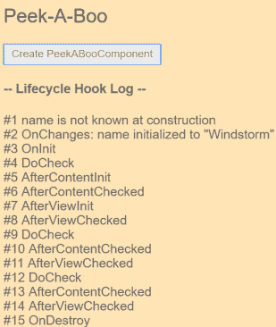
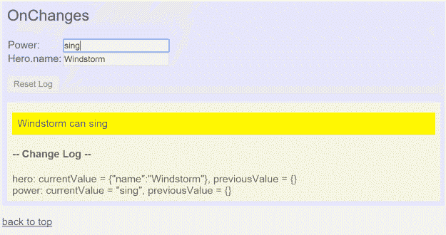
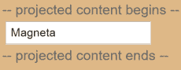
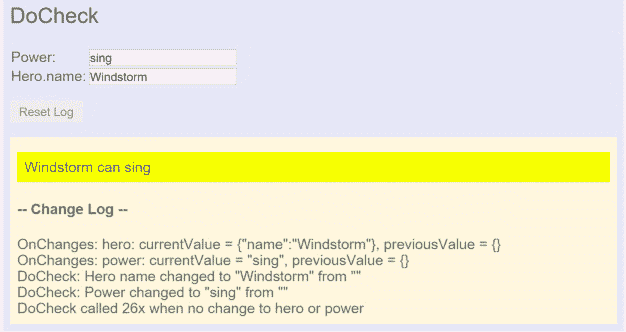
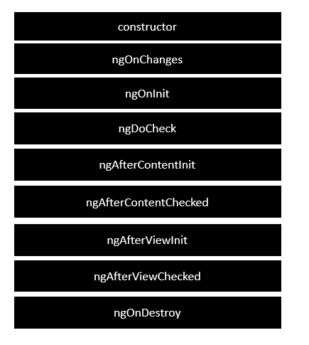
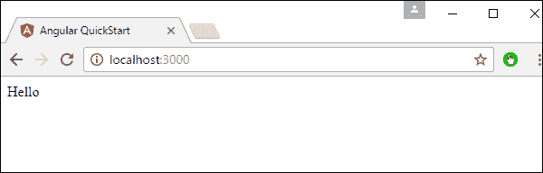

# 角度生命周期挂钩

> 原文:[https://www.javatpoint.com/angular-lifecycle-hooks](https://www.javatpoint.com/angular-lifecycle-hooks)

组件实例的生命周期从 Angular 实例化组件类并呈现组件视图及其子视图时开始。生命周期继续进行更改检测，因为 Angular 会在数据绑定属性更改时进行检查，并根据需要更新视图和组件实例。

当 Angular 销毁组件实例并从 DOM 中移除其渲染模板时，生命周期结束。指令具有类似的生命周期，因为 Angular 在执行中创建、更新和销毁实例。

您的应用程序可以使用生命周期挂钩方法来挖掘组件生命周期中的关键事件，或者指示新实例启动，在需要时开始检测更改，在部署期间更新，并在删除实例之前清理它们。

### 先决条件

在使用生命周期挂钩之前，您应该对以下内容有一个基本的了解:

### 对生命周期事件做出反应

您可以通过在 Angular 核心库中实现一个或多个生命周期挂钩接口来响应组件或指令生命周期中的事件。钩子允许您在 Angular 创建、更新或销毁组件或指令实例时，对该实例进行适当的操作。

每个接口都为一个钩子方法定义了一个原型，它的名字是以 ng 为前缀的接口名。例如 **OnInit** 接口有一个钩子方法叫做 ngOnInit()。假设您在组件或指令类中实现了这个方法。在这种情况下，Angular 会在检查该组件的输入属性或首次调用指令后调用。

```

peek-a-boo.directive.ts (excerpt)
content_copy@Directive({selector: '[appPeekABoo]'})
export class PeekABooDirective implements OnInit {
  constructor(private logger: LoggerService) { }

  // implement OnInit's `ngOnInit` method
  ngOnInit() {
    this.logIt(`OnInit`);
  }
  logIt(msg: string) {
    this.logger.log(`#${nextId++} ${msg}`);
  }
}

```

您不需要实现所有的生命周期挂钩，只需要实现您所需要的。

### 生命周期事件序列

在您的应用程序通过调用组件或指令的构造函数来实例化该组件或指令之后，Angular 会调用您在该实例的生命周期中的适当点调用的钩子方法。

Angular 按照以下顺序执行钩子方法。您可以使用它来执行以下类型的任务。

| 挂钩方法 | 目的 | 时间 |
| ngOnchange() | 当角度设置或重置数据绑定输入属性时做出反应。方法接收当前和以前属性值的简单更改对象。
请注意，这种情况经常发生，因此您在此执行的任何操作都会显著影响性能。使用变更检测挂钩查看本文档中的详细信息。 | **ngOnInit()** (如果组件中绑定了输入)以及每当一个或多个数据绑定输入属性发生变化时。
请注意，如果您的组件没有输入或者在没有提供任何输入的情况下使用它，框架将不会调用 ngOnChanges()。 |
| ngOnInit() | 当 Angular 首次显示数据绑定属性并设置指令或组件的输入属性时，初始化指令或组件。请参阅本文档中启动组件或指令的详细信息。 | 在第一个 ngOnChanges()之后调用一次。即使不调用 ngOnChanges()，也会调用 ngOnInit()(这是没有模板绑定输入时会发生的情况)。 |
| ngdocheck() | 检测 Angular 自身可能检测到或可能检测不到的变化并采取行动。请参阅本文档中定义自定义变更检测的详细信息和示例。 | 在每次更改检测运行后立即调用，在第一次运行后立即调用。 |
| ngAfterContentInit() | 在角度投影后，外部内容进入组件视图或具有指令的反应视图。
参见本文档中响应内容变化的细节和示例。 | 在第一个 ngDoCheck()之后调用一次。 |
| ngOnDestroy() | 在销毁角度指令或组件之前进行清理。为了避免内存泄漏，取消订阅可观察的对象并分离事件处理程序。请参阅本文档中实例销毁时的清理中的详细信息。 | 在销毁 Angular 指令或组件之前立即调用。 |

### 生命周期示例集

这个实例通过一系列在根 **AppComponent** 控制下作为组件呈现的练习，演示了生命周期钩子的使用。在每种情况下，父组件都充当子组件的测试装备，该子组件公开一个或多个生命周期挂钩方法。

下表列出了带有简要说明的练习。下面几节中还将使用示例代码来演示特定的功能。

| 成分 | 描述 |
| **躲猫猫** | 显示每个生命周期挂钩。每个钩子方法都写入屏幕日志。 |
| **间谍** | 展示了如何使用带有自定义指令的生命周期挂钩。SpyDirective 实现了 ngOnInit()和 ngOnDestroy()钩子，并使用它们来查看和报告元素何时移入或移出当前视图。 |
| **OnChanges** | 演示 Angular 如何在每次组件输入属性之一更改时调用 ngOnChanges()钩子，并演示如何解释传递给钩子方法的对象。 |
| doceck | 使用自定义更改检测实现 ngDoCheck()方法。要查看 Angular 调用此钩子的次数，请查看钩子发布的日志中的更改。 |
| **后视** | 显示了“角度”在视图中的含义。显示 ngAfterViewInit()和 ngAfterViewChecked()钩子。 |
| 事后 | 演示如何将外部内容投影到组件中，并将投影的内容与组件的可见子组件分开。演示 ngAfterContentInit()和 ngAfterContentChecked()钩子。 |
| **计数器** | 演示组件和指令的组合，每个组件和指令都有自己的钩子。 |

### 初始化组件

使用 **ngOnInit()** 方法执行以下初始化任务。

在构造函数之外执行复杂的初始化。组件必须便宜且制造安全。最好不要担心新组件会在您决定演示它或您正在测试之前联系远程服务器。

A **ngOnInit()** 是组件获取其初始数据的好地方。在“角度”设置完输入属性后，设置组件。构造函数只需将初始化的局部变量设置为简单的值。

请记住，指令的数据绑定输入属性直到构造之后才设置。如果需要基于这些属性初始化指令，请在运行 ngOnInit()时设置它们。

ngOnChanges()方法是您第一次访问这些属性。Angular 在 **ngOnInit()之前调用 ngOnChanges()，但在此之后调用了几次。它只调用一次 ngOnInit()。**

### 实例销毁时的清理

将清理逻辑放入 **ngOnDestroy()，**哪个逻辑应该在 Angular 破坏指令之前运行。

它是释放不会被自动垃圾收集的资源的地方。如果你忽略了这一点，你就有内存泄漏的风险。

*   取消订阅可观察事件和 DOM 事件。
*   停止间隔计时器。
*   说明注销在全局或应用程序服务中注册的所有回调。

**ngOnDestroy()** 方法也有时间通知应用程序的另一部分该组件即将离开。

### 一般示例

以下示例演示了各种生命周期事件的调用顺序和相对频率，以及如何将钩子单独或一起用于组件和指令。

### 所有生命周期事件的顺序和频率

为了显示 Angular 调用如何按照预期的顺序挂钩，PeekABooComponent 显示了组件中的所有挂钩。

以下快照显示了单击创建按钮和销毁按钮后的日志状态。



日志消息的顺序遵循定义的钩子调用顺序:onchange、oninit、doccheck(3x)、afterContentInit、aftercontentChecked (3x)、afterviewInit、afterviewChecked (3x)和 onDestroy。

请注意，日志确认输入属性(名称属性)在其创建时没有指定的值。onInit()方法可以使用输入属性进行进一步初始化。

用户点击更新英雄按钮，日志会显示另一个

OnChange 和另外两个三元组 DoCheck，AfterContentCheck 和 AfterViewCheck。请注意，这三个钩子经常会触发，因此保持它们的逻辑尽可能精简非常重要。

### 使用指令来观察 DOM。

间谍示例演示了如何对组件和指令使用 hook 方法。SpyDirective 实现了两个钩子，ngOnInit()和 ngOnDestroy()，来检测当前视图中被查看的元素。

该模板在本机 SpyComponent 管理的英雄复读机中的

上实现 SpyDirective。

该实例不进行任何初始化或清理。当指令被实例化和销毁时，它通过记录指令来跟踪场景中元素的存在和消失。

这样的间谍指令可以提供对您无法直接更改的 DOM 对象的洞察。不得触碰原

的实现或修改任何第三方组件。但是，您可以使用指令查看这些元素。

该指令定义了 ngOnInit()和 **ngOnDestroy()** 钩子，它们使用注入的日志服务将消息记录到父节点。

```

src/app/spy.directive.ts
content_copylet nextId = 1;

// Spy on any element to which it is applied.
// Usage: <div appSpy>...</div>
@Directive({selector: '[appSpy]'})
export class SpyDirective implements OnInit, OnDestroy {
  private id = nextId++;

  constructor(private logger: LoggerService) { }

  ngOnInit() {
    this.logger.log(`Spy #${this.id} onInit`);
  }

  ngOnDestroy() {
    this.logger.log(`Spy #${this.id} onDestroy`);
  }
}

```

您可以将 spy 应用于任何父元素或组件元素，并看到它作为该元素同时被初始化和销毁。在这里，它附加到重复英雄

:

**src/app/spy . component . html**

```

content_copy<p *ngFor="let hero of heroes" appSpy>
  {{hero}}
</p>

```

每一个间谍建造和破坏钩子都通过日志中的一个条目来表示一个附属英雄的存在和消失。增加一个英雄会产生一个新英雄

。间谍的 **ngOnInit()** 记录了那个事件。

重置按钮清除英雄列表。Angular 从 DOM 中移除所有英雄

元素，并立即销毁他们的间谍指令。间谍的“T2”方法报告了它的最后时刻。

### 一起使用组件和指令挂钩

在本例中，每当父组件增加其 InputCount 属性时，反组件都使用 ngOnChanges()方法来记录更改。

本示例对上一示例中的反组件日志应用 SpyDirective，以查看日志条目的创建和销毁。

### 使用变更检测挂钩

每当 Angular 检测到输入属性的更改时，它都会调用组件或指令的 ngOnChanges()方法。onchange 示例通过监视 onchange()钩子来演示这一点。

```

on-changes.component.ts (excerpt)
content_copyngOnChanges(changes: SimpleChanges) {
  for (const propName in changes) {
    const chng = changes[propName];
    const cur  = JSON.stringify(chng.currentValue);
    const prev = JSON.stringify(chng.previousValue);
    this.changeLog.push(`${propName}: currentValue = ${cur}, previousValue = ${prev}`);
  }
}

```

ngOnChanges()方法接受一个对象，该对象将每个已更改的属性名称映射到一个保存当前和以前属性值的简单更改对象。这个钩子遍历已更改的属性并记录它们。

示例组件 OnChangesComponent 有两个输入属性:英雄和力量。**src/app/on-changes . component . ts**

```

content_copy@Input() hero!: Hero;
@Input() power = '';
The host OnChangesParentComponent binds to them as follows.
src/app/on-changes-parent.component.html
content_copy<on-changes [hero]="hero" [power]="power"></on-changes>

```

下面是用户进行更改时的示例。



日志条目显示为 power 属性更改的字符串值。但是注意 **ngOnChanges()** 方法并不能捕捉到英雄的变化。这是因为 Angular 只在输入属性值改变时调用钩子。在这种情况下，英雄是输入属性，英雄属性的值是对英雄对象的引用。当对象引用的 name 属性值更改时，该对象引用没有更改。

### 响应视图更改

当 Angular 在变更检测期间遍历视图层次结构时，它需要确保一个子视图中的变更不会导致其父视图中的变更。由于单向数据流的工作方式，这样的更改将无法正确完成。

如果您需要进行一个与预期数据流相反的更改，您必须触发一个新的更改检测周期来提交该更改。这些例子显示了如何安全地进行这样的改变。

后视图示例探索了在创建组件的子视图后，Angular 调用的后视图初始化()和后视图检查()。这是一个在<input>中显示英雄名字的子视图:

**子视图组件**

```

content_copy@Component ({
  selector: 'app-child-view',
  template: `<label for="hero-name">Hero name: </label>
  <input type="text" id="hero-name" [(ngModel)]="hero">`
})
export class ChildViewComponent {
  hero = 'Magneta';
}
The AfterViewComponent displays this child view within its template:
AfterViewComponent (template)
content_copytemplate: `
  <div>child view begins</div>
    <app-child-view></app-child-view>
  <div>child view ends</div>`

```

以下钩子基于子视图中的变化值采取行动，这只能通过使用 **@ViewChild 属性**查询子视图来访问。

**AfterViewComponent(类摘录)**

```

content_copyexport class AfterViewComponent implements  AfterViewChecked, AfterViewInit {
  private prevHero = '';

  // Query for a VIEW child of type `ChildViewComponent`
  @ViewChild(ChildViewComponent) viewChild!: ChildViewComponent;

  ngAfterViewInit() {
    // viewChild is set after the view has been initialized
    this.logIt('AfterViewInit');
    this.doSomething();
  }

  ngAfterViewChecked() {
    // viewChild is updated after the view has been checked
    if (this.prevHero === this.viewChild.hero) {
      this.logIt('AfterViewChecked (no change)');
    } else {
      this.prevHero = this.viewChild.hero;
      this.logIt('AfterViewChecked');
      this.doSomething();
    }
  }
  // ...
}

```

### 响应估计的内容更改

内容投影是一种从组件外部导入 HTML 内容并将该内容插入组件模板指定位置的方法。您可以通过查看以下结构来识别模板中的内容投影。

*   组件元素标签之间的 HTML。
*   组件模板中<ng-content>标签的存在。</ng-content>

AngularJS 开发人员将这种技术称为 transclusion。

AfterContent 示例探索 afterContentInit()和 afterContentChecked()钩子，Angular 在将外部内容投影到组件中后调用这些钩子。

考虑上一个后视示例的这种变化。这一次，它不是将子视图包含在模板中，而是从 AfterContent 组件的父视图中导入内容。以下是基本的*模板。*

```

AfterContentParentComponent (template excerpt)

```

```

content_copy`<after-content>
  <app-child></app-child>
</after-content>`

```

请注意，<app-child>标签位于<after-content>标签之间。除非您打算将内容投影到组件中，否则不要将内容放在组件的元素标签之间。</after-content></app-child>

现在，让我们看看组件的模板。

```

AfterContentComponent (template)

```

```

content_copytemplate: `
  <div>projected content begins</div>
    <ng-content></ng-content>
  <div>projected content ends</div>`

```

<ng-content>标签是外部内容的占位符。它告诉 Angular 在哪里插入内容。在这种情况下，推断的内容是来自父级的<app-child>。</app-child></ng-content>



### 材料后使用挂钩

后材质挂钩类似于后视图挂钩。主要区别在于子组件。

*   后视图钩子与视图子视图相关，视图子视图的元素标签出现在组件的模板中。
*   后内容挂钩与内容子项相关，内容子项是 Angular 投影到组件中的子组件。

下面的 AfterContent 钩子基于 ContentChild 中值的变化采取行动，只需使用用@ContentChild 修饰的属性查询它们就可以访问这些值。

```

AfterContentComponent (class excerpts)

```

```

content_copyexport class AfterContentComponent implements AfterContentChecked, AfterContentInit {
  private prevHero = '';
  comment = '';

  // Query for a CONTENT child of type `ChildComponent`
  @ContentChild(ChildComponent) contentChild!: ChildComponent;

  ngAfterContentInit() {
    // contentChild is set after the content has been initialized
    this.logIt('AfterContentInit');
    this.doSomething();
  }

  ngAfterContentChecked() {
    // contentChild is updated after the content has been checked
    if (this.prevHero === this.contentChild.hero) {
      this.logIt('AfterContentChecked (no change)');
    } else {
      this.prevHero = this.contentChild.hero;
      this.logIt('AfterContentChecked');
      this.doSomething();
    }
  }
  // ...
}

```

### 定义自定义变更检测

要监视 ngOnChanges()无法捕捉到的更改，您可以实现您的更改检查，如 DoCheck 示例所示。这个例子展示了如何使用 ngDoCheck()钩子来检测和处理 Angular 自己无法捕捉到的变化。

文档检查采样器使用以下 ngDoCheck()钩子扩展了 OnChanges 采样器:

```

DoCheckComponent (ngDoCheck)
content_copyngDoCheck() {

  if (this.hero.name !== this.oldHeroName) {
    this.changeDetected = true;
    this.changeLog.push(`DoCheck: Hero name changed to "${this.hero.name}" from "${this.oldHeroName}"`);
    this.oldHeroName = this.hero.name;
  }

  if (this.power !== this.oldPower) {
    this.changeDetected = true;
    this.changeLog.push(`DoCheck: Power changed to "${this.power}" from "${this.oldPower}"`);
    this.oldPower = this.power;
  }

  if (this.changeDetected) {
      this.noChangeCount = 0;
  } else {
      // log that hook was called when there was no relevant change.
      const count = this.noChangeCount += 1;
      const noChangeMsg = `DoCheck called ${count}x when no change to hero or power`;
      if (count === 1) {
        // add new "no change" message
        this.changeLog.push(noChangeMsg);
      } else {
        // update last "no change" message
        this.changeLog[this.changeLog.length - 1] = noChangeMsg;
      }
  }

  this.changeDetected = false;
}

```

这段代码检查一些感兴趣的值，抓取它们的当前位置并与以前的值进行比较。它会在英雄或者力量没有真正变化的时候，在日志中写一条特殊的消息，这样你就可以看到 DoCheck()被调用了多少次。结果很有启发性。



虽然 ngDoCheck()钩子可以检测到英雄的名字什么时候变了，但是非常昂贵。这种挂钩被称为峰值频率——在每个变化检测周期之后，无论变化发生在哪里。在这个例子中，在用户可以做任何事情之前，它已经被调用了二十多次。

大多数初始检查都是由 Angular 在页面的其他地方首次呈现不相关的数据而触发的。只需将光标移动到另一个<input>即可启动呼叫。相对而言，很少有电话透露相关数据的真实变化。如果您使用这个钩子，您的实现必须非常轻量级，否则用户体验会受到影响。

Angular 2 应用程序从头到尾经历一整套流程或生命周期。

下图显示了 Angular two 应用程序生命周期中的整个过程。



**以下是每个生命周期钩子的描述。**

**ngOnChanges** -当数据绑定属性的值改变时，调用该方法。

**ngOnInit** -在 Angular 显示数据绑定属性后，当指令/组件被初始化时调用。

**ngdoccheck**-这是用于检测和处理 Angular 可能会自动检测到或可能不会自动检测到的变化。

**ngafterecontentit**-这是在 Angular 将外部内容投影到组件视图后的反应中调用的。

**ngAfterContentChecked** -这是在 Angular 检查了组件中的估计含量后调用的。

**ngafterviewit**-在 Angular 初始化了组件的视图和子视图后，在 React 中调用。

**ngAfterViewChecked** -这是在异常检查了组件的视图和子视图后在 React 中调用的。

**非破坏性** -这是角度破坏指令/组件之前的清理步骤。

以下是实现生命周期挂钩的示例。在 **App.component.ts** 文件中，输入以下代码。

```

import { 
   Component 
} from '@angular/core';  

@Component ({ 
   selector: 'my-app', 
   template: '<div> {{values}} </div> ' 
}) 

export class AppComponent { 
   values = ''; 
   ngOnInit() { 
      this.values = "Hello"; 
   } 
}

```

在上面的程序中，我们专门调用了 ngOnInit 生命周期钩子来引用它的值。值参数必须设置为“hello”。

保存所有代码更改并刷新浏览器后，您将获得以下输出。



* * *