# 角 AWS

> 原文:[https://www.javatpoint.com/angular-aws](https://www.javatpoint.com/angular-aws)

**先决条件**

*   角度命令行界面
*   自动气象站账户

### 创建角度应用

让我们从创建我们的 Angular 项目开始。首先，我们需要通过运行以下命令来安装最新版本的 Angular CLI。

```

npm install -g @angular/CLI

```

运行上述命令后，您可以通过运行 ng 版本来验证最新的 CLI 版本。它将显示如下版本:

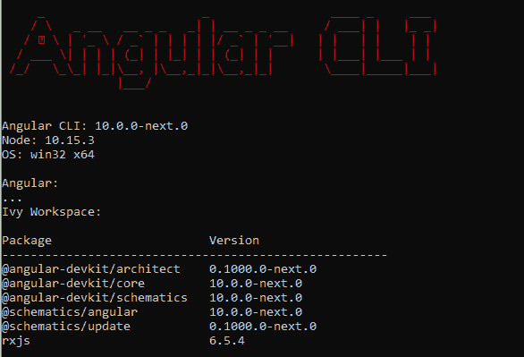

现在，让我们创建一个新的角度应用程序。您可以导航到要创建角度项目的工作区，然后运行下面的命令

```

ng new MyFirstAngularApp.

```

对于这个例子，我们将不添加路由，我们将使用 SCSS 格式的样式表

Angular CLI 将安装所有必要的 npm 包，并在选定的工作区下创建 Angular 应用程序。如果您在开发中使用 VS Code，您可以按照如下方式查看工作区以及所有必要的文件。

*   package.json 文件具有所有必需的依赖项
*   angular.json 文件包含所有必要的配置以及输出文件和 CSS 样式路径
*   tsconfig.json 定义编译 typescript 文件所需的编译器选项
*   main.ts 是启动应用程序的应用程序入口点
*   初始应用。组件和应用程序。将添加模块文件，用于显示应用程序登录页面

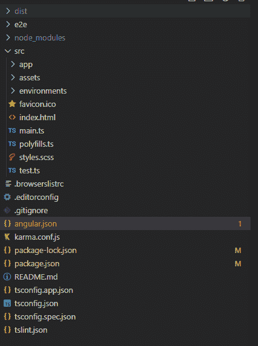

### 构建应用程序并生成输出文件夹

我们可以通过运行下面的命令来生成构建文件。它将生成 angular.json 文件中指定的输出文件夹。这个文件夹将服务于 AWS S3 桶，我们将在本文后面看到。

```

ng build -prod

```

您可以验证 angular.json 文件中配置的输出路径。

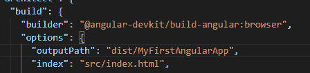

成功构建应用程序后，dist/my firstanagrugapp 将输出如下文件。

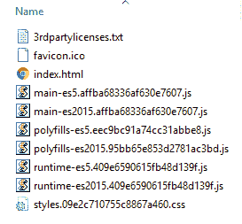

### 在本地主机上提供应用程序。

转到工作区，运行 ng serve 命令来构建应用程序，并在 localhost 上启动开发服务器。您可以在浏览器中打开链接，并验证登录页面，如下所示。

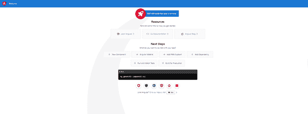

**将 Angular 应用部署到 AWS S3 服务**

接下来，让我们将 angular 应用程序部署到无服务器的 S3 服务中。要继续，您需要一个 AWS 帐户。您可以在<u>https://aws.amazon.com/console/</u>创建一个免费账户。他们在第一年的免费等级下提供很多免费服务。特别是对 S3 来说，你可以在第一年免费获得以下东西。

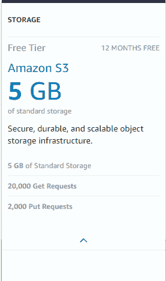

成功创建帐户并登录后，您可以在服务->存储选项下导航到 S3。第一步是创建一个 S3 桶名。存储桶名称在所有 AWS 帐户中是唯一的，因此不应选择通用名称，因为它可能被采用。

此外，如果您明智地选择桶名，这将有所帮助，因为 S3 以以下格式公开了网址。

```

[BUCKET-NAME].s3-website.[BUCKET-ZONE].amazonaws.com

```

在桶名之后，您需要选择区域。选择离用户位置更近的区域是有意义的，这将为用户提供更快的应用程序性能。以下是我为铲斗定义的配置。

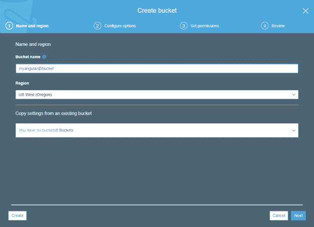

让我们点击创建按钮，最终创建我们的 S3 桶。一旦桶成功创建，您可以在 S3 桶列表中找到它，如下所示。

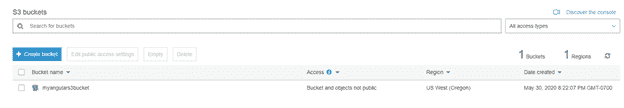

单击新创建的存储桶，然后单击属性选项卡。你会看到一张卡片列表。

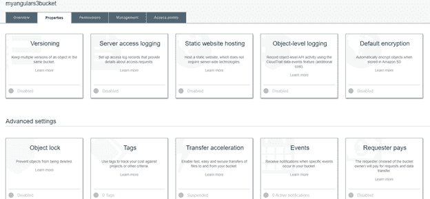

点击“静态网站托管”卡，定义我们的应用程序的条目和错误页面。

你会在那里看到三个选项，你需要选择“使用这个桶来托管一个网站”。在这里，您需要定义索引和错误文档。在我们的例子中，我们将两个文档都定义为 index.html 页面。

此外，您可以看到端点 URL，它将在浏览器中启动应用程序。

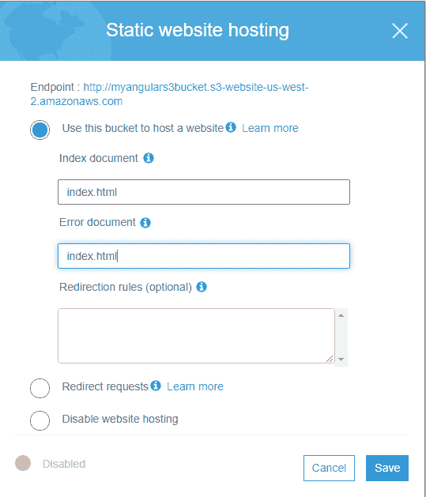

让我们单击保存并用给定的端点网址点击浏览器。在这个阶段，我们得到了以下 403 个被禁止的错误。原因是默认情况下，所有 S3 桶策略都是私有的，这将使所有用户都无法访问应用程序。

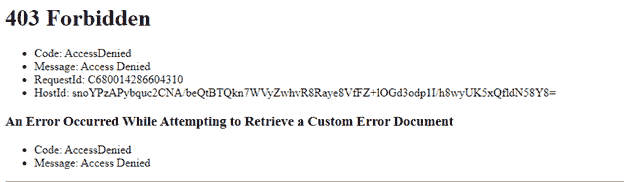

我们可以在“桶策略”选项卡下管理桶策略，并授予所有用户公共访问权限。

首先，让我们转到“权限”选项卡，然后单击“编辑”按钮。这里，以下两个选项“通过新的公共桶阻止公共访问”和“通过新的公共桶阻止公共和跨帐户访问”默认设置为真。让我们取消选中它们，然后单击保存。

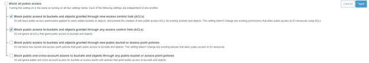

接下来，您需要应用一个策略，允许匿名用户访问我们的数据。我们可以复制以下策略，并将其粘贴到“管理存储桶策略”部分。如果您在 JSON 对象的 Resource 属性中用当前的现有存储桶更改存储桶名称，将会有所帮助。

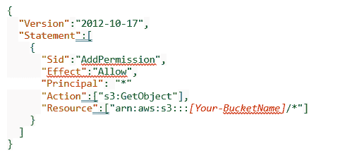

我已经更新了桶策略如下。同样，非常重要的是只向用户授予 GetObject，而不是 PUT、DELETE 等。，任何类型的编辑访问，以防止任何安全问题。

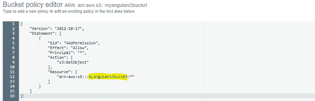

### 部署角度构建

现在，让我们复制在文章中最初讨论的角度构建输出，它是在 dist/my firstanagrugarapp 路径上生成的，并在 S3 上传。

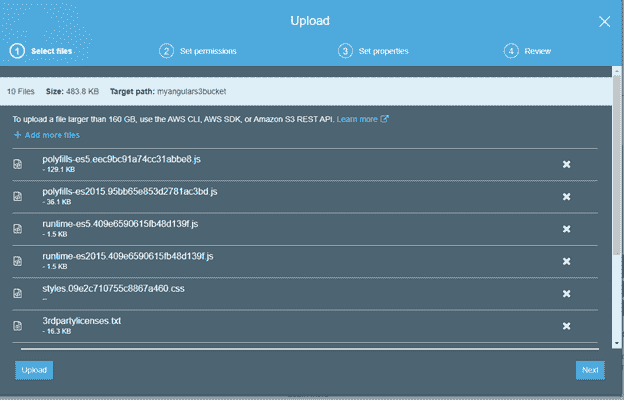 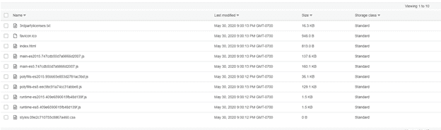

文件成功上传后，您可以导航到 S3 端点 URL，并验证应用程序是否已启动和运行。

<u>【你的-bucket name】. 3-网站-【你的-bucket tregion】. amazonaws . com</u>

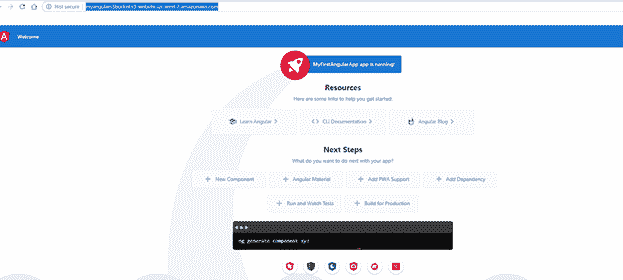

我们刚刚创建了第一个 angular 应用程序，并将其部署在 AWS 无服务器 S3。

* * *