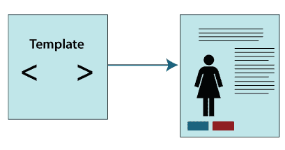
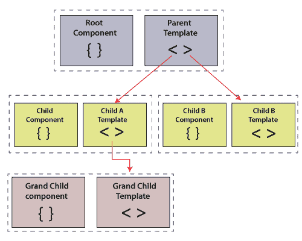
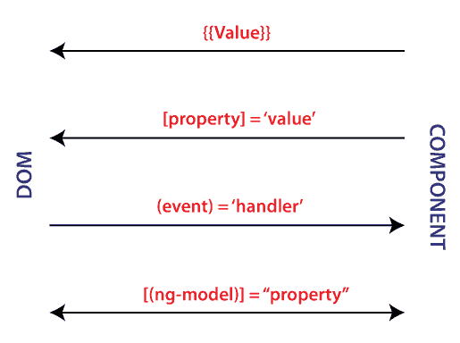
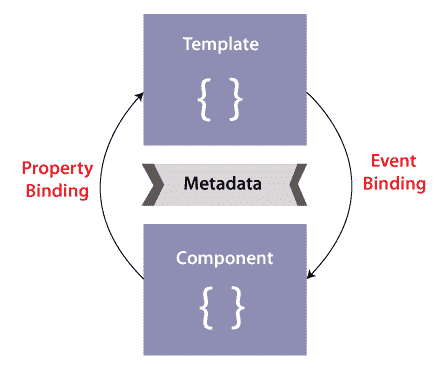
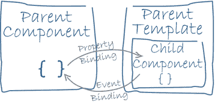
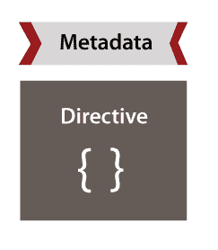

# 角度样板

> 原文：<https://www.javatpoint.com/angular-template>

在 Angular 中，模板是 HTML 的一部分。在模板中使用特殊语法来创建 Angular 的许多功能。

应用程序中的每个 Angular 模板都是一大块 HTML，包含在浏览器显示的页面中。有角度的 HTML 模板在浏览器中呈现视图或用户界面，就像普通的 HTML 一样，但功能更多。

当您使用 Angular CLI 生成 Angular 应用程序时，app.component.html 文件是包含占位符 HTML 的默认模板。

模板语法指南向您展示了如何通过协调类和模板之间的数据来控制 UX/用户界面。

大多数模板语法指南都有专门的工作示例应用程序来演示每个指南的主题。查看全面的模板语法实时代码/下载示例，了解它们如何在一个应用程序中协同工作。

### 增强你的网页

在模板中用专门的 Angular 语法扩展应用程序的 HTML 词汇表。例如，Angular 可以帮助您使用内置模板函数、变量、事件监听和数据绑定等功能动态获取和设置 DOM(文档对象模型)值。

几乎所有的 HTML 语法都是有效的模板语法。但是，因为 Angular 模板是整个网页的一部分，而不是整个页面的一部分，所以您不需要包括像、或这样的元素。您可以特别关注您正在开发的页面部分。

Angular 不支持模板中的

### 关于模板语法的更多信息

您可能还对以下内容感兴趣:

*   插值-如何在 HTML 中使用插值和表达式。
*   模板语句-响应模板中的事件。
*   **绑定语法** -在应用程序中使用绑定来协调值。
*   **属性绑定** -设置目标元素或指令@Input()装饰器的属性。
*   **属性、类和样式绑定** -设置属性、类和样式的值。
*   **事件绑定** -监听事件和你的 HTML。
*   **双向绑定** -在一个类和它的模板之间共享数据。
*   **内置指令** -监听并修改 HTML 的行为和布局。
*   **模板引用变量** -使用一个特殊的变量来引用模板内的一个 DOM 元素。
*   **输入输出** -父上下文与子指令或组件共享数据。
*   **模板表达式操作符** -了解管道操作符，|，防止 HTML 中出现空值或未定义的值。
*   **SVG 中的模板** -动态生成交互图形。

一个组件控制一个称为视图的屏幕补丁。例如，《英雄之旅》教程中的各个组件定义并控制以下每个场景:

带导航链接的申请路线。

### 英雄榜

您定义了应用程序逻辑——它支持类内的视图。该类通过属性和方法的 API 与视图交互。

例如，HeroListComponent 有一个保存英雄数组的英雄属性。当用户从列表中选择一个英雄时，它的 SelectHero()方法设置一个 SelectedHero 属性。组件从服务继承 hero，这是构造函数上的 TypeScript 参数属性。服务通过依赖注入机制提供给组件。

```

src/app/hero-list.component.ts (class)
content_copyexport class HeroListComponent implements OnInit {
  heroes: Hero[] = [];
  selectedHero: Hero | undefined;
  constructor(private service: HeroService) { }
  ngOnInit() {
    this.heroes = this.service.getHeroes();
  }
  selectHero(hero: Hero) { this.selectedHero = hero; }
}

```

当用户在应用程序中移动时，Angular 会创建、更新和销毁组件。您的应用程序可以通过可选的生命周期挂钩来执行生命周期中的每一刻操作，例如 **ngOnInit()。**

**组件元数据**


@Component 装饰器将紧接在其下的类标识为组件类，并指定其元数据。在下面的示例代码中，您可以看到 HeroListComponent 只是一个没有特殊的 Angular 符号或语法的类。除非您用@Component 装饰器将其标记为一个组件，否则它不是一个组件。

组件的元数据告诉 Angular 在哪里可以找到创建和渲染组件及其视图的关键构建块。具体来说，它将模板与组件相关联，或者直接与内联代码相关联，或者通过引用相关联。组件及其模板共同描述了一个视图。

除了包含或指示模板，@Component 还配置元数据，例如，如何在 HTML 中引用组件以及它需要什么服务。

```

src/app/hero-list.component.ts (metadata)
content_copy@Component({
  selector:    'app-hero-list',
  templateUrl: './hero-list.component.html',
  providers:  [ HeroService ]
})
export class HeroListComponent implements OnInit {
/* . . . */
}

```

此示例显示了一些最有用的@Component 配置选项:

**选择器:**一个 CSS 选择器，告诉 Angular 创建并插入这个组件的一个实例，在模板 HTML 中找到相应的标签。例如，如果应用程序的 HTML 包含<应用程序-英雄列表></应用程序-英雄列表>，Angular 会在这些标签之间插入一个英雄列表组件视图的实例。

**模板 Url:** 该组件的 HTML 模板的模块相关地址。或者，您可以将 HTML 模板作为模板属性的值内联提供。该模板定义了组件的宿主视图。

**提供者:**组件所需服务的一系列提供者。该示例告诉 Angular 如何提供一个英雄服务实例，组件的构造函数使用该实例来获取要显示的英雄列表。

**模板和想法**



使用关联模板定义组件视图。模板是 HTML 的一种形式，它告诉 Angular 如何呈现组件。

视图通常是分层组织的，允许您将整个用户界面部分或页面作为一个单元进行修改或显示和隐藏。与组件直接关联的模板定义了该组件的宿主视图。组件还可以定义视图层次结构，其中包含由其他组件承载的嵌入式视图。



视图层次结构可以包括来自同一模块中组件的视图，但也可以包括来自不同模块中定义的组件的视图。

### 模板语法

模板看起来像普通的 HTML，除了它还包含 Angular 模板语法，该语法基于应用程序的逻辑和应用程序状态以及 DOM 数据来转换 HTML。您的模板可以使用数据绑定来协调应用程序和 DOM 数据，在显示数据之前使用管道来转换数据，以及使用指令来实现正在显示的应用程序逻辑。

例如，这里有一个教程的 HeroListComponent 模板。

**src/app/hero-list . component . html**

```

content_copy<h2>Hero List</h2>

<p><i>Select a hero from the list to see details.</i></p>
<ul>
  <li *ngFor="let hero of heroes" (click)="selectHero(hero)">
    {{hero.name}}
  </li>
</ul>
<app-hero-detail *ngIf="selectedHero" [hero]="selectedHero"></app-hero-detail>

```

该模板使用了特定的 HTML 元素，如

## 、

，包括 Angular 模板语法元素，* ngFor、{{hero.name}}、(点击)、[hero]和<app-hero contains="" details="" are="" also="" included.="">。模板语法元素告诉 Angular 如何使用程序逻辑和数据在屏幕上呈现 HTML。</app-hero>

*ngFor 指令告诉 Angular 迭代一个列表。

{{hero。name}}、(click)和[hero]通过响应用户输入，将程序数据绑定到 DOM 和从 DOM 中获取数据。请参见下面关于数据绑定的更多信息。

示例中的<app-hero-detail>标签是一个元素，它代表一个新的组件，HeroDetailComponent。定义了英雄列表组件的英雄细节子视图。请注意这样的自定义组件是如何与同一布局中的原始 HTML 相匹配的。</app-hero-detail>

### 数据绑定

如果没有框架，您将负责将数据值推送到 HTML 控件，并将用户响应转换为动作和值更新。任何有经验的前端 JavaScript 程序员都可以证明，手工编写这种推拉逻辑既繁琐又容易出错，读起来简直是一场噩梦。

Angular 支持双向数据绑定，这是一种用于协调模板部分和组件部分的机制。请参阅将绑定标记添加到模板 HTML，了解如何在角度中添加两侧。



每种形式都有一个方向:从 DOM，从 DOM，或者两者都有

HeroListComponent 模板的这个例子使用了其中的三种形式。

src/app/hero-list . component . html(绑定)

```

content_copy<li>{{hero.name}}</li>
<app-hero-detail [hero]="selectedHero"></app-hero-detail>
<li (click)="selectHero(hero)"></li>

```

{{hero.name}}插值显示

*   The hero.name attribute value of the component within the element.

[英雄]属性绑定将父英雄列表组件中选定英雄的值传递给子英雄列表组件的英雄属性。

当用户点击英雄的名字时，(点击)事件调用绑定组件的 SelectHero 方法。

双向数据绑定(主要用于模板驱动的表单)将属性和事件绑定结合在一个符号中。下面是一个来自 HeroDetailComponent 模板的例子，它使用了带有 ngModel 指令的双向数据绑定。

```

src/app/hero-detail.component.html (ngModel)
content_copy<input type="text" id="hero-name" [(ngModel)]="hero.name">

```

在双向绑定中，数据从属性值组件流向输入框，就像属性绑定一样。用户更改也会流回组件，将属性重置为最新值，就像事件绑定一样。

Angular 为每个 JavaScript 事件处理一次所有数据绑定，并从应用程序组件树的根开始遍历所有子组件。



数据绑定在模板及其组件之间的通信中起着重要作用，对于父组件和子组件之间的通信也很重要。



### 管道

角形管道允许您在模板中声明显示值的变化。@Pipe 带有装饰器的类定义了一个函数，该函数将输入值转换为显示在视图中的输出值。

Angular 定义了各种管道，如日期管道和货币管道；有关完整列表，请参见管道应用编程接口列表。您也可以定义新管道。

要在 HTML 模板中指定值更改，请使用管道运算符(|)。

```

{{interpolated_value | pipe_name}}

```

您可以链接管道，将一个管道函数的输出发送给另一个管道函数进行转换。管道还可以接受控制其执行转换方式的参数。例如，您可以将所需的格式传递给数据管道。

```

content_copy<!-- Default format: output 'Jun 15, 2015'-->
 <p>Today is {{today | date}}</p>

<!-- fullDate format: output 'Monday, June 15, 2015'-->
<p>The date is {{today | date:'fullDate'}}</p>

 <!-- shortTime format: output '9:43 AM'-->
 <p>The time is {{today | date:'shortTime'}}</p>

```

**指令**



角度模板是动态的。当 Angular 渲染它们时，它会根据指令给出的指令改变 DOM。指令是一个带有@Directive()装饰器的类。

组件在技术上是一个指令。然而，组件对于 Angular 应用程序来说是如此的专门化和中心化，以至于 Angular 定义了@Component()装饰器，用面向模板的特性扩展了@Directive()装饰器。

除了组件，还有两种其他类型的指令:结构指令和特性指令。Angular 定义了两种类型的几个指令，您可以使用@ Directive()装饰器定义自己的指令。

对于组件，指令的元数据将修饰类与选择器元素相关联，您可以使用选择器元素将其插入到 HTML 中。在模板中，指令通常显示为元素标记中的属性，或者是名称，或者是赋值的目标或绑定。

**结构说明**

结构指令通过添加、移除和更改 DOM 中的元素来改变布局。示例模板使用两个内置的结构指令来为视图的呈现方式添加应用程序逻辑。

```

src/app/hero-list.component.html (structural)
content_copy<li *ngFor="let hero of heroes"></li>
<app-hero-detail *ngIf="selectedHero"></app-hero-detail>

```

*   *神经生长因子是一个迭代过程；它告诉 Angular 在英雄列表中为每个英雄消灭一个
*   。
*   *ngIf 是一个条件句；只有当一个选定的英雄存在时，它才包括希罗多德组件。

### 属性指令

属性指令改变现有元素的外观或行为。在模板中，它们看起来像常规的 HTML 属性，因此得名。

实现双向数据绑定的 ngModel 指令就是属性指令的一个例子。NgModel 通过设置其显示值属性和响应更改事件来修改现有元素(通常为<input>)的行为。

```

src/app/hero-detail.component.html (ngModel)
content_copy<input type="text" id="hero-name" [(ngModel)]="hero.name">

```

Angular 有更多预定义的指令来改变布局结构(例如，ngSwitch)或修改 DOM 元素和组件的方面(例如， **ngStyle** 和 **ngClass** )。

### 模板语句

模板语句是可以在 HTML 中用来响应用户事件的方法或属性。使用模板语句，您的应用程序可以通过显示动态内容或提交表单来吸引用户。

在以下示例中，模板语句出现在=符号右侧的引号中，表示为 deleteHero()(事件)=“语句”。

```

src/app/app.component.html
content_copy<button(click)="deleteHero()">delete hero</button>

```

当用户点击删除英雄按钮时，Angular 调用组件类中的**删除英雄()**方法。

使用带有元素、组件或指令的模板语句来响应事件。

### 句法

像模板表达式一样，模板语句使用看起来像 JavaScript 的语言。然而，模板语句的解析器不同于模板表达式的解析器。此外，模板语句解析器特别支持基本赋值、=，以及用分号链接表达式；

不允许使用以下 JavaScript 和模板表达式语法:

```

New increment and decrement operators, ++ and --
operator assignment, such as += and -=
the bitwise operators, such as | and &

```

### 管道操作员

语句有一个上下文——语句所属的应用程序的特定部分。

语句只能引用语句上下文中的内容，通常是组件实例。例如，(click)=“deleteHero()”的 deleteHero()是下面代码片段中组件的一个方法。

src/app/app.component.html

```

content_copy<button (click)="deleteHero()">Delete hero</button>

```

语句上下文还可以引用模板自身上下文的属性。在下面的示例中，组件的事件处理方法 onSave()将模板自己的$event 对象作为参数。在接下来的两行中，deleteHero()方法采用模板输入变量 Hero，onSubmit()采用模板上下文变量#heroForm。

**src/app/app . component . html**

```

content_copy<button (click)="onSave($event)">Save</button>
<button *ngFor="let hero of heroes" (click)="deleteHero(hero)">{{hero.name}}</button>
<form #heroForm (ngSubmit)="onSubmit(heroForm)"> ... </form>

```

在这个例子中，$event 对象是 hero 和#heroForm 的引用模板。

模板引用名称优先于组件引用名称。Hero 是前面 deleteHero(英雄)中的模板输入变量，而不是组件的 hero 属性。

### 陈述最佳实践

### 简洁

使用方法调用或基本属性赋值来保持模板语句最少。

### 根据上下文工作

对模板语句的引用可以是组件类或模板的实例。因此，模板语句不能引用全局命名空间中的任何内容，如窗口或文档。例如，模板语句不能调用 console.log()或 math.max()。

* * *