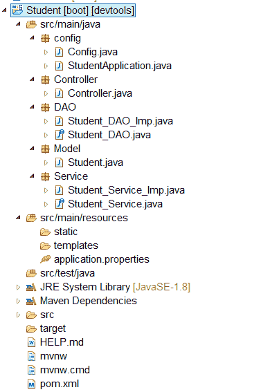
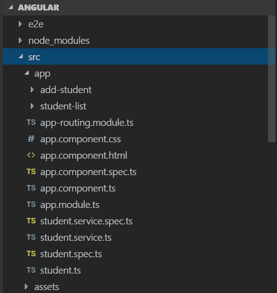
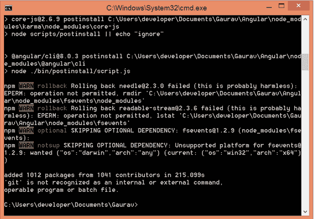
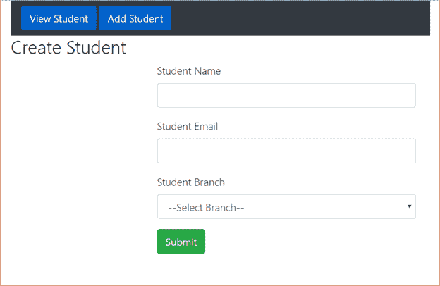
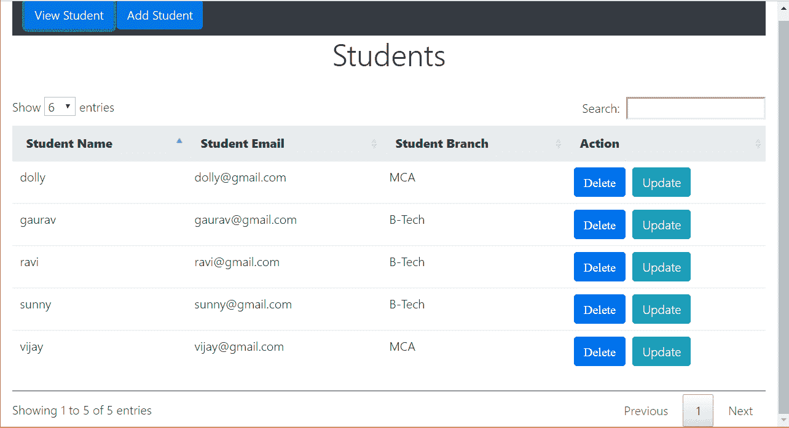
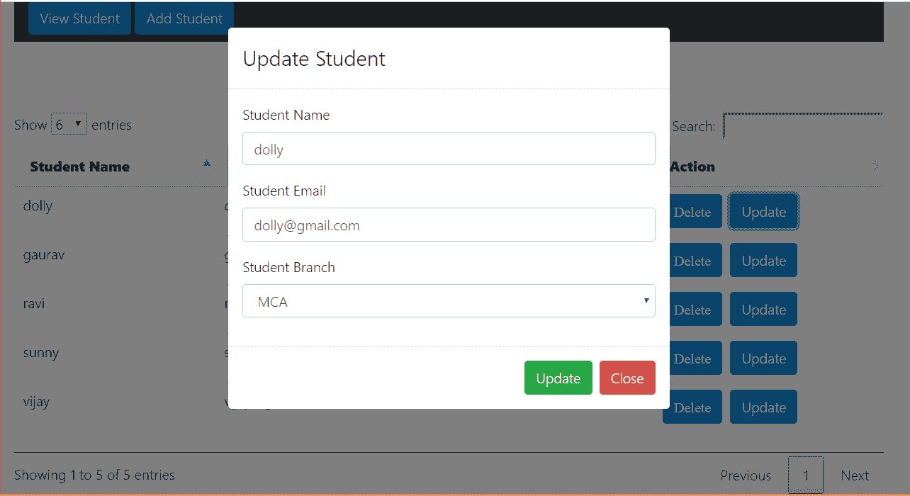

# 弹簧 Angular 积垢的应用

> 原文：<https://www.javatpoint.com/angular-spring-crud-example>

在本节中，我们将开发一个 CRUD(创建-读取-更新-删除)web 应用程序。该应用程序包含学生表单，该表单包含 CRUD 功能，如添加、查看、删除和更新学生。在这个集成中，我们使用 Spring Boot 来处理后端部分，使用 Angular 来处理前端部分。

## 应用程序的工作

*   一旦我们在服务器上部署了我们的应用程序，就会在 web 浏览器上生成一个学生表单。
*   该表单便于添加和查看学生。
*   点击添加学生链接，页面重定向到创建学生表单，我们可以通过填写所需的详细信息并提交它们来添加学生。
*   使用查看学生链接，我们可以获取现有学生的详细信息。这里，每个学生还包含更新和删除链接。
*   因此，我们可以更新学生的详细信息，也可以从数据库中删除它们。
*   完成后，在网络浏览器中提供网址 [http://localhost:4200/](http://localhost:4200/) 。

## 要使用的工具

*   使用任何 IDE 来开发 Spring 和 Hibernate 项目。可能是 STS/Eclipse/Netbeans。这里，我们使用的是 STS (Spring 工具套件)。
*   数据库的 MySQL。
*   使用任何集成开发环境来开发 Angular 项目。可能是 Visual Studio 代码/崇高。这里，我们使用的是 Visual Studio 代码。
*   服务器:Apache Tomcat/JBoss/Glassfish/Weblogic/Websphere。

## 我们使用的技术

在这里，我们使用以下技术:

*   春季靴 2
*   休眠 5
*   Angular 6
*   关系型数据库

## 创建数据库

让我们创建一个数据库 **indigo** 。不需要创建表，因为 Hibernate 是自动创建的。

## 弹簧模块

让我们看看 Spring Boot 的目录结构，我们需要遵循:



要开发 CRUD 应用程序，请遵循以下步骤:-

*   向 pom.xml 文件添加依赖项。

```js
<?xml version="1.0" encoding="UTF-8"?>
<project  xmlns:xsi="http://www.w3.org/2001/XMLSchema-instance"
	xsi:schemaLocation="http://maven.apache.org/POM/4.0.0 http://maven.apache.org/xsd/maven-4.0.0.xsd">
	<modelVersion>4.0.0</modelVersion>
	<parent>
		<groupId>org.springframework.boot</groupId>
		<artifactId>spring-boot-starter-parent</artifactId>
		<version>2.1.4.RELEASE</version>
		<relativePath/> <!-- lookup parent from repository -->
	</parent>
	<groupId>com.main</groupId>
	<artifactId>Student</artifactId>
	<version>0.0.1-SNAPSHOT</version>
	<name>Student</name>
	<description>Demo project for Spring Boot</description>

	<properties>
		<java.version>1.8</java.version>
	</properties>

	<dependencies>

		<dependency>
		    <groupId>org.springframework.boot</groupId>
		    <artifactId>spring-boot-devtools</artifactId>
            <optional>true</optional>
		</dependency>

		<dependency>
			<groupId>org.springframework.boot</groupId>
			<artifactId>spring-boot-starter-data-jpa</artifactId>
		</dependency>
		<dependency>
			<groupId>org.springframework.boot</groupId>
			<artifactId>spring-boot-starter-web</artifactId>
		</dependency>

		<dependency>
			<groupId>mysql</groupId>
			<artifactId>mysql-connector-java</artifactId>
			<scope>runtime</scope>
		</dependency>
		<dependency>
			<groupId>org.springframework.boot</groupId>
			<artifactId>spring-boot-starter-test</artifactId>
			<scope>test</scope>
		</dependency>
	</dependencies>

	<build>
		<plugins>
			<plugin>
				<groupId>org.springframework.boot</groupId>
				<artifactId>spring-boot-maven-plugin</artifactId>
			</plugin>
		</plugins>
	</build>

</project>

```

*   创建配置类
    代替 XML，我们执行基于注释的配置。因此，我们创建了一个 configuration 类，并在其中指定了所需的配置。然而，还有一个配置类 StudentApplication.java。这个类是由 Spring Boot 自动提供的

**Config.java**

```js
package config;

import java.util.Properties;
import javax.sql.DataSource;
import org.springframework.beans.factory.annotation.Value;
import org.springframework.boot.autoconfigure.EnableAutoConfiguration;
import org.springframework.boot.autoconfigure.orm.jpa.HibernateJpaAutoConfiguration;
import org.springframework.context.annotation.Bean;
import org.springframework.context.annotation.ComponentScan;
import org.springframework.context.annotation.ComponentScans;
import org.springframework.context.annotation.Configuration;
import org.springframework.jdbc.datasource.DriverManagerDataSource;
import org.springframework.orm.hibernate5.HibernateTransactionManager;
import org.springframework.orm.hibernate5.LocalSessionFactoryBean;
import org.springframework.transaction.annotation.EnableTransactionManagement;
import org.springframework.web.servlet.view.InternalResourceViewResolver;

@Configuration
@EnableTransactionManagement
@EnableAutoConfiguration(exclude = { HibernateJpaAutoConfiguration.class})
@ComponentScans(value = { @ComponentScan("boot.entry"),
	      @ComponentScan("Model"),
	      @ComponentScan("Controller"),
	      @ComponentScan("DAO"),
	      @ComponentScan("Miscallaneous"),
	      @ComponentScan("Service")})
public class Config {

	 @Value("${db.driver}")
	    private String DB_DRIVER;

	    @Value("${db.password}")
	    private String DB_PASSWORD;

	    @Value("${db.url}")
	    private String DB_URL;

	    @Value("${db.username}")
	    private String DB_USERNAME;

	    @Value("${hibernate.dialect}")
	    private String HIBERNATE_DIALECT;

	    @Value("${hibernate.show_sql}")
	    private String HIBERNATE_SHOW_SQL;

	    @Value("${hibernate.hbm2ddl.auto}")
	    private String HIBERNATE_HBM2DDL_AUTO;

	    @Value("${entitymanager.packagesToScan}")
	    private String ENTITYMANAGER_PACKAGES_TO_SCAN;

	    @Bean
	    public LocalSessionFactoryBean sessionFactory() {
	        LocalSessionFactoryBean sessionFactory = new LocalSessionFactoryBean();
	        sessionFactory.setDataSource(dataSource());
	        sessionFactory.setPackagesToScan(ENTITYMANAGER_PACKAGES_TO_SCAN);
	        Properties hibernateProperties = new Properties();
	        hibernateProperties.put("hibernate.dialect", HIBERNATE_DIALECT);
	        hibernateProperties.put("hibernate.show_sql", HIBERNATE_SHOW_SQL);
	        hibernateProperties.put("hibernate.hbm2ddl.auto", HIBERNATE_HBM2DDL_AUTO);
	        sessionFactory.setHibernateProperties(hibernateProperties);
	        return sessionFactory;
	    }

	    @Bean
	    public DataSource dataSource() {
	        DriverManagerDataSource dataSource = new DriverManagerDataSource();
	        dataSource.setDriverClassName(DB_DRIVER);
	        dataSource.setUrl(DB_URL);
	        dataSource.setUsername(DB_USERNAME);
	        dataSource.setPassword(DB_PASSWORD);
	        return dataSource;
	    }

	    @Bean
	    public HibernateTransactionManager transactionManager() {
	        HibernateTransactionManager txManager = new HibernateTransactionManager();
	        txManager.setSessionFactory(sessionFactory().getObject());
	        return txManager;
	    }

	    @Bean
	    public InternalResourceViewResolver jspViewResolver() {
	        InternalResourceViewResolver resolver= new InternalResourceViewResolver();
	        resolver.setPrefix("/views/");
	        resolver.setSuffix(".jsp");
	        return resolver;
	    } 

	}

```

**StudentApplication.java**

```js
package config;

import org.springframework.boot.SpringApplication;
import org.springframework.boot.autoconfigure.SpringBootApplication;

@SpringBootApplication
public class StudentApplication {

	public static void main(String[] args) {
		SpringApplication.run(StudentApplication.class, args);
	}

}

```

*   创建实体类
    这里，我们正在创建一个实体/POJO(普通旧 Java 对象)类。

**Student.java**

```js
package Model;

import javax.persistence.Entity;
import javax.persistence.GeneratedValue;
import javax.persistence.GenerationType;
import javax.persistence.Id;
import javax.persistence.Table;

@Entity
@Table(name="student")
public class Student {
	@Id
	@GeneratedValue(strategy=GenerationType.IDENTITY)
	private int student_id;
	private String student_name;
	private String student_email;
	private String student_branch;
	public int getStudent_id() {
		return student_id;
	}
	public void setStudent_id(int student_id) {
		this.student_id = student_id;
	}
	public String getStudent_name() {
		return student_name;
	}
	public void setStudent_name(String student_name) {
		this.student_name = student_name;
	}
	public String getStudent_email() {
		return student_email;
	}
	public void setStudent_email(String student_email) {
		this.student_email = student_email;
	}
	public String getStudent_branch() {
		return student_branch;
	}
	public void setStudent_branch(String student_branch) {
		this.student_branch = student_branch;
	}

}

```

*   创建 DAO 接口
    这里，我们正在创建 DAO 接口来执行数据库相关的操作。

**Student_DAO.java**

```js
package DAO;

import java.util.List;

import Model.Student;

public interface Student_DAO {

	public boolean saveStudent(Student student);
	public List getStudents();
	public boolean deleteStudent(Student student);
	public List <student>getStudentByID(Student student);
	public boolean updateStudent(Student student);
}</student> 
```

*   创建 DAO 接口实现类

**Student_DAO_Imp.java**

```js
package DAO;

import java.util.List;

import org.hibernate.Session;
import org.hibernate.SessionFactory;
import org.hibernate.query.Query;
import org.springframework.beans.factory.annotation.Autowired;
import org.springframework.stereotype.Repository;

import Model.Student;

@Repository
public class Student_DAO_Imp  implements Student_DAO{

	@Autowired
	private SessionFactory sessionFactory;

	@Override
	public boolean saveStudent(Student student) {
		boolean status=false;
		try {
			sessionFactory.getCurrentSession().save(student);
			status=true;
		} catch (Exception e) {
			e.printStackTrace();
		}
		return status;
	}

	@Override
	public List<Student> getStudents() {
		Session currentSession = sessionFactory.getCurrentSession();
		Query<Student> query=currentSession.createQuery("from Student", Student.class);
		List<Student> list=query.getResultList();
		return list;
	}

	@Override
	public boolean deleteStudent(Student student) {
		boolean status=false;
		try {
			sessionFactory.getCurrentSession().delete(student);
			status=true;
		} catch (Exception e) {
			e.printStackTrace();
		}
		return status;
	}

	@Override
	public List<Student> getStudentByID(Student student) {
		Session currentSession = sessionFactory.getCurrentSession();
		Query<Student> query=currentSession.createQuery("from Student where student_id=:student_id", Student.class);
		query.setParameter("student_id", student.getStudent_id());
		List<Student> list=query.getResultList();
		return list;
	}

	@Override
	public boolean updateStudent(Student student) {
		boolean status=false;
		try {
			sessionFactory.getCurrentSession().update(student);
			status=true;
		} catch (Exception e) {
			e.printStackTrace();
		}
		return status;
	}

}

```

*   创建服务层接口

在这里，我们创建了一个服务层接口，作为 DAO 和 Entity 类之间的桥梁。

**Student_Service.java**

```js
package Service;

import java.util.List;
import Model.Student;

public interface Student_Service {

	public boolean saveStudent(Student student);
	public List getStudents();
	public boolean deleteStudent(Student student);
	public List <student>getStudentByID(Student student);
	public boolean updateStudent(Student student);
}</student> 
```

*   创建服务层实现类

**Student_Service_Imp.java**

```js
package Service;

import java.util.List;
import org.springframework.beans.factory.annotation.Autowired;
import org.springframework.stereotype.Service;
import org.springframework.transaction.annotation.Transactional;
import DAO.Student_DAO;
import Model.Student;

@Service
@Transactional
public class Student_Service_Imp implements Student_Service {

	@Autowired
	private Student_DAO studentdao;

	@Override
	public boolean saveStudent(Student student) {
		return studentdao.saveStudent(student);
	}

	@Override
	public List<Student> getStudents() {
		return studentdao.getStudents();
	}

	@Override
	public boolean deleteStudent(Student student) {
		return studentdao.deleteStudent(student);
	}

	@Override
	public List<Student> getStudentByID(Student student) {
		return studentdao.getStudentByID(student);
	}

	@Override
	public boolean updateStudent(Student student) {
		return studentdao.updateStudent(student);
	}

}

```

*   创建控制器类

**Controller.java**

```js
package Controller;

import java.util.List;
import org.springframework.beans.factory.annotation.Autowired;
import org.springframework.web.bind.annotation.CrossOrigin;
import org.springframework.web.bind.annotation.DeleteMapping;
import org.springframework.web.bind.annotation.GetMapping;
import org.springframework.web.bind.annotation.PathVariable;
import org.springframework.web.bind.annotation.PostMapping;
import org.springframework.web.bind.annotation.RequestBody;
import org.springframework.web.bind.annotation.RequestMapping;
import org.springframework.web.bind.annotation.RestController;

import Model.Student;
import Service.Student_Service;

@RestController
@CrossOrigin(origins="http://localhost:4200")
@RequestMapping(value="/api")
public class Controller {

	@Autowired
	private Student_Service studentservice;

	@PostMapping("save-student")
	public boolean saveStudent(@RequestBody Student student) {
		 return studentservice.saveStudent(student);

	}

	@GetMapping("students-list")
	public List<Student> allstudents() {
		 return studentservice.getStudents();

	}

	@DeleteMapping("delete-student/{student_id}")
	public boolean deleteStudent(@PathVariable("student_id") int student_id,Student student) {
		student.setStudent_id(student_id);
		return studentservice.deleteStudent(student);
	}

	@GetMapping("student/{student_id}")
	public List<Student> allstudentByID(@PathVariable("student_id") int student_id,Student student) {
		 student.setStudent_id(student_id);
		 return studentservice.getStudentByID(student);

	}

	@PostMapping("update-student/{student_id}")
	public boolean updateStudent(@RequestBody Student student,@PathVariable("student_id") int student_id) {
		student.setStudent_id(student_id);
		return studentservice.updateStudent(student);
	}
}

```

*   编辑应用程序.属性文件
    这里，我们正在编辑 **src/main/resources** 文件夹中的**应用程序.属性**文件。以下文件包含配置属性。

**应用属性**

```js
# Database
db.driver= com.mysql.jdbc.Driver
db.url= jdbc:mysql://localhost:3306/indigo
db.username=root
db.password=

# Hibernate
hibernate.dialect=org.hibernate.dialect.MySQL5Dialect
hibernate.show_sql=true
hibernate.hbm2ddl.auto=update
entitymanager.packagesToScan=Model

```

## Angular 模块

让我们看看 Angular 的目录结构，我们需要遵循:



*   创建 Angular 项目

让我们使用以下命令创建一个 Angular 项目:

*ng 新棱 Angular*




这里， **Angular** 是项目名称。

## 安装引导 CSS 框架

使用以下命令在项目中安装引导。

*npm 安装[【邮件保护】](/cdn-cgi/l/email-protection) -保存*

现在，在 style.css 文件中包含以下代码。

```js
@import "~bootstrap/dist/css/bootstrap.css";

```

## 安装 Angular 数据表

使用以下命令在项目中安装 Angular 数据表。

*npm 安装 Angular-数据表-保存*


需要在 **app.module.ts** 文件的导入数组中包含 **DataTableModule** 。

*   生成组件
    在 visual studio 中打开项目，然后使用以下命令生成 Angular 组件:
    *ng g c AddStudent*
    T5】ng g c student list


让我们也使用下面的命令创建一个服务类

*ng g s 学生*


*   编辑**应用模块文件**
    *   **导入路由** -这里，我们正在导入路由文件(app-routing.module.ts)并将其包含在导入数组中。
    *   **导入 ReactiveFormsModule** -这里，我们正在导入 **ReactiveFormsModule** 用于反应表单，并在导入数组中指定它。
    *   **导入 HttpModule** -这里，我们正在为服务器请求导入 **HttpModule** ，并在导入数组中指定它。
    *   **注册服务类** -这里，我们提到的是提供商阵列中的服务类。

```js
import { BrowserModule } from '@angular/platform-browser';
import { NgModule } from '@angular/core';
import { AppRoutingModule } from './app-routing.module';
import { AppComponent } from './app.component';
import { FormsModule, ReactiveFormsModule } from '@angular/forms';
import { HttpClientModule } from '@angular/common/http';
import {DataTablesModule} from 'angular-datatables';
import { StudentListComponent } from './student-list/student-list.component';
import { AddStudentComponent } from './add-student/add-student.component';

@NgModule({
  declarations: [
    AppComponent,
    StudentListComponent,
    AddStudentComponent,
  ],
  imports: [
    BrowserModule,
    AppRoutingModule,
    FormsModule,
    ReactiveFormsModule,
    HttpClientModule,
    DataTablesModule
  ],
  providers: [],
  bootstrap: [AppComponent]
})
export class AppModule { }

```

*   编辑 **app-routing.module.ts** 文件

```js
import { NgModule } from '@angular/core';
import { Routes, RouterModule } from '@angular/router';
import { StudentListComponent } from './student-list/student-list.component';
import { AddStudentComponent } from './add-student/add-student.component';

const routes: Routes = [
  { path: '', redirectTo: 'view-student', pathMatch: 'full' },
  { path: 'view-student', component: StudentListComponent },
  { path: 'add-student', component: AddStudentComponent },
];

@NgModule({
  imports: [RouterModule.forRoot(routes)],
  exports: [RouterModule]
})
export class AppRoutingModule { }

```

*   编辑**app.component.html**文件

```js
    <div  class="container-fluid">
    <nav class="navbar navbar-expand-sm bg-dark navbar-dark">
        <ul class="navbar-nav">
          <li class="nav-item ">
            <a routerLink="view-student" class="nav-link" class="btn btn-primary active" role="button" >View Student</a>
          </li>
          <li class="nav-item">
            <a  routerLink="add-student" class="nav-link" class="btn btn-primary active" role="button" >Add Student</a>
          </li>          
        </ul>
      </nav>   
        <router-outlet></router-outlet>
    </div>

```

*   创建**学生班级**

让我们使用以下命令创建一个类:-

*ng g 班学生*


现在，指定**学生**班级内的必填字段。

```js
export class Student {

    student_id:number;
    student_name:String;
    student_email:String;
    student_branch:String;
}

```

这个类的目的是将指定的字段映射到 Spring 实体类的字段。

*   编辑**学生服务文件**

```js
import { Injectable } from '@angular/core';
import { HttpClient } from '@angular/common/http';
import { Observable } from 'rxjs';

@Injectable({
  providedIn: 'root'
})

export class StudentService {

  private baseUrl = 'http://localhost:8080/api/';

  constructor(private http:HttpClient) { }

  getStudentList(): Observable<any> {
    return this.http.get(`${this.baseUrl}`+'students-list');
  }

  createStudent(student: object): Observable<object> {
    return this.http.post(`${this.baseUrl}`+'save-student', student);
  }

  deleteStudent(id: number): Observable<any> {
    return this.http.delete(`${this.baseUrl}/delete-student/${id}`, { responseType: 'text' });
  }

  getStudent(id: number): Observable<Object> {
    return this.http.get(`${this.baseUrl}/student/${id}`);
  }

  updateStudent(id: number, value: any): Observable<Object> {
    return this.http.post(`${this.baseUrl}/update-student/${id}`, value);
  }

}

```

*   编辑**添加学生组件文件**

```js
import { Component, OnInit } from '@angular/core';
import { StudentService } from '../student.service';
import {FormControl,FormGroup,Validators} from '@angular/forms';
import { Student } from '../student';
@Component({
  selector: 'app-add-student',
  templateUrl: './add-student.component.html',
  styleUrls: ['./add-student.component.css']
})
export class AddStudentComponent implements OnInit {

  constructor(private studentservice:StudentService) { }

  student : Student=new Student();
  submitted = false;

  ngOnInit() {
    this.submitted=false;
  }

  studentsaveform=new FormGroup({
    student_name:new FormControl('' , [Validators.required , Validators.minLength(5) ] ),
    student_email:new FormControl('',[Validators.required,Validators.email]),
    student_branch:new FormControl()
  });

  saveStudent(saveStudent){
    this.student=new Student();   
    this.student.student_name=this.StudentName.value;
    this.student.student_email=this.StudentEmail.value;
    this.student.student_branch=this.StudentBranch.value;
    this.submitted = true;
    this.save();
  }

  save() {
    this.studentservice.createStudent(this.student)
      .subscribe(data => console.log(data), error => console.log(error));
    this.student = new Student();
  }

  get StudentName(){
    return this.studentsaveform.get('student_name');
  }

  get StudentEmail(){
    return this.studentsaveform.get('student_email');
  }

  get StudentBranch(){
    return this.studentsaveform.get('student_branch');
  }

  addStudentForm(){
    this.submitted=false;
    this.studentsaveform.reset();
  }
}

```

*   编辑**add-student.component.html**文件

```js
<h3>Create Student</h3>
<div class="row">
  <div class="col-sm-4"></div>
  <div class="col-sm-4" >
    <div [hidden]="submitted" style="width: 400px;">
      <form [formGroup]="studentsaveform" #savestudent (ngSubmit)="saveStudent(saveStudent)">
          <div class="form-group">
              <label for="name">Student Name</label>
              <input type="text" class="form-control"  formControlName="student_name" data-toggle="tooltip" 
                 data-placement="right" title="Enter Student Name" >
              <div class="alert alert-danger" *ngIf = "(StudentName.touched) && (StudentName.invalid)" 
                style="margin-top: 5px;">
                  <span *ngIf="StudentName.errors.required">Student Name is Required</span>
                    <span *ngIf = "StudentName.errors.minlength"> 
                        MinLength Error 
                    </span>                   
                </div>
          </div>

          <div class="form-group">
              <label for="name">Student Email</label>
              <input type="text" class="form-control" formControlName="student_email" 
                data-toggle="tooltip" data-placement="right" title="Enter Student Email">
                <div class="alert alert-danger" *ngIf = "(StudentEmail.touched) && (StudentEmail.invalid)" 
                style="margin-top: 5px;">
                  <span *ngIf="StudentEmail.errors.required">Student Email is Required</span>
                    <span *ngIf = "StudentEmail.errors.email"> 
                        Invalid Email Format 
                    </span>                   
                </div>
          </div>

          <div class="form-group">
              <label for="branch">Student Branch</label>
                <select class="form-control" formControlName="student_branch" data-toggle="tooltip" 
                      data-placement="right" title="Select Student Branch">
                    <option value="null">--Select Branch--</option>
                  <option value="B-Tech">B-Tech</option>
                  <option value="BCA">BCA</option>
                  <option value="MCA">MCA</option>
                  <option value="M-Tech">M-Tech</option>
                </select>
          </div>

          <button type="submit" class="btn btn-success">Submit</button>
      </form>
  </div>
  </div>
  <div class="col-sm-4"></div>
</div>
<div class="row">
  <div class="col-sm-4"></div>
  <div class="col-sm-4">
      <div [hidden]="!submitted">
         <h4>Student Added SuccessFully!</h4>
         <button (click)="addStudentForm()" class='btn btn-primary'>Add More Student</button>
      </div>      
  </div>
  <div class="col-sm-4"></div>
</div>

```

点击**添加学生**，如下页面生成:



现在，填写所需的详细信息并提交给添加学生。

*   编辑**学生列表文件**

```js
import { Component, OnInit } from '@angular/core';
import { StudentService } from '../student.service';
import { Student } from '../student';
import { Observable,Subject } from "rxjs";

import {FormControl,FormGroup,Validators} from '@angular/forms';

@Component({
  selector: 'app-student-list',
  templateUrl: './student-list.component.html',
  styleUrls: ['./student-list.component.css']
})
export class StudentListComponent implements OnInit {

 constructor(private studentservice:StudentService) { }

  studentsArray: any[] = [];
  dtOptions: DataTables.Settings = {};
  dtTrigger: Subject= new Subject();

  students: Observable<student>;
  student : Student=new Student();
  deleteMessage=false;
  studentlist:any;
  isupdated = false;    

  ngOnInit() {
    this.isupdated=false;
    this.dtOptions = {
      pageLength: 6,
      stateSave:true,
      lengthMenu:[[6, 16, 20, -1], [6, 16, 20, "All"]],
      processing: true
    };   
    this.studentservice.getStudentList().subscribe(data =>{
    this.students =data;
    this.dtTrigger.next();
    })
  }

  deleteStudent(id: number) {
    this.studentservice.deleteStudent(id)
      .subscribe(
        data => {
          console.log(data);
          this.deleteMessage=true;
          this.studentservice.getStudentList().subscribe(data =>{
            this.students =data
            })
        },
        error => console.log(error));
  }

  updateStudent(id: number){
    this.studentservice.getStudent(id)
      .subscribe(
        data => {
          this.studentlist=data           
        },
        error => console.log(error));
  }

  studentupdateform=new FormGroup({
    student_id:new FormControl(),
    student_name:new FormControl(),
    student_email:new FormControl(),
    student_branch:new FormControl()
  });

  updateStu(updstu){
    this.student=new Student(); 
   this.student.student_id=this.StudentId.value;
   this.student.student_name=this.StudentName.value;
   this.student.student_email=this.StudentEmail.value;
   this.student.student_branch=this.StudentBranch.value;
   console.log(this.StudentBranch.value);

   this.studentservice.updateStudent(this.student.student_id,this.student).subscribe(
    data => {     
      this.isupdated=true;
      this.studentservice.getStudentList().subscribe(data =>{
        this.students =data
        })
    },
    error => console.log(error));
  }

  get StudentName(){
    return this.studentupdateform.get('student_name');
  }

  get StudentEmail(){
    return this.studentupdateform.get('student_email');
  }

  get StudentBranch(){
    return this.studentupdateform.get('student_branch');
  }

  get StudentId(){
    return this.studentupdateform.get('student_id');
  }

  changeisUpdate(){
    this.isupdated=false;
  }
}</student> 
```

*   编辑**student-list.component.html**文件

```js
<div class="panel panel-default">
  <div class="panel-heading">
      <h1 style="text-align: center">Students</h1><br>
      <div class="row" [hidden]="!deleteMessage">

                <div class="col-sm-4"></div>
                <div class="col-sm-4">
                        <div class="alert alert-info alert-dismissible">
                                <button type="button" class="close" data-dismiss="alert"></button>
                                <strong>Student Data Deleted</strong>
                        </div>
                </div>
                <div class="col-sm-4"></div>
        </div>           
    </div>

  <div class="panel-body">
      <table  class="table table-hover table-sm" datatable [dtOptions]="dtOptions"
      [dtTrigger]="dtTrigger"  >
          <thead class="thead-light">
              <tr>
                  <th>Student Name</th>
                  <th>Student Email</th>
                  <th>Student Branch</th>
                  <th>Action</th>

              </tr>
          </thead>
          <tbody>
               <tr *ngFor="let student of students ">
                  <td>{{student.student_name}}</td>
                  <td>{{student.student_email}}</td>
                  <td>{{student.student_branch}}</td>
                  <td><button (click)="deleteStudent(student.student_id)" class='btn btn-primary'><i class="fa fa-futboll-0">Delete</i></button>
                    <button (click)="updateStudent(student.student_id)" class='btn btn-info'
                    data-toggle="modal" data-target="#myModal">Update</button>
                  </td>
                </tr> 
          </tbody><br>
      </table>
  </div>
</div> 

<div class="modal" id="myModal">
        <div class="modal-dialog">
          <div class="modal-content">
                <form [formGroup]="studentupdateform" #updstu (ngSubmit)="updateStu(updstu)">
            <!-- Modal Header -->
            <div class="modal-header">
              <h4 class="modal-title" style="text-align: center">Update Student</h4>

            </div>

            <!-- Modal body -->
            <div class="modal-body" *ngFor="let student of studentlist " >
                <div [hidden]="isupdated">

                    <input type="hidden" class="form-control"  formControlName="student_id" [(ngModel)]="student.student_id">
                            <div class="form-group">
                                <label for="name">Student Name</label>
                                <input type="text" class="form-control"  formControlName="student_name" [(ngModel)]="student.student_name"  >
                            </div>

                            <div class="form-group">
                                <label for="name">Student Email</label>
                                <input type="text" class="form-control" formControlName="student_email" [(ngModel)]="student.student_email">
                            </div>

                            <div class="form-group">
                                <label for="name">Student Branch</label>
                                  <select class="form-control" formControlName="student_branch" required>                                   
                                    <option value="B-Tech" [selected]="'B-Tech' == student.student_branch">B-Tech</option>
                                    <option value="BCA" [selected]="'BCA' == student.student_branch">BCA</option>
                                    <option value="MCA" [selected]="'MCA' == student.student_branch" >MCA</option>
                                    <option value="M-Tech" [selected]="'M-Tech' == student.student_branch">M-Tech</option>
                                  </select>                               
                            </div>                   
                  </div>  
                  <div [hidden]="!isupdated">
                      <h4>Student Detail Updated!</h4>
                  </div>        

            </div>

            <!-- Modal footer -->
            <div class="modal-footer" >
              <button type="submit" class="btn btn-success" [hidden]="isupdated">Update</button>
              <button type="button" class="btn btn-danger" data-dismiss="modal" (click)="changeisUpdate()">Close</button>
            </div>

        </form>
          </div>
        </div>
      </div>

```

点击**查看学生**，如下页面生成:



点击**更新学生**，出现如下引导模式:



在这里，我们可以更新现有学生的详细信息。

点击**删除**，现有学生将从数据库中删除。让我们看看删除特定学生后的结果。

[Download this example](https://static.javatpoint.com/sppages/download/angular/AngularSpringBootCrud.zip)

* * *