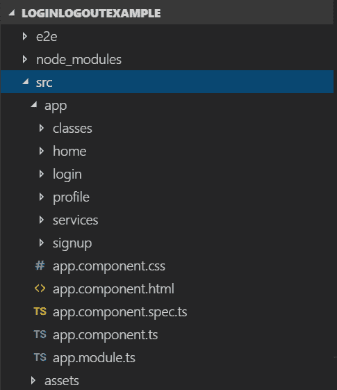
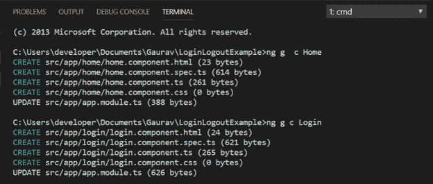
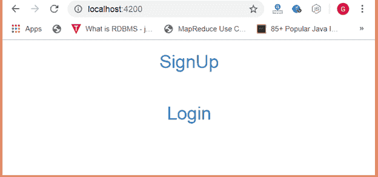

# Spring 角度登录和注销应用程序

> 原文：<https://www.javatpoint.com/angular-spring-login-and-logout-example>

在本节中，我们将创建一个登录和注销 web 应用程序。这个应用程序包括一个注册和登录表单。在这个集成中，我们使用 Spring 来处理后端部分，Angular 来处理前端部分。

## 应用程序的工作

*   一旦我们在服务器上部署了我们的应用程序，就会生成一个欢迎页面，其中包含两个链接——注册和登录。
*   新用户可以选择注册，并通过填写所需的详细信息进行注册。
*   但是，现有用户可以使用他们的电子邮件 id 和密码登录。
*   登录后，我们可以获取现有用户的详细信息。
*   最后，我们可以通过点击注销链接退出当前状态。

## 要使用的工具

*   使用任何 IDE 来开发 Spring 和 Hibernate 项目。可能是 MyEclipse/Eclipse/Netbeans。这里，我们使用的是 Eclipse。
*   数据库的 MySQL。
*   使用任何集成开发环境来开发 Angular 项目。可能是 Visual Studio 代码/崇高。这里，我们使用的是 Visual Studio 代码。
*   服务器:Apache Tomcat/JBoss/Glassfish/Weblogic/Websphere。

## 我们使用的技术

在这里，我们使用以下技术:

*   春天 5
*   休眠 5
*   角度 6
*   关系型数据库

## 创建数据库

让我们创建一个数据库**登录示例**。不需要创建表，因为 Hibernate 是自动创建的。

## 弹簧模块

让我们看看我们需要遵循的 Spring 的目录结构:


要开发登录和注销应用程序，请执行以下步骤

*   向 pom.xml 文件添加依赖项。

```
<project  xmlns:xsi="http://www.w3.org/2001/XMLSchema-instance"
  xsi:schemaLocation="http://maven.apache.org/POM/4.0.0 http://maven.apache.org/maven-v4_0_0.xsd">
  <modelVersion>4.0.0</modelVersion>
  <groupId>com.javatpoint</groupId>
  <artifactId>LoginLogoutExample</artifactId>
  <packaging>war</packaging>
  <version>0.0.1-SNAPSHOT</version>
  <name>LoginLogoutExample Maven Webapp</name>
  <url>http://maven.apache.org</url>

  	<properties>
		<springframework.version>5.0.6.RELEASE</springframework.version>
		<hibernate.version>5.2.16.Final</hibernate.version>
		<mysql.connector.version>5.1.45</mysql.connector.version>
		<c3po.version>0.9.5.2</c3po.version>

		<maven.compiler.source>1.8</maven.compiler.source>
		<maven.compiler.target>1.8</maven.compiler.target>
	</properties>

  <dependencies>

  <!-- Spring -->
	<dependency>
		<groupId>org.springframework</groupId>
		<artifactId>spring-webmvc</artifactId>
		<version>${springframework.version}</version>
	</dependency>

	<dependency>
		<groupId>org.springframework</groupId>
		<artifactId>spring-tx</artifactId>
		<version>${springframework.version}</version>
	</dependency>

	<dependency>
		<groupId>org.springframework</groupId>
		<artifactId>spring-orm</artifactId>
		<version>${springframework.version}</version>
	</dependency>

	<!-- Add Jackson for JSON converters -->
	<dependency>
		<groupId>com.fasterxml.jackson.core</groupId>
		<artifactId>jackson-databind</artifactId>
		<version>2.9.5</version>
	</dependency>

	<!-- Hibernate -->
	<dependency>
		<groupId>org.hibernate</groupId>
		<artifactId>hibernate-core</artifactId>
		<version>${hibernate.version}</version>
	</dependency>

	<!-- MySQL -->
	<dependency>
		<groupId>mysql</groupId>
		<artifactId>mysql-connector-java</artifactId>
		<version>${mysql.connector.version}</version>
	</dependency>

	<!-- C3PO -->
	<dependency>
		<groupId>com.mchange</groupId>
		<artifactId>c3p0</artifactId>
		<version>${c3po.version}</version>
	</dependency>

	<!-- Servlet+JSP+JSTL -->
	<dependency>
		<groupId>javax.servlet</groupId>
		<artifactId>javax.servlet-api</artifactId>
		<version>3.1.0</version>
	</dependency>

	<dependency>
		<groupId>javax.servlet.jsp</groupId>
		<artifactId>javax.servlet.jsp-api</artifactId>
		<version>2.3.1</version>
	</dependency>

	<dependency>
		<groupId>javax.servlet</groupId>
		<artifactId>jstl</artifactId>
		<version>1.2</version>
	</dependency>

	<!-- to compensate for java 9 not including jaxb -->
	<dependency>
		<groupId>javax.xml.bind</groupId>
		<artifactId>jaxb-api</artifactId>
		<version>2.3.0</version>
	</dependency>

	<!--  Web token dependency -->
    <dependency>
    	<groupId>io.jsonwebtoken</groupId>
    	<artifactId>jjwt</artifactId>
    	<version>0.9.1</version>
	</dependency>

 	<!--  JUnit dependency -->
    <dependency>
        <groupId>junit</groupId>
        <artifactId>junit</artifactId>
        <version>3.8.1</version>
        <scope>test</scope>
    </dependency>

	<!-- https://mvnrepository.com/artifact/org.apache.commons/commons-dbcp2 -->
	<dependency>
	    <groupId>org.apache.commons</groupId>
	    <artifactId>commons-dbcp2</artifactId>
	    <version>2.0</version>
	</dependency> 

  </dependencies>

  <build>
    <finalName>LoginLogoutExample</finalName>
  </build>
</project>

```

*   创建配置类
    代替 XML，我们执行基于注释的配置。因此，我们创建了两个类，并在其中指定了所需的配置。

**DemoAppConfig.java**

```
package com.javatpoint.LoginLogoutExample.config;

import java.beans.PropertyVetoException;
import java.util.Properties;
import javax.sql.DataSource;
import org.hibernate.SessionFactory;
import org.springframework.beans.factory.annotation.Autowired;
import org.springframework.context.annotation.Bean;
import org.springframework.context.annotation.ComponentScan;
import org.springframework.context.annotation.Configuration;
import org.springframework.context.annotation.PropertySource;
import org.springframework.core.env.Environment;
import org.springframework.orm.hibernate5.HibernateTransactionManager;
import org.springframework.orm.hibernate5.LocalSessionFactoryBean;
import org.springframework.transaction.annotation.EnableTransactionManagement;
import org.springframework.web.servlet.config.annotation.EnableWebMvc;

import org.springframework.web.servlet.config.annotation.WebMvcConfigurer;

import com.mchange.v2.c3p0.ComboPooledDataSource;

@Configuration
@EnableWebMvc
@EnableTransactionManagement
@ComponentScan("com.javatpoint.LoginLogoutExample")
@PropertySource(value = { "classpath:persistence-mysql.properties" })
@PropertySource(value = { "classpath:persistence-mysql.properties" })
@PropertySource(value = { "classpath:application.properties" })
public class DemoAppConfig implements WebMvcConfigurer {

	@Autowired
	private Environment env;

	@Bean
	public DataSource myDataSource() {

		// create connection pool
		ComboPooledDataSource myDataSource = new ComboPooledDataSource();

		// set the jdbc driver
		try {
			myDataSource.setDriverClass("com.mysql.jdbc.Driver");		
		}
		catch (PropertyVetoException exc) {
			throw new RuntimeException(exc);
		}

		// set database connection props
		myDataSource.setJdbcUrl(env.getProperty("jdbc.url"));
		myDataSource.setUser(env.getProperty("jdbc.user"));
		myDataSource.setPassword(env.getProperty("jdbc.password"));

		// set connection pool props
		myDataSource.setInitialPoolSize(getIntProperty("connection.pool.initialPoolSize"));
		myDataSource.setMinPoolSize(getIntProperty("connection.pool.minPoolSize"));
		myDataSource.setMaxPoolSize(getIntProperty("connection.pool.maxPoolSize"));		
		myDataSource.setMaxIdleTime(getIntProperty("connection.pool.maxIdleTime"));

		return myDataSource;
	}

	private Properties getHibernateProperties() {

		// set hibernate properties
		Properties props = new Properties();
		props.setProperty("hibernate.dialect", env.getProperty("hibernate.dialect"));
		props.setProperty("hibernate.show_sql", env.getProperty("hibernate.show_sql"));
		props.setProperty("hibernate.format_sql", env.getProperty("hibernate.format_sql"));
		props.setProperty("hibernate.hbm2ddl.auto", env.getProperty("hibernate.hbm2ddl"));
		return props;				
	}

	// need a helper method 
		// read environment property and convert to int

		private int getIntProperty(String propName) {

			String propVal = env.getProperty(propName);

			// now convert to int
			int intPropVal = Integer.parseInt(propVal);
			return intPropVal;
		}

		@Bean
		public LocalSessionFactoryBean sessionFactory(){

			// create session factory
			LocalSessionFactoryBean sessionFactory = new LocalSessionFactoryBean();

			// set the properties
			sessionFactory.setDataSource(myDataSource());
			sessionFactory.setPackagesToScan(env.getProperty("hibernate.packagesToScan"));
			sessionFactory.setHibernateProperties(getHibernateProperties());

			return sessionFactory;
		}

		@Bean
		@Autowired
		public HibernateTransactionManager transactionManager(SessionFactory sessionFactory) {

			// setup transaction manager based on session factory
			HibernateTransactionManager txManager = new HibernateTransactionManager();
			txManager.setSessionFactory(sessionFactory);

			return txManager;
		}	

}

```

**鼠标 pringgmvcdispatcher serviceinitiator . Java**

```
package com.javatpoint.LoginLogoutExample.config;

import org.springframework.web.servlet.support.AbstractAnnotationConfigDispatcherServletInitializer;

public class MySpringMvcDispatcherServletInitializer extends AbstractAnnotationConfigDispatcherServletInitializer {

	@Override
	protected Class<?>[] getRootConfigClasses() {
		// TODO Auto-generated method stub
		return null;
	}

	@Override
	protected Class<?>[] getServletConfigClasses() {
		return new Class[] { DemoAppConfig.class };
	}

	@Override
	protected String[] getServletMappings() {
		return new String[] { "/" };
	}

}

```

*   创建实体类
    这里，我们正在创建以下实体类:
    1.  AdminDetail.java-这是一个实体/POJO(普通旧 Java 对象)类。
    2.  Token.java-它用于身份验证目的。

**AdminDetail.java**

```
package com.javatpoint.LoginLogoutExample.entity;

import javax.persistence.Column;
import javax.persistence.Entity;
import javax.persistence.GeneratedValue;
import javax.persistence.GenerationType;
import javax.persistence.Id;
import javax.persistence.Table;

@Entity
@Table(name="admin_detail")
public class AdminDetail {

	@Id
	@GeneratedValue(strategy=GenerationType.AUTO)
	@Column(name="admin_id")
	private int adminID;

	@Column(name="email_id" , unique=true)
	public String emailId;

	@Column(name="name")
	public String name;

	@Column(name="password")
	public String password;

	@Column(name="role")
	public String role;

	public AdminDetail() { }

	public AdminDetail(int adminID, String emailId, String name, String password, String role) {
		super();
		this.adminID = adminID;
		this.emailId = emailId;
		this.name = name;
		this.password = password;
		this.role = role;
	}

	public int getAdminID() {
		return adminID;
	}

	public void setAdminID(int adminID) {
		this.adminID = adminID;
	}

	public String getEmailId() {
		return emailId;
	}

	public void setEmailId(String emailId) {
		this.emailId = emailId;
	}

	public String getName() {
		return name;
	}

	public void setName(String name) {
		this.name = name;
	}

	public String getPassword() {
		return password;
	}

	public void setPassword(String password) {
		this.password = password;
	}

	public String getRole() {
		return role;
	}

	public void setRole(String role) {
		this.role = role;
	}

	@Override
	public String toString() {
		return "AdminDetail [adminID=" + adminID + ", emailId=" + emailId + ", name=" + name + ", password=" + password
				+ ", role=" + role + "]";
	}

}

```

**令牌. java**

```
package com.javatpoint.LoginLogoutExample.entity;

import javax.persistence.Column;
import javax.persistence.Entity;
import javax.persistence.GeneratedValue;
import javax.persistence.GenerationType;
import javax.persistence.Id;
import javax.persistence.Table;

@Entity
@Table(name="Token")
public class Token {

	@Id
	@GeneratedValue(strategy=GenerationType.AUTO)
	@Column(name="token_id")
	private int tokenID;

	@Column(name="user_id" , unique=true)
	private int userID;

	@Column(name="authenticationToken")
	private String authenticationToken;

	@Column(name="secretKey")
	private String secretKey;

	@Column(name="email_id")
	private String emailId;

	public Token() { }

	public Token(int tokenID, int userID, String authenticationToken, String secretKey, String emailId) {
		super();
		this.tokenID = tokenID;
		this.userID = userID;
		this.authenticationToken = authenticationToken;
		this.secretKey = secretKey;
		this.emailId = emailId;
	}

	public int getTokenID() {
		return tokenID;
	}

	public void setTokenID(int tokenID) {
		this.tokenID = tokenID;
	}

	public int getUserID() {
		return userID;
	}

	public void setUserID(int userID) {
		this.userID = userID;
	}

	public String getAuthenticationToken() {
		return authenticationToken;
	}

	public void setAuthenticationToken(String authenticationToken) {
		this.authenticationToken = authenticationToken;
	}

	public String getSecretKey() {
		return secretKey;
	}

	public void setSecretKey(String secretKey) {
		this.secretKey = secretKey;
	}

	public String getEmailId() {
		return emailId;
	}

	public void setEmailId(String emailId) {
		this.emailId = emailId;
	}

	@Override
	public String toString() {
		return "Token [tokenID=" + tokenID + ", userID=" + userID + ", authenticationToken=" + authenticationToken
				+ ", secretKey=" + secretKey + ", emailId=" + emailId + "]";
	}

}

```

*   创建 DAO 接口
    这里，我们正在创建两个 DAO 接口来执行数据库相关的操作。

**AdminDAO.java**

```
package com.javatpoint.LoginLogoutExample.DAO.interfaces;

import java.util.List;
import com.javatpoint.LoginLogoutExample.entity.AdminDetail;

public interface AdminDAO {

	public int saveAdminDetail(AdminDetail adminDetail);

	public int adminLogin(String emailId , String password);

	public List<AdminDetail> getAdminData();
}

```

**令牌道.java**

```
package com.javatpoint.LoginLogoutExample.DAO.interfaces;

public interface TokenDAO {

	public void saveUserEmail(String email , int adminId);

	public boolean updateToken(String email , String authenticationToken , String secretKey);

	public int getTokenDetail(String email );

	public int tokenAuthentication(String token , int emailId);

}

```

*   创建 DAO 接口实现类

**AdminDAOImpl.java**

```
package com.javatpoint.LoginLogoutExample.DAO.implementation;

import java.util.List;
import org.hibernate.Session;
import org.hibernate.SessionFactory;
import org.hibernate.query.Query;
import org.springframework.beans.factory.annotation.Autowired;
import org.springframework.stereotype.Repository;
import com.javatpoint.LoginLogoutExample.DAO.interfaces.AdminDAO;
import com.javatpoint.LoginLogoutExample.entity.AdminDetail;

@Repository("adminDAO")
public class AdminDAOImpl implements AdminDAO {

	// Autowired SessionFactory Object So that we can get session object used for interaction with Database.
	@Autowired
	private SessionFactory sessionFactory;

	/*
	 * Register Admin Details. 
	*/
	public int saveAdminDetail(AdminDetail adminDetail) {

		Session session = null;
		try
		{
			session = sessionFactory.getCurrentSession();

			int id = (Integer) session.save(adminDetail);
			return id;
		}
		catch(Exception exception)
		{
			System.out.println("Excecption while saving admin Details : " + exception.getMessage());
			return 0;
		}
		finally
		{
			session.flush();
		}
	}

	public int adminLogin(String emailId, String password) {

		Session session = null;
		try
		{
			session = sessionFactory.getCurrentSession();

			Query query = session.createQuery("from AdminDetail where emailId=:emailId and password=:password");
			query.setParameter("emailId", emailId);
			query.setParameter("password", password);
			List<AdminDetail> list = query.list();

			int size = list.size();
			if(size == 1)
			{
				return list.get(0).getAdminID();
			}
			else
			{
				return -1;
			}
		}
		catch(Exception exception)
		{
			System.out.println("Excecption while saving admin Details : " + exception.getMessage());
			return 0;
		}
		finally
		{
			session.flush();
		}

	}

	public List<AdminDetail> getAdminData() {
		Session session = null;
		try
		{
			session = sessionFactory.getCurrentSession();

			Query<AdminDetail> query = session.createQuery("from AdminDetail");
			List<AdminDetail> list = query.list();

			if(list.size() > 0)
			{
				return list;
			}
			else
			{
				return null;
			}

		}
		catch(Exception exception)
		{
			System.out.println("Excecption while saving admin Details : " + exception.getMessage());
			return null;
		}
		finally
		{
			session.flush();
		}

	}

}

```

**token Dao imple . Java**

```
package com.javatpoint.LoginLogoutExample.DAO.implementation;

import java.util.List;
import org.hibernate.Session;
import org.hibernate.SessionFactory;
import org.hibernate.query.Query;
import org.springframework.beans.factory.annotation.Autowired;
import org.springframework.stereotype.Repository;
import com.javatpoint.LoginLogoutExample.DAO.interfaces.TokenDAO;
import com.javatpoint.LoginLogoutExample.entity.Token;

@Repository("tokenDAO")
public class TokenDAOImpl implements TokenDAO  {

	@Autowired
	SessionFactory sessionFactory;

	public void saveUserEmail(String email, int adminId) {
		Session session = null; 
		try
		{
			session = sessionFactory.getCurrentSession();
			Token t = new Token();
			t.setUserID(adminId);
			t.setEmailId(email);
			session.save(t); 
		}
		catch(Exception exception)
		{
			System.out.println("Exception in saving UserEmail In Token Table :: " + exception.getMessage());
		}
		finally
		{
			session.flush();
		}

	}

	public boolean updateToken(String email, String authenticationToken, String secretKey) {
		Session session = null;
		try 
		{
			session = sessionFactory.getCurrentSession();
			Query theQuery = null;		

			theQuery = session.createQuery("Update Token set authenticationToken = :authenticationToken , secretKey = :secretKey where emailId =:userEmail ");

			theQuery.setParameter("authenticationToken", authenticationToken);
			theQuery.setParameter("userEmail", email);
			theQuery.setParameter("secretKey", secretKey);

			int result = theQuery.executeUpdate();

			if(result == 1)
			{
				return true;
			}
			else
			{
				return false;
			}
		}
		catch(Exception exception)
		{
			System.out.println("Error while updating token :: " + exception.getMessage());
			return false;
		}
		finally
		{
			session.flush();
		}			
	}

	public int getTokenDetail(String email) {
		Session session = null;
		try
		{
			session = sessionFactory.getCurrentSession();
			Query<Token> query = session.createQuery("from Token where emailId =:userEmail");
			query.setParameter("userEmail", email);

			List<Token> tokenDetails = query.list();

			if(tokenDetails.size() > 0)
			{
				return tokenDetails.get(0).getTokenID();
			}
			else
			{
				return 0;
			}

		}
		catch(Exception exception)
		{
			System.out.println("Exception while getting token ID :: " + exception.getMessage());		
		}
		finally
		{
			session.flush();
		}

		return 0;
	}

	public int tokenAuthentication(String token, int emailId) {
		Session session = null;

		try 
		{
			session = sessionFactory.getCurrentSession();

			Query query = session.createQuery("from Token where userID =:userID and authenticationToken = :token");
			query.setParameter("userID", emailId);
			query.setParameter("token", token);
			List<Token> tokenDetails = query.list();

			if(tokenDetails.size() > 0)
			{
				return tokenDetails.get(0).getTokenID();
			}
			else
			{
				return 0;
			}

		}
		catch(Exception exception)
		{
			System.out.println("Exception while Authenticating token :: "+ exception);
			return 0;
		}
		finally
		{
			session.flush();
		}

	}

}

```

*   创建服务层接口

在这里，我们创建了服务层接口，作为 DAO 和实体类之间的桥梁。

**管理服务. java**

```
package com.javatpoint.LoginLogoutExample.service.interfaces;

import java.util.List;
import com.javatpoint.LoginLogoutExample.entity.AdminDetail;

public interface AdminService {

	public int saveAdminDetail(AdminDetail adminDetail);

	public int adminLogin(String emailId , String password);

	public List<AdminDetail> getAdminData();
}

```

**TokenService.java**

```
package com.javatpoint.LoginLogoutExample.service.interfaces;

public interface TokenService {

	public void saveUserEmail(String email , int adminId);

	public boolean updateToken(String email , String authenticationToken , String secretKey);

	public int getTokenDetail(String email );

	public int tokenAuthentication(String token , int emailId);

}

```

*   创建服务层实现类

**admin service example . Java**

```
package com.javatpoint.LoginLogoutExample.service.implementation;

import java.util.List;
import javax.transaction.Transactional;
import org.springframework.beans.factory.annotation.Autowired;
import org.springframework.stereotype.Service;
import com.javatpoint.LoginLogoutExample.DAO.interfaces.AdminDAO;
import com.javatpoint.LoginLogoutExample.entity.AdminDetail;
import com.javatpoint.LoginLogoutExample.service.interfaces.AdminService;

@Service("adminService")
public class AdminServiceImpl implements AdminService {

	@Autowired
	private AdminDAO adminDAO;

	@Transactional
	public int saveAdminDetail(AdminDetail adminDetail) {
		return adminDAO.saveAdminDetail(adminDetail);
	}

	@Transactional
	public int adminLogin(String emailId, String password) {
		return adminDAO.adminLogin(emailId, password);
	}

	@Transactional
	public List getAdminData() {
		return adminDAO.getAdminData();
	}

} 
```

**TokenServiceImpl.java**

```
package com.javatpoint.LoginLogoutExample.service.implementation;

import javax.transaction.Transactional;
import org.springframework.beans.factory.annotation.Autowired;
import org.springframework.stereotype.Service;
import com.javatpoint.LoginLogoutExample.DAO.interfaces.TokenDAO;
import com.javatpoint.LoginLogoutExample.service.interfaces.TokenService;

@Service("tokenService")
public class TokenServiceImpl implements TokenService {

	@Autowired
	private TokenDAO tokenDAO;

	@Transactional
	public void saveUserEmail(String email, int adminId) {
		tokenDAO.saveUserEmail(email, adminId);
	}

	@Transactional
	public boolean updateToken(String email, String authenticationToken, String secretKey) {
		return tokenDAO.updateToken(email, authenticationToken, secretKey);
	}

	@Transactional
	public int getTokenDetail(String email) {
		return tokenDAO.getTokenDetail(email);
	}

	@Transactional
	public int tokenAuthentication(String token, int emailId) {
		return tokenDAO.tokenAuthentication(token, emailId);
	}

}

```

*   创建令牌类

**GenerateToken.java**

```
package com.javavtpoint.LoginLogoutExample.Token;

import javax.crypto.spec.SecretKeySpec;
import javax.xml.bind.DatatypeConverter;
import java.security.Key;
import java.util.Date;
import java.util.Random;

import io.jsonwebtoken.*;

public class GenerateToken {

public String[] createJWT(String id, String issuer, String subject, String role , long ttlMillis) {

	    //The JWT signature algorithm we will be using to sign the token
	    SignatureAlgorithm signatureAlgorithm = SignatureAlgorithm.HS256;

	    long nowMillis = System.currentTimeMillis();
	    Date now = new Date(nowMillis);

		Random random = new Random();
		String secretKey = id  + Integer.toString(random.nextInt(1000));

	    byte[] apiKeySecretBytes = DatatypeConverter.parseBase64Binary(secretKey);

	    Key signingKey = null;
	    try{

	    	signingKey = new SecretKeySpec(apiKeySecretBytes, signatureAlgorithm.getJcaName());
	    }
	    catch(Exception e)
	    {
	    	System.out.println("Exception while generating key " + e.getMessage() );
	    }

	    JwtBuilder builder = Jwts.builder().setId(id)
	                                .setIssuedAt(now)
	                                .setSubject(subject)
	                                .setIssuer(issuer)
	                                .setPayload(role)
	                                .signWith(signatureAlgorithm, signingKey);

	    //if it has been specified, let's add the expiration
	    if (ttlMillis >= 0) {
	    long expMillis = nowMillis + ttlMillis;
	        Date exp = new Date(expMillis);
	        builder.setExpiration(exp);
	    }

	    String[] tokenInfo = {builder.compact() , secretKey};
	    return tokenInfo;

	}
}

```

*   创建控制器类

**AdminController.java**

```
package com.javatpoint.LoginLogoutExample.restController;

import java.util.List;
import org.springframework.beans.factory.annotation.Autowired;
import org.springframework.http.HttpHeaders;
import org.springframework.http.HttpStatus;
import org.springframework.http.ResponseEntity;
import org.springframework.web.bind.annotation.CrossOrigin;
import org.springframework.web.bind.annotation.GetMapping;
import org.springframework.web.bind.annotation.PathVariable;
import org.springframework.web.bind.annotation.PostMapping;
import org.springframework.web.bind.annotation.RequestBody;
import org.springframework.web.bind.annotation.RequestHeader;
import org.springframework.web.bind.annotation.RequestMapping;
import org.springframework.web.bind.annotation.RestController;

import com.javatpoint.LoginLogoutExample.entity.AdminDetail;
import com.javatpoint.LoginLogoutExample.service.interfaces.AdminService;
import com.javatpoint.LoginLogoutExample.service.interfaces.TokenService;
import com.javavtpoint.LoginLogoutExample.Token.GenerateToken;

@RestController
@RequestMapping("/api")
@CrossOrigin(origins = "http://localhost:4200", allowedHeaders = "*", exposedHeaders = "Authorization")
public class AdminController {

	@Autowired
	private AdminService adminService;

	@Autowired
	private TokenService tokenService;

	GenerateToken generateToken = new GenerateToken();

	@PostMapping("/saveAdmin")
	public int saveAdminDetail(@RequestBody AdminDetail adminDetail) {
		return adminService.saveAdminDetail(adminDetail);
	}

	@PostMapping("/login")
	public ResponseEntity<Integer> login(@RequestBody AdminDetail adminDetail)
	{
		int status;
		HttpHeaders httpHeader = null;

		// Authenticate User.
		status = adminService.adminLogin(adminDetail.getEmailId(), adminDetail.getPassword());

		/*
		 * If User is authenticated then Do Authorization Task.
		 */
		if (status > 0) 
		{
			/*
			 * Generate token.
			 */
			String tokenData[] = generateToken.createJWT(adminDetail.getEmailId(), "JavaTpoint", "JWT Token",
					adminDetail.getRole(), 43200000);

			// get Token.
			String token = tokenData[0];

			System.out.println("Authorization :: " + token);

			// Create the Header Object
			httpHeader = new HttpHeaders();

			// Add token to the Header.
			httpHeader.add("Authorization", token);

			// Check if token is already exist.
			long isUserEmailExists = tokenService.getTokenDetail(adminDetail.getEmailId());

			/*
			 * If token exist then update Token else create and insert the token.
			 */
			if (isUserEmailExists > 0) 
			{
				tokenService.updateToken(adminDetail.getEmailId(), token, tokenData[1]);
			} 
			else 
			{
				tokenService.saveUserEmail(adminDetail.getEmailId(), status);
				tokenService.updateToken(adminDetail.getEmailId(), token, tokenData[1]);
			}

			return new ResponseEntity<Integer>(status, httpHeader, HttpStatus.OK);
		} 

		// if not authenticated return  status what we get.
		else 
		{
			return new ResponseEntity<Integer>(status, httpHeader, HttpStatus.OK);
		}

	}

	@GetMapping("/getAdminData/{adminId}")
	public List<AdminDetail> getAdminData(@PathVariable int adminId, @RequestHeader("Authorization") String authorizationToken)
	{
		String token[] = authorizationToken.split(" ");
		int result = tokenService.tokenAuthentication(token[1], adminId);

		if (result > 0) {
			return adminService.getAdminData();
		} else {
			return null;
		}
	}

}

```

*   **创建属性文件**

这里，我们在项目中的 **src/main/resources** 内创建属性文件。以下文件包含休眠连接配置。

**持久性-mysql.properties**

```
#
# JDBC connection properties
#
jdbc.driver=com.mysql.jdbc.Driver
jdbc.url=jdbc:mysql://localhost:3306/loginlogoutexample?useSSL=false
jdbc.user=root
jdbc.password=

#
# Connection pool properties
#
connection.pool.initialPoolSize=5
connection.pool.minPoolSize=5
connection.pool.maxPoolSize=20
connection.pool.maxIdleTime=3000

#
# Hibernate properties
#

hibernate.dialect=org.hibernate.dialect.MySQL5Dialect
hibernate.show_sql=true
hibernate.format_sql=true
hibernate.hbm2ddl=update
hibernate.packagesToScan=com.javatpoint.LoginLogoutExample.entity

```

## 角度模块

让我们看看 Angular 的目录结构，我们需要遵循:



*   创建角度项目

让我们使用以下命令创建一个角度项目:

*ng 新登录示例*

这里，LoginLogoutExample 是项目的名称。

## 安装引导 CSS 框架

使用以下命令在项目中安装引导。

*npm 安装[【邮件保护】](/cdn-cgi/l/email-protection) -保存*

现在，在 style.css 文件中包含以下代码。

```
@import "~bootstrap/dist/css/bootstrap.css";

```

*   生成组件
    在 visual studio 中打开项目，然后使用以下命令生成以下 Angular 组件:
    *ng g c Home*
    T5】ng g c 登录
    T8】ng g c 注册
    T11】ng g c Profile




让我们也使用下面的命令创建一个服务类

*天然气服务/管理*


*   编辑 **app.module.ts** 文件
    *   **实现路由** -这里，我们正在导入 **@angular/router** 包中存在的**路由模块**，并在导入数组中定义路径。
    *   **导入 ReactiveFormsModule** -这里，我们正在导入 **ReactiveFormsModule** 用于反应表单，并在导入数组中指定它。
    *   **导入 HttpModule** -这里，我们正在为服务器请求导入 **HttpModule** ，并在导入数组中指定它。
    *   **注册服务类** -这里，我们提到的是提供者数组中的服务类。

```
import { BrowserModule } from '@angular/platform-browser';
import { NgModule } from '@angular/core';

// import Http module
import { HttpModule} from '@angular/http';

// import ReactiveFormsModule for reactive form
import { ReactiveFormsModule } from '@angular/forms';

// import module for Routing.
import { RouterModule } from '@angular/router';

import { AppComponent } from './app.component';
import { LoginComponent } from './login/login.component';
import { HomeComponent } from './home/home.component';
import { SignupComponent } from './signup/signup.component';
import { AdminService } from './services/admin.service';
import { ProfileComponent } from './profile/profile.component';

@NgModule({
  declarations: [
    AppComponent,
    LoginComponent,
    HomeComponent,
    SignupComponent,
    ProfileComponent
  ],
  imports: [
    BrowserModule,
    ReactiveFormsModule,
    HttpModule,
    RouterModule.forRoot([
      {
        path : '',
        component : HomeComponent 
      },
      {
        path : 'login',
        component : LoginComponent  
      },
      {
        path : 'signup',
        component : SignupComponent 
      },
      {
        path : 'profile/:adminId',
        component : ProfileComponent
      }
    ])

  ],
  providers: [
    AdminService
  ],
  bootstrap: [AppComponent]
})
export class AppModule { }

```

*   编辑**app.component.html**文件

```
<router-outlet></router-outlet>

```

*   编辑**home.component.html**文件
    这是应用程序的欢迎页面，包括两个链接——注册和登录。

```
<div style="text-align: center">

    <h2>  <a [routerLink]="['/signup']">SignUp</a> <br><br> </h2>
    <h2>  <a [routerLink]="['/login']">Login</a> <br><br> </h2>

</div>

```



*   创建**管理详细信息**类

让我们使用以下命令创建一个类:-

*ng g 类类/AdminDetail*


现在，在 **AdminDetail** 类中指定必填字段。

```
export class AdminDetail {
    emailId : string;
    name : string;
    password : string ;
    role : string;
}

```

这个类的目的是将指定的字段映射到 Spring 实体类的字段。

*   编辑**管理服务文件**

```
import { Injectable } from '@angular/core';
import { Http, RequestOptions , Headers } from '@angular/http';
import { Observable } from 'rxjs';
import { AdminDetail } from '../classes/admin-detail';
import { Router } from '@angular/router';

import { JwtHelperService } from '@auth0/angular-jwt';

@Injectable({
  providedIn: 'root'
})
export class AdminService {

  // Base URL
  private  baseUrl = "http://localhost:8080/LoginLogoutExample/api/";

  constructor(private http: Http, private router : Router) { }

  saveAdminDetails(adminDetail : AdminDetail) : Observable {
      let url = this.baseUrl + "saveAdmin";
      return this.http.post(url,adminDetail);
  }

  login(adminDetail : AdminDetail) : Observable <any>{
      let url = this.baseUrl + "login";
      return this.http.post(url, adminDetail);
  }

  logout() 
  { 
    // Remove the token from the localStorage.
    localStorage.removeItem('token');

    this.router.navigate(['']);

  }

  /*
  * Check whether User is loggedIn or not.
  */

  isLoggedIn() { 

    // create an instance of JwtHelper class.
    let jwtHelper = new JwtHelperService();

    // get the token from the localStorage as we have to work on this token.
    let token = localStorage.getItem('token');

    // check whether if token have something or it is null.
    if(!token)
    {
      return false;
    }

    // get the Expiration date of the token by calling getTokenExpirationDate(String) method of JwtHelper class. this method accepts a string value which is nothing but a token.

    if(token)
    {
      let expirationDate = jwtHelper.getTokenExpirationDate(token);

      // check whether the token is expired or not by calling isTokenExpired() method of JwtHelper class.

      let isExpired = jwtHelper.isTokenExpired(token);

      return !isExpired;    
    }   
  }

  getAdminDetail(adminId) : Observable <any>{
      let url = this.baseUrl + "getAdminData/" + adminId;

       // create an instance of Header object.
      let headers = new Headers();

      // get token from localStorage.
      let token = localStorage.getItem('token');

      // Append Authorization header.
      headers.append('Authorization' , 'Bearer ' + token);

      // create object of RequestOptions and include that in it.
      let options = new RequestOptions( { headers : headers } );

      return this.http.get(url , options);
  }

}</any></any> 
```

*   编辑**注册组件文件**

```
import { Component, OnInit } from '@angular/core';
import { FormGroup, FormControl, Validators } from '@angular/forms';
import { AdminDetail } from '../classes/admin-detail';
import { AdminService } from '../services/admin.service';
import { Router } from '@angular/router';

@Component({
  selector: 'app-signup',
  templateUrl: './signup.component.html',
  styleUrls: ['./signup.component.css']
})
export class SignupComponent implements OnInit {

  private adminDetail = new AdminDetail();

  constructor(private adminService : AdminService, private router : Router) { }

  ngOnInit() {
  }

  // create the form object.
  form = new FormGroup({
      fullName : new FormControl('' , Validators.required),
      email : new FormControl('' , Validators.required),
      password : new FormControl('' , Validators.required),
      confirmPassword : new FormControl('' , Validators.required),
      role : new FormControl('' , Validators.required),
  });

  AdminForm(AdminInformation)
  {
     let pass = this.Password.value;
     let confirmPass = this.ConfirmPassword.value;

     if(pass == confirmPass)
     {
        this.adminDetail.name = this.FullName.value;
        this.adminDetail.emailId = this.Email.value;
        this.adminDetail.password = this.Password.value;
        this.adminDetail.role = this.Role.value;

        this.adminService.saveAdminDetails(this.adminDetail).subscribe(
          response => {
              let result = response.json();

              if(result > 0)
              {
                this.router.navigate(['/login']);
              }
              else
              {
                  alert("error occur while registring User. please try after sometime.")
              }
          },
          error => {
            alert("error occur while registring User. please try after sometime.")
          }
        );

     }
     else
     {
        alert("Password and confirm password not match.");
     }
  }

  get FullName(){
    return this.form.get('fullName');
  }

  get Email(){
      return this.form.get('email');
  }

  get Password(){
      return this.form.get('password');
  }

  get ConfirmPassword(){
      return this.form.get('confirmPassword');
  }

  get Role(){
      return this.form.get('role');
  }

}

```

*   编辑**signup.component.html**文件

```
<h2>SignUp form</h2>

<form [formGroup]="form" #AdminInformation (ngSubmit)="AdminForm(AdminInformation)">

  <div class="row">
    <div class=" col-md-offset-1 col-md-4">
        <label for="fullName"> Name </label>
        <input formControlName="fullName" class="form-control" type="text"> 
    </div>
  </div>

  <div class="row">
    <div class=" col-md-offset-1 col-md-4">
        <label for="email"> Email </label>
        <input formControlName="email" class="form-control" type="text"> 
    </div>
  </div>

  <div class="row">
    <div class=" col-md-offset-1 col-md-4">
        <label for="password"> Password </label>
        <input formControlName="password" class="form-control" type="password"> 
    </div>
  </div>

  <div class="row">
    <div class=" col-md-offset-1 col-md-4">
        <label for="confirmPassword"> Confirm Password </label>
        <input formControlName="confirmPassword" class="form-control" type="password"> 
    </div>
  </div>

  <div class="row">
    <div class=" col-md-offset-1 col-md-4">
        <label for="role"> Role </label>
        <input formControlName="role" class="form-control" type="text"> 
    </div>
  </div>

  <div class="row" style="margin-top: 40px;">
    <div class="col-md-offset-1 col-md-4">
        <button class="btn btn-md btn-primary btn-style"  >Save</button>
    </div>
  </div>

</form>

```


*   编辑**登录组件文件**

```
import { Component, OnInit } from '@angular/core';
import { FormGroup, Validators, FormControl } from '@angular/forms';
import { AdminDetail } from '../classes/admin-detail';
import { AdminService } from '../services/admin.service';
import { Router } from '@angular/router';

@Component({
  selector: 'app-login',
  templateUrl: './login.component.html',
  styleUrls: ['./login.component.css']
})
export class LoginComponent implements OnInit {

  private adminDetail = new AdminDetail();

  constructor(private adminService : AdminService, private router : Router) { }

  ngOnInit() {
    if((this.adminService.isLoggedIn()) )
    {
        this.router.navigate(['/profile' , localStorage.getItem('id')]);
    }
    else
    {
        this.router.navigate(['/login']);
    }
  }

  // create the form object.
  form = new FormGroup({
    email : new FormControl('' , Validators.required),
    password : new FormControl('' , Validators.required)
  });

  Login(LoginInformation)
  {
      this.adminDetail.emailId = this.Email.value;
      this.adminDetail.password = this.Password.value;

      this.adminService.login(this.adminDetail).subscribe(
        response => {
            let result =  response.json();

            if(result > 0)
            {
              let token = response.headers.get("Authorization");

              localStorage.setItem("token" , token);
              localStorage.setItem("id" , result);

              this.router.navigate(['/profile', result]);
            }
            if(result == -1)
            {
              alert("please register before login Or Invalid combination of Email and password");
            }

        },
        error => {
            console.log("Error in authentication");
        }
      );
  }

  get Email(){
      return this.form.get('email');
  }

  get Password(){
      return this.form.get('password');
  }

}

```

*   编辑**login.component.html**文件

```
<h2>Login form</h2>

<form [formGroup]="form" #LoginInformation (ngSubmit)="Login(LoginInformation)">

  <div class="row">
    <div class=" col-md-offset-1 col-md-4">
        <label for="email"> Email </label>
        <input formControlName="email" class="form-control" type="text"> 
    </div>
  </div>

  <div class="row">
    <div class=" col-md-offset-1 col-md-4">
        <label for="password"> Password </label>
        <input formControlName="password" class="form-control" type="password"> 
    </div>
  </div>

  <div class="row" style="margin-top: 40px;">
    <div class="col-md-offset-1 col-md-4">
        <button class="btn btn-md btn-primary btn-style"  >Login</button>
    </div>
  </div>

</form>

```


*   编辑 **profile.component.ts** 文件
    一旦用户登录，就会重定向到 profile 组件。

```
import { Component, OnInit } from '@angular/core';
import { AdminService } from '../services/admin.service';
import { ActivatedRoute, Router } from '@angular/router';

@Component({
  selector: 'app-profile',
  templateUrl: './profile.component.html',
  styleUrls: ['./profile.component.css']
})
export class ProfileComponent implements OnInit {

  private adminId;
  private haveData= 0;

  private data = [];

  private dataRequest = false;

  constructor(private adminService  : AdminService, private route : ActivatedRoute, private router : Router) { }

  ngOnInit() {

    if((this.adminService.isLoggedIn()) )
    {
      this.route.paramMap.subscribe(params => {
        this.adminId =+ params.get('adminId');
      });
    }
    else
    {
        this.router.navigate(['/login']);
    }

  }

  getAdminData()
  {
      this.haveData = 0;

      this.dataRequest = true;

      this.adminService.getAdminDetail(this.adminId).subscribe(
          response => {

              let result = response.json();
              this.data = result;

              if(result == " ")
              {
                  this.haveData = 0;
              }
              else
              {
                this.haveData = this.haveData + 1;
              }
          },
          error => {
              console.log("error while getting Admin Data");
          }
      );
  }

}

```

*   编辑**profile.component.html**文件

```
<div style="text-align: right ; margin-right: 40px;">

  <h2>  <a (click)= "adminService.logout()">Logout</a> <br> </h2>

</div>

<div style="text-align: center ; margin-right: 40px;">

  <h2>  <a (click)="getAdminData()" >Get Admin Details</a> <br> </h2>

</div>

<div *ngIf="haveData > 0 && dataRequest">
    <table class="table table-responsive table-striped">

        <tr>
          <th>Email ID</th>
          <th>Name</th>
          <th>Password</th>
          <th>Role</th>
        </tr>

        <ng-container *ngFor = "let item of data">
            <tr>
              <td>{{item.emailId}}</td>
              <td>{{item.name}}</td>
              <td>{{item.password}}</td>
              <td>{{item.role}}</td>
            </tr>
        </ng-container>

      </table>
</div>

<div *ngIf="haveData == 0 && dataRequest">
    Don't have Data.
</div>

```

用户可以通过点击**获取管理详情**链接获取管理详情。


现在，用户可以通过点击**注销**退出当前状态。

[Download this example](https://static.javatpoint.com/sppages/download/angular/AngularSpringLoginLogout.zip)

* * *