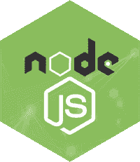

# Node.js 教程

> 哎哎哎:# t0]https://www . javatppoint . com/nodejs-tutorial



Node.js 教程提供了 Node.js 的基本和高级概念。我们的 Node.js 教程是为初学者和专业人士设计的。

Node.js 是一个用于运行 JavaScript 应用程序的跨平台环境和库，用于创建网络和服务器端应用程序。

我们的 Node.js 教程包含了 Node.js 的所有主题，比如在 windows 和 linux 上安装 Node.js、REPL、包管理器、回调、事件循环、os、路径、查询字符串、密码学、调试器、URL、DNS、Net、UDP、进程、子进程、缓冲区、流、文件系统、全局对象、web 模块等。还会给出 Node.js 面试问题，帮助你更好的理解 Node.js 技术。

## 什么是 Node.js

Node.js 是一个跨平台的运行时环境和库，用于在浏览器之外运行 JavaScript 应用程序。它用于创建服务器端和网络应用程序。它是开源的，可以免费使用。可从本链接[https://nodejs.org/en/](https://nodejs.org/en/)下载

Node.js 的许多基本模块都是用 JavaScript 编写的。Node.js 主要用于运行实时服务器应用程序。

其官方文件给出的定义如下:

？Node.js 是一个基于 Chrome 的 JavaScript 运行时构建的平台，用于轻松构建快速且可扩展的网络应用程序。Node.js 使用事件驱动、非阻塞的 I/O 模型，使其轻量级且高效，非常适合跨分布式设备运行的数据密集型实时应用程序。？

Node.js 还提供了各种 JavaScript 模块的丰富库，以简化 web 应用程序的开发。

```
Node.js = Runtime Environment + JavaScript Library

```

**node . js 的不同部分**

下图说明了 Node.js 的一些重要部分:


## Node.js 的特性

下面列出了 Node.js 的一些重要特性，这些特性使它成为软件架构师的首选。

1.  **极快:** Node.js 是基于谷歌 Chrome 的 V8 JavaScript Engine 构建的，所以它的库在代码执行上非常快。
2.  **I/O 异步，事件驱动:**node . js 库的所有 API 都是异步的，即不阻塞。因此，基于 Node.js 的服务器从不等待应用编程接口返回数据。服务器在调用下一个应用编程接口后会移动到下一个应用编程接口，Node.js 的事件通知机制有助于服务器从上一个应用编程接口调用中获得响应。这也是它非常快的一个原因。
3.  **单线程:** Node.js 遵循带有事件循环的单线程模型。
4.  **高可伸缩性:** Node.js 之所以具有高可伸缩性，是因为事件机制帮助服务器以非阻塞的方式进行响应。
5.  **无缓冲:** Node.js 在上传音视频文件的同时，减少了整体处理时间。Node.js 应用程序从不缓冲任何数据。这些应用程序只是以块的形式输出数据。
6.  **开源:** Node.js 有一个开源社区，这个社区产生了很多优秀的模块，为 Node.js 应用增加了额外的功能。
7.  **许可证:** Node.js 是在 MIT 许可证下发布的。

* * *

## Node.js 索引

* * *

**Node.js 教程**

*   [Node.js 教程](nodejs-tutorial)
*   [安装 Node.js Windows](install-nodejs)
*   [安装 Node.js Linux](install-nodejs-on-linux-ubuntu-centos)
*   [Node.js 第一个示例](nodejs-first-example)
*   [Node.js 控制台](nodejs-console)
*   node . js repl
*   node . js NPM
*   [NodeJS CL 选项](nodejs-command-line-options)
*   [Node.js 全局](nodejs-global-objects)
*   [NodeJS 作业系统](nodejs-os)
*   [Node.js 定时器](nodejs-timer)
*   [NodeJS 错误](nodejs-errors)
*   [Node.js DNS](nodejs-dns)
*   [Node.js 网](nodejs-net)
*   [Node.js Crypto](nodejs-crypto)
*   [Node.js TLS/SSL](nodejs-tls-ssl)
*   [Node.js 调试器](nodejs-debugger)
*   [Node.js 流程](nodejs-process)
*   [Node.js 子进程](nodejs-child-process)
*   [Node.js 缓冲区](nodejs-buffers)
*   [Node.js 流](nodejs-streams)
*   [Node.js 文件系统](nodejs-file-system)
*   [NodeJS 路径](nodejs-path)
*   [Node.js StringDecoder](nodejs-stringdecoder)
*   [Node.js 查询字符串](nodejs-query-string)
*   node . js zlib
*   [Node.js 断言](nodejs-assertion-testing)
*   [Node.js V8](nodejs-v8)
*   [Node.js 回调](nodejs-callbacks)
*   [节点事件](nodejs-events)
*   node . js punycode
*   node . js tty
*   [Node.js Web 模块](nodejs-web-modules)

**Node.js MySQL**

*   [MySQL 创建连接](nodejs-mysql-create-connection)
*   [MySQL 创建数据库](nodejs-mysql-create-database)
*   [MySQL 创建表](nodejs-mysql-create-table)
*   [MySQL 插入记录](nodejs-mysql-insert-record)
*   [MySQL 删除记录](nodejs-mysql-delete-record)
*   [MySQL 选择记录](nodejs-mysql-select-record)
*   [MySQL 选择唯一](nodejs-mysql-select-unique-record)
*   [MySQL 删除表](nodejs-mysql-drop-table)

**node . js mongob**

*   [创建连接](nodejs-mongodb-create-connection)
*   [创建数据库](nodejs-mongodb-create-database)
*   [创建收藏](nodejs-mongodb-create-collection)
*   [蒙戈布插入](nodejs-mongodb-insert)
*   [MongoDB 选择](nodejs-mongodb-select)
*   [MongoDB 查询](nodejs-mongodb-query)
*   [MongoDB 排序](nodejs-mongodb-sorting)
*   [MongoDB 移除](nodejs-mongodb-remove)

**差异**

*   [Node.js vs AngularJS](nodejs-vs-angularjs)
*   [Node.js vs Python](nodejs-vs-python)
*   [Node.js vs PHP](nodejs-vs-php)
*   [Node.js vs Java](nodejs-vs-java)

**Node.js 快递**

*   [Express.js 教程](expressjs-tutorial)
*   [什么是快递](what-is-expressjs)
*   [安装 Express.js](install-expressjs)
*   [快递请求](expressjs-request)
*   [Express.js 回应](expressjs-response)
*   [Express.js Get](expressjs-get)
*   [快递 js 邮](expressjs-post)
*   [快递路线](expressjs-routing)
*   [Express.js Cookies](expressjs-cookies)
*   [Express.js 文件上传](expressjs-file-upload)
*   [Express.js 中间件](expressjs-middleware)
*   [快手脚手架](expressjs-scaffolding)
*   [Express.js 模板](expressjs-template)

**面试问题**

*   [Node.js 访谈](node-js-interview-questions)
*   [安古拉杰采访](angularjs-interview-questions)
*   [JavaScript 面试](javascript-interview-questions)
*   [jQuery 面试](jquery-interview-questions)
*   [骨气访谈](backbone-js-interview-questions)
*   [烬 js 采访](ember-js-interview-questions)
*   [Neo4j 访谈](neo4j-interview-questions)

* * *

## 先决条件

在学习 Node.js 之前，你必须具备 JavaScript 和任何编程语言的基础知识。

## 观众

我们的 Node.js 教程旨在帮助初学者和专业人士。

## 问题

我们保证您在本 Node.js 教程中不会发现任何问题。但是如果有任何错误，请在联系表格中发布问题。