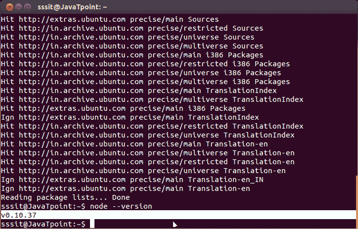

# 在 Linux/Ubuntu/CentOS 上安装 Node.js

> 原文:[https://www . javatpoint . com/install-nodejs-on-Linux-Ubuntu-centos](https://www.javatpoint.com/install-nodejs-on-linux-ubuntu-centos)

我们可以很容易地在 Linux/Ubuntu/CentOS/fedora/linuxmint 等上安装 Node.js。要在 Linux (Ubuntu)操作系统上安装 Node.js，请按照以下说明操作:

1)打开 Ubuntu 终端(可以使用快捷键(Ctrl+Alt+T)。

2)键入命令 **sudo apt-get 安装 python-软件-属性**

3)按回车键(如果您已经为您的系统设置了密码，则系统会要求输入密码)

4)键入密码并按回车键

5)键入命令**sudo apt-add-repository PPA:Chris-lea/node . js**

6)按回车键

7)再次按回车键继续

8)键入命令 **sudo apt-get update** (等待一段时间)

9)类型命令 **sudo apt-get 安装 nodejs npm**

10)键入命令 **sudo apt-get 安装节点**

安装完成。现在可以通过**节点-版本**查看节点的版本

通过 **npm -v** 检查 npm 版本

现在，您可以通过键入以下命令来检查已安装程序列表中的 node.js

**dpkg - get-selections**

