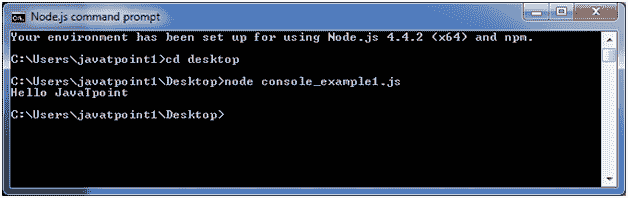
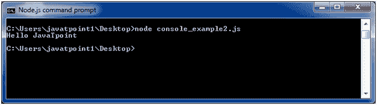
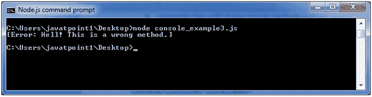
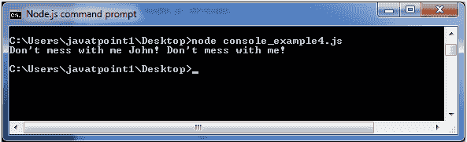

# Node.js 控制台

> 哎哎哎:# t0]https://www . javatppoint . com/nodejs-console

Node.js 控制台模块提供了一个简单的调试控制台，类似于 web 浏览器提供的 JavaScript 控制台机制。

有三种控制台方法可用于编写任何 node.js 流:

1.  console.log()
2.  console.error()
3.  console.warn()

## Node.js console.log()

console.log()函数用于在控制台上显示简单消息。

文件:console_example1.js

```js
console.log('Hello JavaTpoint'); 

```

打开 Node.js 命令提示符并运行以下代码:

```js
node console_example1.js

```



我们也可以在 console.log()函数中使用格式说明符。

文件:console_example2.js

```js
console.log('Hello %s', 'JavaTpoint'); 

```

打开 Node.js 命令提示符并运行以下代码:

```js
node console_example2.js

```



## Node.js console.error()

console.error()函数用于在控制台上呈现错误消息。

文件:console_example3.js

```js
console.error(new Error('Hell! This is a wrong method.'));

```

打开 Node.js 命令提示符并运行以下代码:

```js
node console_example3.js

```



## Node.js console.warn()

console.warn()函数用于在控制台上显示警告消息。

文件:console_example4.js

```js
const name = 'John';
console.warn(`Don't mess with me ${name}! Don't mess with me!`); 

```

打开 Node.js 命令提示符并运行以下代码:

```js
node console_example4.js

```

