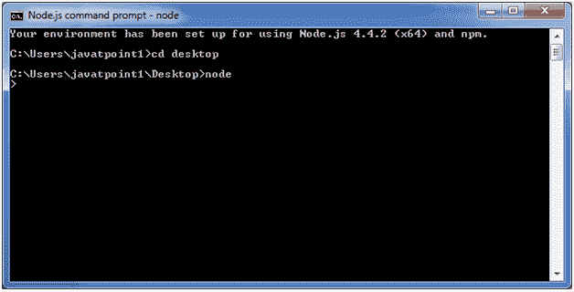

# REPL

> 哎哎哎:# t0]https://www . javatppoint . com/nodejs-repl

术语 REPL 代表**阅读评估打印**和**循环**。它指定了一个计算机环境，如窗口控制台或 Unix/Linux 外壳，您可以在其中输入命令，系统以交互模式响应输出。

## REPL 环境

Node.js 或 Node 与 REPL 环境捆绑在一起。REPL 环境的每个部分都有特定的工作。

**读取:**读取用户输入；将输入解析成 JavaScript 数据结构并存储在内存中。

**Eval:** 取并评估数据结构。

**打印:**打印结果。

**循环:**循环上述命令，直到用户按 ctrl-c 两次。

## 如何开始 REPL

您可以通过在命令提示符下运行“node”来启动 REPL。看这个:



您可以在 REPL 节点命令提示符下执行各种数学运算:

## 简单表达式

启动 REPL 节点后命令提示符下放入任意数学表达式:

```
Example: >10+20-5
25

```


```
Example2: >10+12 + (5*4)/7

```


## 使用变量

变量用于存储值并在以后打印。如果不使用 **var** 关键字，则值存储在变量中并打印，而如果使用 **var** 关键字，则值存储但不打印。您可以使用 console.log()打印变量。

**示例:**


## Node.js 多行表达式

节点 REPL 支持像 JavaScript 这样的多行表达式。请参见以下边做边循环示例:

```
var x = 0
undefined
> do {
... x++;
... console.log("x: " + x);
... } while ( x < 10 );

```


## 下划线变量

您也可以使用下划线来获得最后的结果。

**示例:**


## REPL 命令

| 命令 | 描述 |
| Ctrl + c | 它用于终止当前命令。 |
| ctrl + c 两次 | 它终止节点 repl。 |
| Ctrl + d | 它终止节点 repl。 |
| 向上/向下键 | 它用于查看命令历史记录和修改以前的命令。 |
| tab 键 | 它指定当前命令的列表。 |
| 。帮助 | 它指定了所有命令的列表。 |
| 。破裂 | 它用于退出多行表达式。 |
| 。清楚的 | 它用于退出多行表达式。 |
| 。保存文件名 | 它将当前节点的 repl 会话保存到一个文件中。 |
| 。加载文件名 | 它用于在当前节点 repl 会话中加载文件内容。 |

## REPL 出口

使用 ctrl + c 命令两次，从 Node.js REPL 出来。

