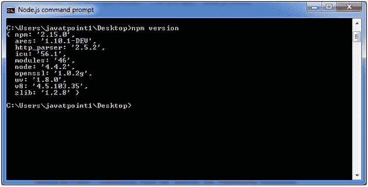
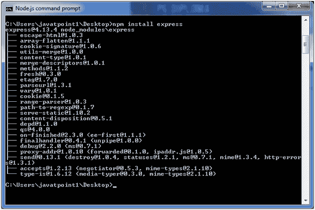
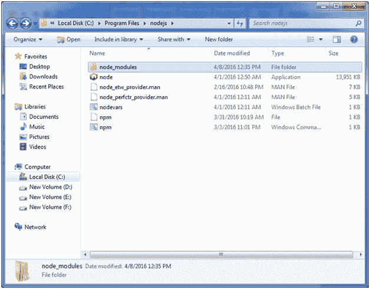
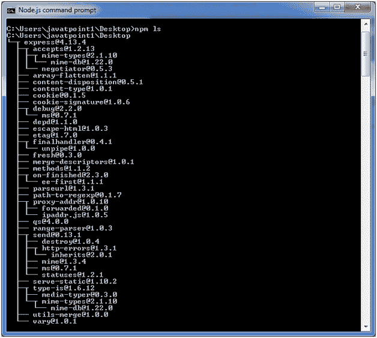
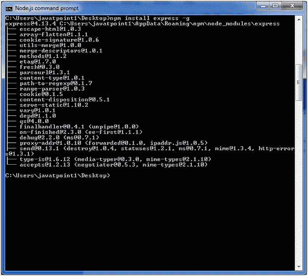
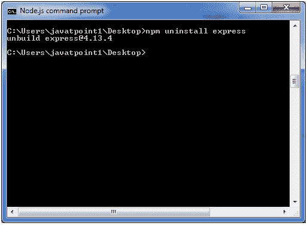
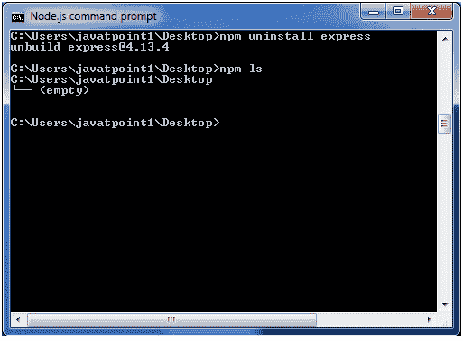
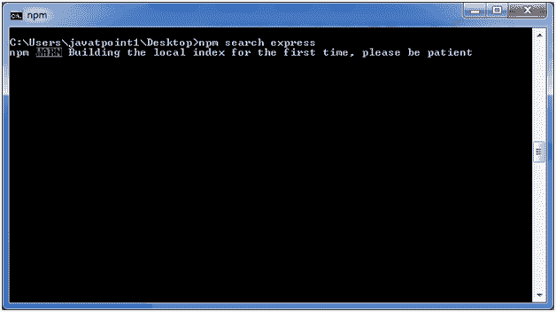
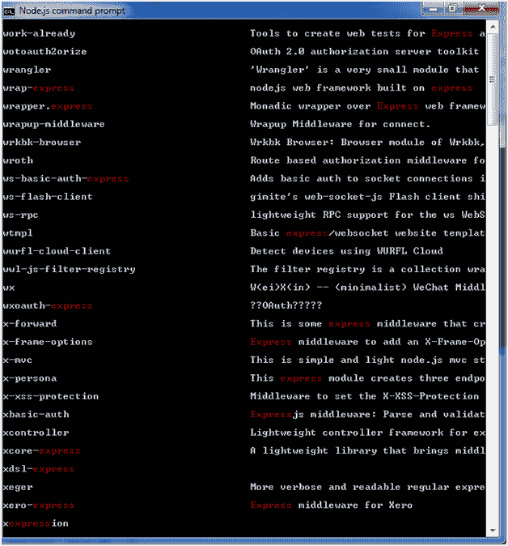

# 包管理器

> 原文：<https://www.javatpoint.com/nodejs-package-manager>

节点包管理器提供两个主要功能:

*   它为可在 search.nodejs.org 搜索的 node.js 包/模块提供在线存储库
*   它还提供命令行工具来安装 Node.js 包，对 Node.js 包进行版本管理和依赖关系管理。

npm 在 v0.6.3 之后的版本中与 Node.js installables 捆绑在一起。您可以通过打开 Node.js 命令提示符并键入以下命令来检查版本:

```
npm  version

```



## 使用 npm 安装模块

以下是安装任何 Node.js 模块的语法:

```
npm install 
```

让我们安装一个著名的名为 express 的 Node.js 网络框架:

打开 Node.js 命令提示符并执行以下命令:

```
npm install express

```

您可以在安装“快速”框架后看到结果。



## 全局安装与本地安装

默认情况下，npm 以本地模式安装依赖项。这里本地模式指定节点应用程序所在的文件夹。例如，如果您安装了 express module，它会在安装 express module 的当前目录中创建 node_modules 目录。



您可以使用 npm ls 命令列出所有本地安装的模块。

打开 Node.js 命令提示符并执行“npm ls”:



全局安装的包/依赖项存储在系统目录中。让我们使用全局安装来安装 express 模块。虽然它也会产生同样的结果，但模块将在全球范围内安装。

打开 Node.js 命令提示符并执行以下代码:

```
npm install express -g

```



这里第一行讲述模块版本及其安装位置。

## 卸载模块

要卸载 Node.js 模块，请使用以下命令:

```
npm uninstall express

```



Node.js 模块被卸载。您可以使用以下命令进行验证:

```
npm ls

```



您可以看到模块现在是空的。

## 搜索模块

“npm 搜索快递”命令用于搜索快递或模块。

```
npm search express

```

 