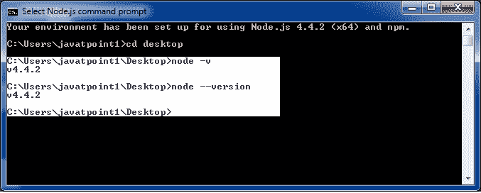

# 命令行选项

> 原文：<https://www.javatpoint.com/nodejs-command-line-options>

Node.js 中有各种各样的命令行选项。这些选项提供了多种方法来执行脚本和其他有用的运行时选项。

让我们看看 Node.js 命令行选项的列表:

| 索引 | [计]选项 | 描述 |
| 1. | v-版本 | 用于打印节点的版本。 |
| 2. | 救命 | 它用于打印节点命令行选项。 |
| 3. | -e，-eval 脚本 | 它将以下参数评估为 JavaScript。在 REPL 预定义的模块也可以在脚本中使用。 |
| 4. | -p，-打印“脚本” | 它与-e 相同，但打印结果。 |
| 5. | -c-检查 | 语法检查脚本而不执行。 |
| 6. | -我-互动的 | 即使 stdin 看起来不是终端，它也会打开 REPL。 |
| 7. | -r，-需要模块 | 它用于在启动时预加载指定的模块。它遵循 require()的模块解析规则。模块可以是文件路径，也可以是节点模块名称。 |
| 8. | -不-贬低 | 沉默反对警告。 |
| 9. | -痕迹-折旧 | 它用于打印折旧的堆栈跟踪。 |
| 10. | 扔弃 | 它会抛出表示不赞成的错误。 |
| 11. | -不-警告 | 它使所有过程警告(包括反对)静音。 |
| 12. | -跟踪-警告 | 它打印进程警告(包括拒绝)的堆栈跟踪。 |
| 13. | 跟踪同步输入输出 | 每当在事件循环的第一轮之后检测到同步 i/o 时，它都会打印堆栈跟踪。 |
| 14. | 零填充缓冲器 | 自动零填充所有新分配的缓冲区和 slowbuffer 实例。 |
| 15. | -跟踪-堆-对象 | 它跟踪堆快照的堆对象分配。 |
| 16. | 教授流程 | 它处理使用 V8 选项- prof 生成的 V8 profiler 输出。 |
| 17. | -V8-选项 | 它打印 V8 命令行选项。 |
| 18. | -TLS-密码-列表=列表 | 它指定了一个替代的默认 tls 密码列表。(需要使用加密支持构建 node.js。(默认)) |
| 19. | -使能-fips | 它在启动时启用符合 fips 的加密。(需要使用 node.js 构建。/configure - openssl-fips) |
| 20. | - force-fips | 它会在启动时强制执行符合 fips 的加密。(不能从脚本代码中禁用。)(要求与- enable-fips 相同) |
| 21. | -ICU-数据-目录=文件 | 它指定了 ICU 数据加载路径。(覆盖节点 _ icu _ 数据) |

## Node.js 命令行选项示例

## 要查看运行节点的版本:

打开 Node.js 命令提示符，运行命令 node -v 或 node - version

## 寻求帮助:

使用命令节点？h 或节点-帮助

## 要评估参数(但不打印结果):

使用命令节点-e，- eval“脚本”

## 要评估参数并打印结果，请执行以下操作:

使用命令节点-p“脚本”

## 即使标准输入没有出现也要打开 REPL:

使用命令 node -i 或 node - interactive

