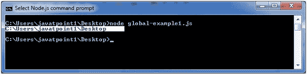
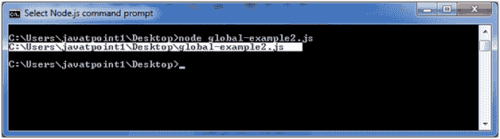

# 全局对象

> 原文：<https://www.javatpoint.com/nodejs-global-objects>

Node.js 全局对象本质上是全局的，在所有模块中都可用。您不需要在应用程序中包含这些对象；相反，它们可以直接使用。这些对象是模块、函数、字符串和对象等。其中一些对象实际上不在全局范围内，而是在模块范围内。

Node.js 全局对象的列表如下所示:

*   __dirname
*   _ _ 文件名
*   安慰
*   过程
*   缓冲器
*   setImmediate(回调[，arg][，...])
*   setInterval(回调，延迟[，arg][，...])
*   setTimeout(回调，延迟[，arg][，...])
*   清除即时对象
*   清除间隔(间隔对象)
*   clearTimeout(timeoutObject)

## Node.js __dirname

它是一个字符串。它指定当前包含代码的目录的名称。

文件:global-example1.js

```
console.log(__dirname); 

```

打开 Node.js 命令提示符并运行以下代码:

```
node global-example1.js 

```



## Node.js __filename

它指定正在执行的代码的文件名。这是此代码文件的解析绝对路径。模块内的值是该模块文件的路径。

文件:global-example2.js

```
console.log(__filename); 

```

打开 Node.js 命令提示符并运行以下代码:

```
node global-example2.js 

```



## Node.js 控制台

单击此处获取控制台类的详细信息。[http://www.javatpoint.com/nodejs-console](https://www.javatpoint.com/nodejs-console)

## Node.js 缓冲

单击此处获取缓冲区类的详细信息。[http://www.javatpoint.com/nodejs-buffers](https://www.javatpoint.com/nodejs-buffers)

## 计时器函数

单击此处获取计时器功能的详细信息。[http://www.javatpoint.com/nodejs-timer](https://www.javatpoint.com/nodejs-timer)