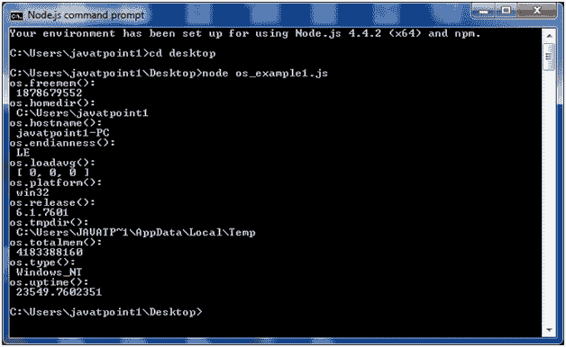
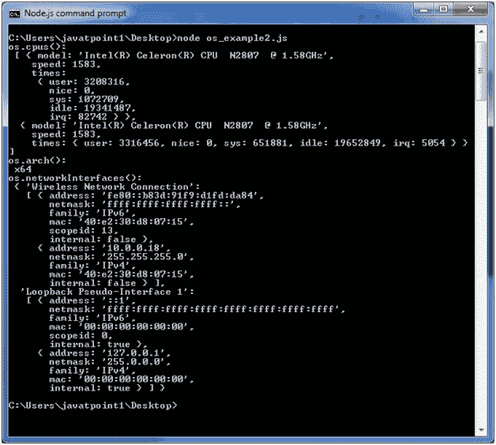

# 节点. js

> 哎哎哎:# t0]https://www . javatppoint . com/nodejs-OS

Node.js OS 提供了一些与操作系统相关的基本实用功能。让我们看看常用函数或方法的列表。

| 索引 | 方法 | 描述 |
| 1. | if.arch（） | 该方法用于获取操作系统的 CPU 架构。 |
| 2. | OS . CPU() | 此方法用于获取一个对象数组，其中包含安装的每个 CPU/内核的信息:型号、速度(以 MHz 为单位)和时间(一个包含 CPU/内核花费的毫秒数的对象:user、nice、sys、idle 和 irq)。 |
| 3. | os . endianness() | 这个方法返回 cpu 的字符顺序。它的可能值是大端的“BE”或小端的“le”。 |
| 4. | os.freemem() | 此方法返回以字节为单位的可用系统内存量。 |
| 5. | os.homedir() | 此方法返回当前用户的主目录。 |
| 6. | os.hostname() | 此方法用于返回操作系统的主机名。 |
| 7. | os.loadavg() | 此方法返回一个包含 1、5 和 15 分钟平均负载的数组。负载平均值是系统活动花费的时间分数，由操作系统计算并表示为分数。 |
| 8. | os.networkinterfaces() | 此方法返回网络接口列表。 |
| 9. | os.platform() | 该方法返回运行计算机的操作系统平台，即‘Darwin’、‘win32’、‘FreeBSD’、‘Linux’、‘sunos’等。 |
| 10. | os.release() | 此方法返回操作系统版本。 |
| 11. | os.tmpdir() | 此方法返回操作系统临时文件的默认目录。 |
| 12. | os.totalmem() | 此方法以字节为单位返回系统内存总量。 |
| 13. | os.type() | 此方法返回操作系统名称。例如 linux 上的' linux '，os x 上的' darwin '和 windows 上的' windows_nt '。 |
| 14. | os.uptime() | 此方法以秒为单位返回系统正常运行时间。 |
| 15. | os . userinfo(选项) | 此方法返回当前有效用户的密码文件条目的子集。 |

## 节点. js 操作系统示例 1

在这个例子中，我们包括一些基本功能。创建一个名为 os_example1.js 的文件，包含以下代码:

文件:os_example1.js

```
const os=require('os');
console.log("os.freemem(): \n",os.freemem());
console.log("os.homedir(): \n",os.homedir());
console.log("os.hostname(): \n",os.hostname());
console.log("os.endianness(): \n",os.endianness());
console.log("os.loadavg(): \n",os.loadavg());
console.log("os.platform(): \n",os.platform());
console.log("os.release(): \n",os.release());
console.log("os.tmpdir(): \n",os.tmpdir());
console.log("os.totalmem(): \n",os.totalmem());
console.log("os.type(): \n",os.type());
console.log("os.uptime(): \n",os.uptime());

```

打开 Node.js 命令提示符并运行以下代码:

```
node os_example1.js

```



## Node.js 操作系统示例 2

在这个例子中，我们包括剩余的函数。创建一个名为 os_example2.js 的文件，包含以下代码:

文件:os_example2.js

```
const os=require('os');
console.log("os.cpus(): \n",os.cpus());
console.log("os.arch(): \n",os.arch());
console.log("os.networkInterfaces(): \n",os.networkInterfaces()); 

```

打开 Node.js 命令提示符并运行以下代码:

```
node os_example2.js

```

