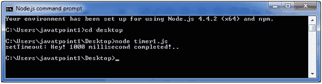

# 节点. js 定时器

> 哎哎哎:# t0]https://www . javatppoint . com/nodejs-timer

Node.js 定时器函数是全局函数。使用定时器功能不需要使用 require()函数。让我们看看定时器功能的列表。

**设置定时器功能:**

*   **setImmediate():** 用于执行 setImmediate。
*   **setInterval():** 用于定义时间间隔。
*   **setTimeout():** ()-用于延迟毫秒后执行一次性回调。

**清除定时器功能:**

*   **清除即时对象:**用于停止即时对象，由设置即时对象创建
*   **清除间隔(间隔对象):**用于停止间隔对象，由设置间隔创建
*   **清除超时(定时器输出对象):**它阻止由设置定时器输出创建的定时器输出对象

## Node.js 计时器设置间隔()示例

本示例将时间间隔设置为 1000 毫秒，并且指定的注释将在每 1000 毫秒后显示一次，直到您终止。

文件:timer1.js

```
setInterval(function() {
 console.log("setInterval: Hey! 1 millisecond completed!.."); 
}, 1000);

```

打开 Node.js 命令提示符并运行以下代码:

```
node timer1.js

```


文件:timer5.js

```
var i =0;
console.log(i);
setInterval(function(){
i++;
console.log(i);
}, 1000); 

```

打开 Node.js 命令提示符并运行以下代码:

```
node timer5.js

```


## Node.js 计时器设置超时()示例

文件:timer1.js

```
setTimeout(function() { 
console.log("setTimeout: Hey! 1000 millisecond completed!..");
}, 1000);

```

打开 Node.js 命令提示符并运行以下代码:

```
node timer1.js

```



此示例显示每 1000 毫秒后的超时，而不设置时间间隔。本示例使用函数的递归属性。

文件:timer2.js

```
var recursive = function () {
    console.log("Hey! 1000 millisecond completed!.."); 
    setTimeout(recursive,1000);
}
recursive(); 

```

打开 Node.js 命令提示符并运行以下代码:

```
node timer2.js

```


## Node.js setInterval()、setTimeout()和 clearTimeout()

让我们看一个使用 clearTimeout()函数的例子。

文件:timer3.js

```
function welcome () {
  console.log("Welcome to JavaTpoint!");
}
var id1 = setTimeout(welcome,1000);
var id2 = setInterval(welcome,1000);
clearTimeout(id1);
//clearInterval(id2);

```

打开 Node.js 命令提示符并运行以下代码:

```
node timer3.js

```


你可以看到上面的例子本质上是递归的。如果您使用 ClearInterval，它将在一个步骤后终止。

## Node.js setInterval()、setTimeout()和 clearInterval()

让我们看一个使用 clearInterval()函数的例子。

文件:timer3.js

```
function welcome () {
  console.log("Welcome to JavaTpoint!");
}
var id1 = setTimeout(welcome,1000);
var id2 = setInterval(welcome,1000);
//clearTimeout(id1);
clearInterval(id2);

```

打开 Node.js 命令提示符并运行以下代码:

```
node timer3.js

```

