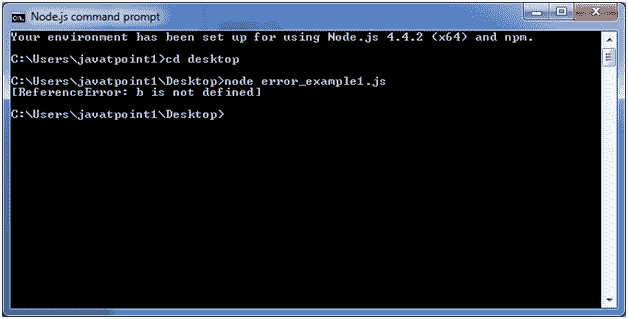
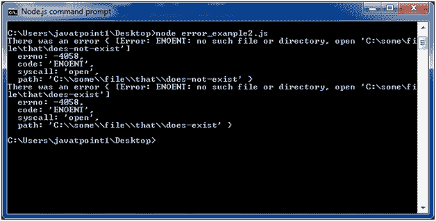

# Node.js 错误

> 原文：<https://www.javatpoint.com/nodejs-errors>

Node.js 应用程序通常面临四种类型的错误:

*   **标准 JavaScript 错误**即<规避错误>、<语法错误>、<范围错误>、<参考错误>、<类型错误>、>
*   **系统错误**
*   **用户指定的错误**
*   **断言错误**

## 节点. js 错误示例 1

让我们举一个例子来部署标准的 JavaScript 错误- ReferenceError。

文件:error_example1.js

```
// Throws with a ReferenceError because b is undefined
try {
  const a = 1;
  const c = a + b;
} catch (err) {
  console.log(err);
}

```

打开 Node.js 命令提示符并运行以下代码:

```
node error_example1.js

```



## 节点. js 错误示例 2

文件:timer2.js

```
const fs = require('fs');
function nodeStyleCallback(err, data) {
 if (err) {
   console.error('There was an error', err);
   return;
 }
 console.log(data);
}
fs.readFile('/some/file/that/does-not-exist', nodeStyleCallback);
fs.readFile('/some/file/that/does-exist', nodeStyleCallback);

```

打开 Node.js 命令提示符并运行以下代码:

```
node error_example2.js

```

