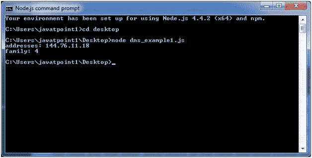
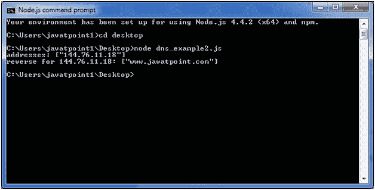
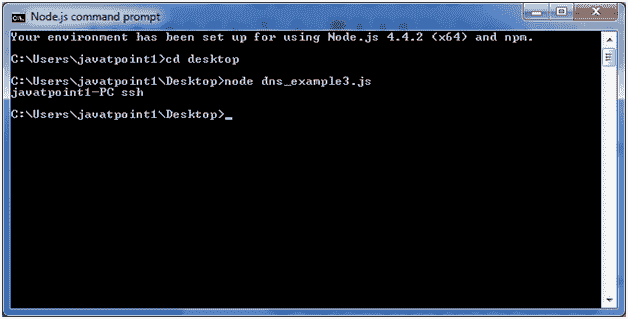

# Node.js DNS

> 哎哎哎:# t0]https://www . javatppoint . com/nodejs-DNS

Node.js 域名系统模块包含获取给定主机名信息的方法。让我们看看常用的域名系统功能列表:

*   dns.getServers()
*   dns.setServers(服务器)
*   dns.lookup(主机名[，选项]，回调)
*   dns.lookupService(地址、端口、回调)
*   dns.resolve(主机名[，rrtype]，回调)
*   dns.resolve4(主机名，回调)
*   dns.resolve6(主机名，回调)
*   dns.resolveCname(主机名，回调)
*   dns.resolveMx(主机名，回调)
*   dns.resolveNs(主机名，回调)
*   dns.resolveSoa(主机名，回调)
*   dns.resolveSrv(主机名，回调)
*   dns.resolvePtr(主机名，回调)
*   dns.resolveTxt(主机名，回调)
*   dns.reverse(ip，回调)

## NodeJS 域名系统示例 1

让我们看看 dns.lookup()函数的例子。

文件:dns_example1.js

```
const dns = require('dns');
dns.lookup('www.javatpoint.com', (err, addresses, family) => {
  console.log('addresses:', addresses);
  console.log('family:',family);
});

```

打开 Node.js 命令提示符并运行以下代码:

```
node dns_example1.js

```



## NodeJS 域名系统示例 2

让我们看看 resolve4()和 reverse()函数的例子。

文件:dns_example2.js

```
const dns = require('dns');
dns.resolve4('www.javatpoint.com', (err, addresses) => {
  if (err) throw err;
  console.log(`addresses: ${JSON.stringify(addresses)}`);
  addresses.forEach((a) => {
    dns.reverse(a, (err, hostnames) => {
      if (err) {
        throw err;
      }
      console.log(`reverse for ${a}: ${JSON.stringify(hostnames)}`);
    });
  });
}); 

```

打开 Node.js 命令提示符并运行以下代码:

```
node dns_example2.js

```



## NodeJS 域名系统示例 3

让我们举一个例子，使用 lookupService()函数打印 localhost 名称。

文件:dns_example3.js

```
const dns = require('dns');
dns.lookupService('127.0.0.1', 22, (err, hostname, service) => {
  console.log(hostname, service);
    // Prints: localhost
});

```

打开 Node.js 命令提示符并运行以下代码:

```
node dns_example3.js

```

