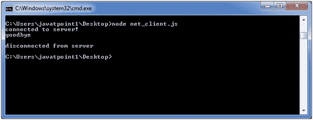

# Node.js Net

> 哎哎哎:# t0]https://www . javatppoint . com/nodejs-net

Node.js 提供了执行套接字编程的能力。我们可以在 Node.js 中创建聊天应用程序，或者使用 socket 编程在客户机和服务器应用程序之间进行通信。

## 网络示例

在本例中，我们使用了两个命令提示:

*   服务器的 Node.js 命令提示符。
*   客户端窗口的默认命令提示符。

**服务器:**

文件:net_server.js

```
const net = require('net');
var server = net.createServer((socket) => {
  socket.end('goodbye\n');
}).on('error', (err) => {
  // handle errors here
  throw err;
});
// grab a random port.
server.listen(() => {
  address = server.address();
  console.log('opened server on %j', address);
});

```

打开 Node.js 命令提示符并运行以下代码:

```
node net_server.js

```


**客户:**

文件:net_client.js

```
const net = require('net');
const client = net.connect({port: 50302}, () => {//use same port of server
  console.log('connected to server!');
  client.write('world!\r\n');
});
client.on('data', (data) => {
  console.log(data.toString());
  client.end();
});
client.on('end', () => {
  console.log('disconnected from server');
});

```

打开 Node.js 命令提示符并运行以下代码:

```
node net_client.js

```



#### 注意:您必须匹配端口。客户端和服务器应该有相似的端口才能成功连接。