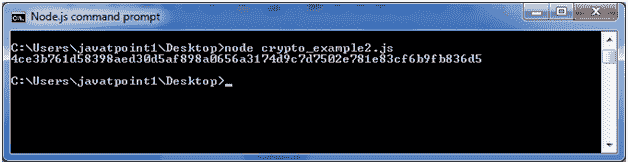
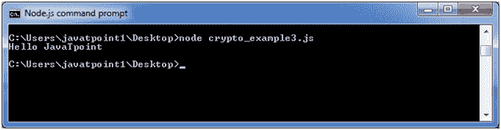

# Node.js Crypto

> 哎哎哎:# t0]https://www . javatppoint . com/nodejs-crypto

Node.js 加密模块支持加密。它提供了加密功能，包括一组用于开放 SSL 的哈希 HMAC、加密、解密、签名和验证功能的包装器。

## 什么是哈希

散列是一个固定长度的位串，即从源数据的某个任意块程序性地和确定性地生成。

## HMAC 是什么

HMAC 代表基于散列的消息认证码。这是一个将哈希算法应用于数据和密钥的过程，从而产生一个最终的哈希。

## 使用哈希和 HMAC 的加密示例

文件:crypto_example1.js

```
const crypto = require('crypto');
const secret = 'abcdefg';
const hash = crypto.createHmac('sha256', secret)
                   .update('Welcome to JavaTpoint')
                   .digest('hex');
console.log(hash);

```

打开 Node.js 命令提示符并运行以下代码:

```
node crypto_example1.js

```


## 使用密码的加密示例

文件:crypto_example2.js

```
const crypto = require('crypto');
const cipher = crypto.createCipher('aes192', 'a password');
var encrypted = cipher.update('Hello JavaTpoint', 'utf8', 'hex');
encrypted += cipher.final('hex');
console.log(encrypted); 

```

打开 Node.js 命令提示符并运行以下代码:

```
node crypto_example2.js

```



## 使用解密的解密示例

文件:crypto_example3.js

```
const crypto = require('crypto');
const decipher = crypto.createDecipher('aes192', 'a password');
var encrypted = '4ce3b761d58398aed30d5af898a0656a3174d9c7d7502e781e83cf6b9fb836d5';
var decrypted = decipher.update(encrypted, 'hex', 'utf8');
decrypted += decipher.final('utf8');
console.log(decrypted);

```

打开 Node.js 命令提示符并运行以下代码:

```
node crypto_example3.js

```

