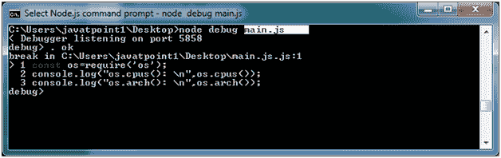
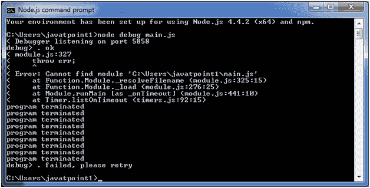

# Node.js 调试器

> 原文： [https://www.javatpoint.com/nodejs-debugger](https://www.javatpoint.com/nodejs-debugger)

Node.js 提供了一个简单的基于 TCP 的协议和内置的调试客户端。为了调试 JavaScript 文件，可以使用 debug 参数，后跟要调试的 js 文件名。

**语法:**

```
node debug [script.js | -e "script" | :<port>]</port> 
```

**示例:**

```
node debug main.js

```



**如有错误:**

如果您在 js 文件源代码中犯了任何错误，或者在 Node.js 命令提示符下提供了错误的路径，那么您将得到以下结果。



在上面的例子中，虽然 main.js 文件位于桌面上，但是没有指定路径。