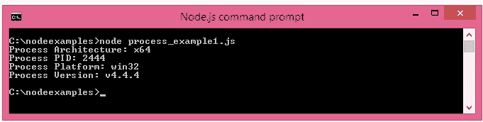
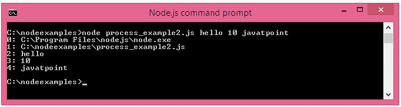
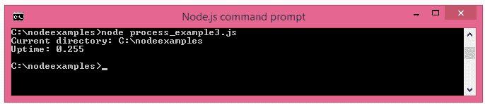

# Node.js 流程

> 原文：<https://www.javatpoint.com/nodejs-process>

Node.js 提供了获取流程信息的工具，如流程 id、架构、平台、版本、发布、正常运行时间、upu 使用等。它也可以用来杀死进程，设置 uid，设置组，取消屏蔽等。

进程是一个全局对象，是 EventEmitter 的一个实例，可以从任何地方访问。

## NodeJS 进程属性

下面列出了常用的 Node.js 进程属性。

| 财产 | 描述 |
| 拱门 | 返回进程架构:“arm”、“ia32”或“x64” |
| 一个参数名 | 以数组形式返回命令行参数 |
| 包封/包围（动词 envelop 的简写） | 返回用户环境 |
| pid | 返回进程的进程 id |
| 平台 | 返回进程的平台:“达尔文”、“freebsd”、“linux”、“sunos”或“win32” |
| 释放；排放；发布 | 返回当前节点版本的元数据 |
| 版本 | 返回节点版本 |
| 版本 | 返回节点版本及其依赖关系 |

## NodeJS 流程属性示例

我们来看简单的流程**示例来打印架构、pid、平台和版本**的流程。

文件:process_example1.js

```js
console.log(`Process Architecture: ${process.arch}`);
console.log(`Process PID: ${process.pid}`);
console.log(`Process Platform: ${process.platform}`);
console.log(`Process Version: ${process.version}`);

```

打开 Node.js 命令提示符并运行以下代码:

```js
node process_example1.js

```



让我们看看另一个打印命令行参数的过程**示例。这里节点被认为是第一个参数，文件名被认为是第二个参数，实际的命令行参数被认为是第三个、第四个、第五个等等。**

文件:process_example2.js

```js
process.argv.forEach((value, index, array) => {
  console.log(`${index}: ${value}`);
});

```

打开 Node.js 命令提示符并运行以下代码:

```js
node process_example2.js

```



## 过程函数

下面列出了常用的 Node.js 过程函数。

| 功能 | 描述 |
| cwd() | 返回当前工作目录的路径 |
| hrtime() | 以[秒，纳秒]为单位返回当前高分辨率实时时间 |
| 内存大小() | 返回一个包含内存使用信息的对象。 |
| process.kill(pid[，信号]) | 用于杀死给定的 pid。 |
| 正常运行时间() | 以秒为单位返回 Node.js 进程的正常运行时间。 |

## 流程函数示例

让我们看看打印当前工作目录的流程**示例和流程的正常运行时间**。

文件:process_example3.js

```js
console.log(`Current directory: ${process.cwd()}`);
console.log(`Uptime: ${process.uptime()}`);

```

打开 Node.js 命令提示符并运行以下代码:

```js
node process_example3.js

```

