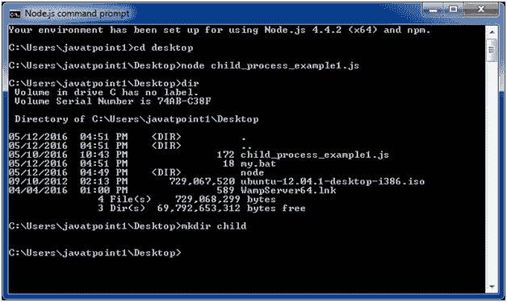
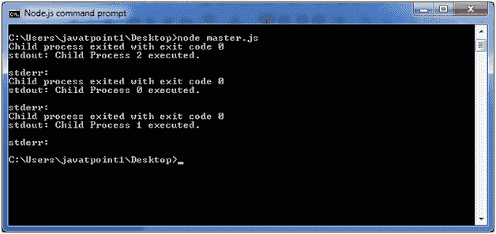
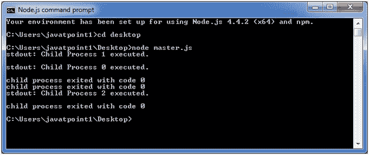
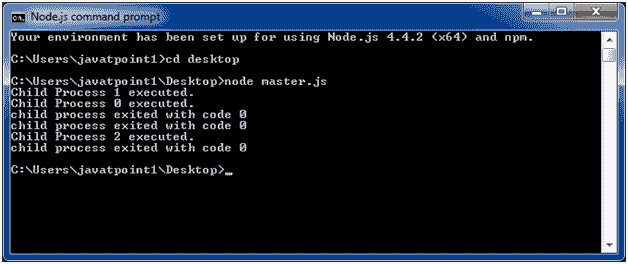

# 子进程

> 原文:[https://www.javatpoint.com/nodejs-child-process](https://www.javatpoint.com/nodejs-child-process)

Node.js 子进程模块提供了以类似于 popen(3)的方式产生子进程的能力。

创建子流程有三种主要方式:

*   **child_process.exec()方法:**此方法在控制台中运行命令并缓冲输出。
*   **child_process.spawn()方法:**该方法使用给定的命令启动一个新的进程。
*   **child_process.fork()方法:**该方法是 spawn()方法创建子进程的特例。

* * *

## Node.js child_process.exec()方法

child_process.exec()方法在控制台中运行命令并缓冲输出。

**语法:**

```
child_process.exec(command[, options], callback)

```

**参数:**

1)命令:它指定要运行的命令，用空格分隔参数。

2)选项:它可能包含以下一个或多个选项:

*   **cwd:** 指定子进程当前的工作目录。
*   **env:** 指定环境键值对。
*   **编码:**字符串(默认:“utf8”)
*   **shell:** 它指定字符串 shell 来执行命令(默认:'/bin/sh '在 UNIX 上，cmd.exe '在 Windows 上，Shell 应该理解 UNIX 上的-c 开关或 Windows 上的/s /c。在 Windows 上，命令行解析应该与 cmd.exe 兼容。)
*   **超时:**数字(默认:0)
*   **最大缓冲区:**数字(默认:200*1024)
*   **killSignal:** 字串(预设:【SIGTERM】
*   **uid 编号:**设置进程的用户身份。
*   **gid 编号:**设置进程的组标识。

**回调:**回调函数指定了三个参数 error、stdout 和 stderr，当进程终止时，用以下输出调用该函数。

## Node.js child_process.exec()示例 1

我们来看简单的流程**示例来打印架构、pid、平台和版本**的流程。

文件:子进程范例 1.js

```
const exec = require('child_process').exec;
exec('my.bat', (err, stdout, stderr) => {
  if (err) {
    console.error(err);
    return;
  }
  console.log(stdout);
});

```

创建一个名为 my.bat 的批处理文件，其代码如下:

文件:my.bat

```
dir
mkdir child

```

打开 Node.js 命令提示符并运行以下代码:

```
node child_process_example1.js

```

它将执行两个命令 *dir* 和 *mkdir child* 。dir 命令将显示当前目录列表，mkdir 命令将创建一个新目录。对于 linux，您可以使用 ls 命令来显示当前目录列表。



它还将创建一个新目录。


## Node.js child_process.exec()示例 2

创建两个名为 support.js 和 master.js 的 js 文件，代码如下:

文件:support.js

```
console.log("Child Process " + process.argv[2] + " executed." );

```

文件:master.js

```
const fs = require('fs');
const child_process = require('child_process');
for(var i=0; i<3; i++) {
   var workerProcess = child_process.exec('node support.js '+i,
      function (error, stdout, stderr) {
         if (error) {
            console.log(error.stack);
            console.log('Error code: '+error.code);
            console.log('Signal received: '+error.signal);
         }
         console.log('stdout: ' + stdout);
         console.log('stderr: ' + stderr);
      });
      workerProcess.on('exit', function (code) {
      console.log('Child process exited with exit code '+code);
   });
}

```

打开 Node.js 命令提示符并运行以下代码:

```
node master.js

```



* * *

## Node.js child_process .产卵()方法

child_process.spawn()方法使用给定的命令启动一个新的进程。此方法返回流(stdout & stderr)，通常在进程返回大量数据时使用。

**语法:**

```
child_process.spawn(command[, args][, options]) 

```

**参数:**

1)命令:指定要运行的命令。

2)参数:它指定字符串参数的数组列表。

3)选项:它可能包含以下一个或多个选项:

*   **cwd:** 指定子进程当前的工作目录。
*   **env:** 指定环境键值对。
*   **stdio:** 数组|String Child 的 stdio 配置
*   **自定义文件描述符:**子级用于标准输入的数组弃用文件描述符
*   **分离布尔:**孩子将成为流程组长
*   **uid 编号:**设置进程的用户身份。
*   **gid 编号:**设置进程的组标识。

## Node.js child_process.spawn()示例

创建两个名为 support.js 和 master.js 的 js 文件，代码如下:

文件:support.js

```
console.log("Child Process " + process.argv[2] + " executed." );

```

文件:master.js

```
const fs = require('fs');
const child_process = require('child_process');
 for(var i=0; i<3; i++) {
   var workerProcess = child_process.spawn('node', ['support.js', i]);
  workerProcess.stdout.on('data', function (data) {
      console.log('stdout: ' + data);
   });
 workerProcess.stderr.on('data', function (data) {
      console.log('stderr: ' + data);
   });
 workerProcess.on('close', function (code) {
      console.log('child process exited with code ' + code);
   });
}

```

打开 Node.js 命令提示符并运行以下代码:

```
node master.js

```



* * *

## Node.js child_process.fork()方法

child_process.fork 方法是创建 Node 进程的派生()的一个特例。除了在普通的 ChildProcess 实例中拥有所有方法之外，此方法还返回具有内置通信通道的对象。

**语法:**

```
child_process.fork(modulePath[, args][, options]) 

```

**参数:**

1) modulePath:这是一个字符串，指定要在子模块中运行的模块。

2)参数:它指定字符串参数的数组列表。

3)选项:它可能包含以下一个或多个选项:

*   **cwd:** 指定子进程当前的工作目录。
*   **env:** 指定环境键值对。
*   **execPath:** 这是一个可执行字符串，用于创建子进程。
*   **execArgv:** 它指定传递给可执行文件的字符串参数的数组列表(默认值:process.execArgv)。
*   **silent:** 它指定 Boolean 如果为 true，子对象的 stdin、stdout 和 stderr 将通过管道传输到父对象，否则它们将从父对象继承，有关更多详细信息，请参见 spawn()的 stdio 的“管道”和“继承”选项(默认值为 false)。
*   **uid 编号:**设置进程的用户身份。
*   **gid 编号:**设置进程的组标识。

## Node.js child_process.fork()示例

创建两个名为 support.js 和 master.js 的 js 文件，代码如下:

文件:support.js

```
const fs = require('fs');
const child_process = require('child_process');
 for(var i=0; i<3; i++) {
   var worker_process = child_process.fork("support.js", [i]);	
  worker_process.on('close', function (code) {
      console.log('child process exited with code ' + code);
   });
}

```

打开 Node.js 命令提示符并运行以下代码:

```
node master.js

```

