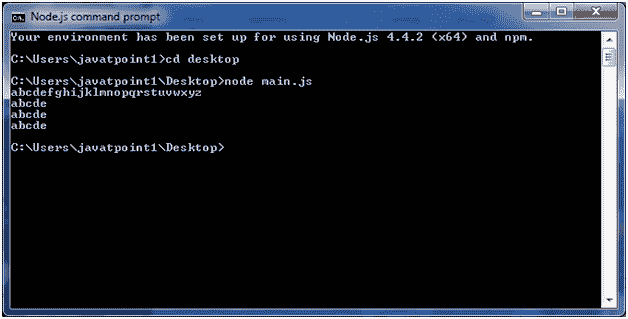

# Node.js 缓冲区

> 原文：<https://www.javatpoint.com/nodejs-buffers>

Node.js 提供了 Buffer 类来存储类似整数数组的原始数据，但是对应于 V8 堆之外的原始内存分配。使用缓冲类是因为纯 JavaScript 对二进制数据不好。因此，在处理 TCP 流或文件系统时，有必要处理八位字节流。

缓冲类是一个全局类。它可以在应用程序中访问，而无需导入缓冲模块。

## 创建缓冲区

有许多方法可以构建节点缓冲区。以下是三种最常用的方法:

1.  **创建一个未启动的缓冲区:**以下是创建一个 10 个八位字节的未启动缓冲区的语法:

```js
var buf = new Buffer(10);

```

3.  **从数组创建缓冲区:**以下是从给定数组创建缓冲区的语法:

```js
var buf = new Buffer([10, 20, 30, 40, 50]); 

```

5.  **从字符串创建缓冲区:**以下是从给定字符串和可选编码类型创建缓冲区的语法:

```js
var buf = new Buffer("Simply Easy Learning", "utf-8"); 

```

## 写入缓冲区

以下是写入节点缓冲区的方法:

**语法:**

```js
buf.write(string[, offset][, length][, encoding])

```

**参数说明:**

**字符串:**指定要写入缓冲区的字符串数据。

**偏移量:**指定开始写入的缓冲区的索引。其默认值为 0。

**长度:**指定写入的字节数。默认为缓冲区长度

**编码:**要使用的编码。“utf8”是默认编码。

**从写缓冲区返回值:**

此方法用于返回写入的八位字节数。在缓冲区空间不足以容纳整个字符串的情况下，它将写入字符串的一部分。

**举个例子:**

创建一个名为“main.js”的 JavaScript 文件，包含以下代码:

文件:main.js

```js
buf = new Buffer(256);
len = buf.write("Simply Easy Learning");
console.log("Octets written : "+  len);

```

打开 Node.js 命令提示符并执行以下代码:

```js
node main.js

```

**输出:**


## 从缓冲区读取

下面是从节点缓冲区读取数据的方法。

**语法:**

```js
buf.toString([encoding][, start][, end])

```

**参数说明:**

**编码:**指定要使用的编码。“utf8”是默认编码

**开始:**指定开始读取的起始索引，默认为 0。

**结束:**指定结束索引结束读取，默认为完整缓冲区。

**从缓冲区读取的返回值:**

此方法从使用指定字符集编码的缓冲区数据中解码并返回一个字符串。

让我们举个例子:

文件:main.js

```js
buf = new Buffer(26);
for (var i = 0 ; i < 26 ; i++) {
  buf[i] = i + 97;
}
console.log( buf.toString('ascii'));       // outputs: abcdefghijklmnopqrstuvwxyz
console.log( buf.toString('ascii',0,5));   // outputs: abcde
console.log( buf.toString('utf8',0,5));    // outputs: abcde
console.log( buf.toString(undefined,0,5)); // encoding defaults to 'utf8', outputs abcde

```

打开 Node.js 命令提示符并执行以下代码:

```js
node main.js

```

**输出:**

