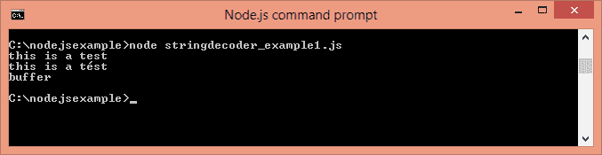

# Node.js StringDecoder

> 哎哎哎:# t0]https://www . javatppoint . com/nodejs-string 解码器

Node.js StringDecoder 用于将缓冲区解码为字符串。它类似于 buffer.toString()，但为 UTF 提供了额外的支持。

您需要使用 require('string_decoder ')来使用 StringDecoder 模块。

```
const StringDecoder = require('string_decoder').StringDecoder;

```

## Node.js 字符串代码方法

StringDecoder 类只有两种方法。

| 方法 | 描述 |
| 解码器.写(缓冲器) | 它用于返回解码后的字符串。 |
| decoder.end() | 它用于返回缓冲区中剩余的尾随字节(如果有)。 |

## Node.js 字符串代码示例

让我们看一个 Node.js StringDecoder 的简单例子。

文件:string decode _ example 1 . js

```
const StringDecoder = require('string_decoder').StringDecoder;
const decoder = new StringDecoder('utf8');

const buf1 = new Buffer('this is a test');
console.log(decoder.write(buf1));//prints: this is a test

const buf2 = new Buffer('7468697320697320612074c3a97374', 'hex');
console.log(decoder.write(buf2));//prints: this is a test

const buf3 = Buffer.from([0x62,0x75,0x66,0x66,0x65,0x72]);
console.log(decoder.write(buf3));//prints: buffer

```

