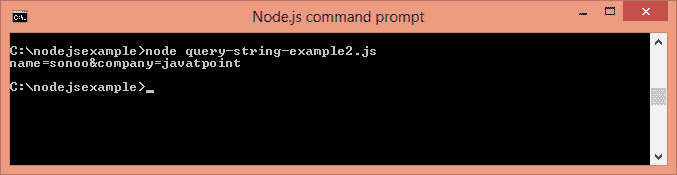

# 查询字符串

> 原文：<https://www.javatpoint.com/nodejs-query-string>

Node.js 查询字符串提供了处理查询字符串的方法。它可以用来将查询字符串转换成 JSON 对象，反之亦然。

要使用查询字符串模块，需要使用 **require('querystring')** 。

## 查询字符串方法

Node.js 查询字符串实用程序有四种方法。下面给出了两个重要的方法。

| 方法 | 描述 |
| querystring.parse(str[，sep][，eq][，options]) | 将查询字符串转换为 JSON 对象。 |
| querystring.stringify(obj[，sep][，eq][，options]) | 将 JSON 对象转换为查询字符串。 |

## Node.js 查询字符串示例 1:解析()

让我们看一个 Node.js 查询字符串解析()方法的简单例子。

文件:查询-字符串-范例 1.js

```js
querystring = require('querystring');
const obj1=querystring.parse('name=sonoo&company=javatpoint');
console.log(obj1);

```


## Node.js 查询字符串示例 2: stringify()

让我们看一个 node . js Query stringify()方法的简单例子。

文件:查询-字符串-范例 2.js

```js
querystring = require('querystring');
const qs1=querystring.stringify({name:'sonoo',company:'javatpoint'});
console.log(qs1);

```

