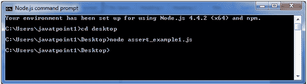
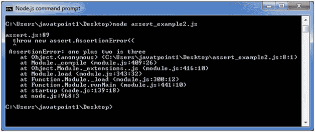

# 断言测试

> 原文：<https://www.javatpoint.com/nodejs-assertion-testing>

Node.js 断言是编写测试的最基本方式。它在运行测试时不提供反馈，除非有一个失败了。assert 模块提供了一组简单的断言测试，可以用来测试不变量。该模块供 Node.js 内部使用，但可以通过 require ('assert ')在应用程序代码中使用。

然而，assert 不是一个测试框架，不能用作通用断言库。

## Node.js 断言示例

让我们看看 Node.js Assert 的一个简单例子。

文件:assert_example1.js

```
var assert = require('assert');
function add (a, b) {
  return a + b;
}
var expected = add(1,2);
assert( expected === 3, 'one plus two is three');

```

它不会提供任何输出，因为情况是真实的。如果你想看到输出，你需要让测试失败。



文件:assert_example2.js

```
var assert = require('assert');
function add (a, b) {
  return a + b;
}
var expected = add(1,2);
assert( expected === 4, 'one plus two is three');

```

现在，您将看到 AssertionError。

