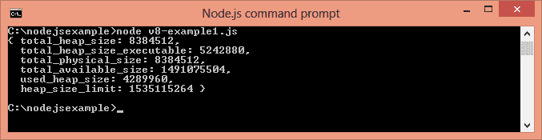
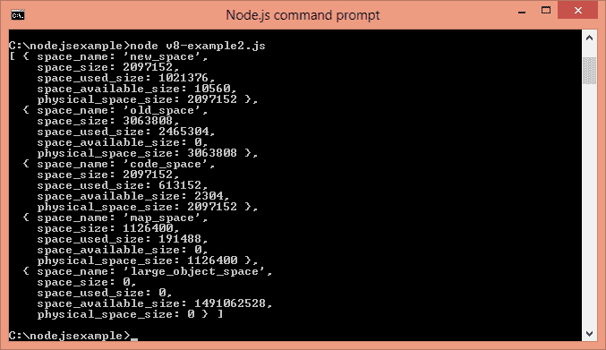

# Node.js V8

> 哎哎哎:# t0]https://www . javatppoint . com/nodejs-V8

* * *

## 什么是 V8

V8 是 Chrome 项目为谷歌 Chrome 网络浏览器开发的开源 JavaScript 引擎。这是在 C 与 C++程序设计学习与实验系统写的。如今，它被用于许多项目，如 Couchbase、MongoDB 和 Node.js。

* * *

## Node.js 中的 V8

Node.js V8 模块表示特定于 V8 版本的接口和事件。它提供了通过 **v8.getHeapStatistics()** 和**V8 . getheapspace statistics()**方法获取堆内存信息的方法。

要使用该模块，需要使用 **require('v8')** 。

```js
const v8 = require('v8');

```

## node . js V8 . getheapstatics()示例

v8.getHeapStatistics()方法返回堆的统计信息，如总堆大小、已用堆大小、堆大小限制、总可用大小等。

文件:v8-example1.js

```js
const v8 = require('v8');
console.log(v8.getHeapStatistics());

```



## node . js V8 . getheapspace statistics()示例

v8.getHeapSpaceStatistics()返回关于堆空间的统计信息。它返回一个包含 5 个对象的数组:新空间、旧空间、代码空间、地图空间和大对象空间。每个对象都包含有关空间名称、空间大小、已用空间大小、可用空间大小和物理空间大小的信息。

文件:v8-example2.js

```js
const v8 = require('v8');
console.log(v8.getHeapSpaceStatistics());

```



* * *

## Node.js 中 V8 的内存限制

目前，默认情况下，v8 在 32 位系统上的内存限制为 512mb，在 64 位系统上为 1gb。您可以通过将- max-old-space-size 设置为 32 位系统的最大 1gb 和 64 位系统的最大 1.7gb 来提高限制。但是，如果达到内存限制，建议将单个进程分成几个工作进程。