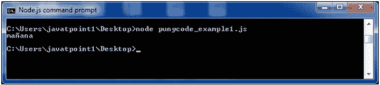
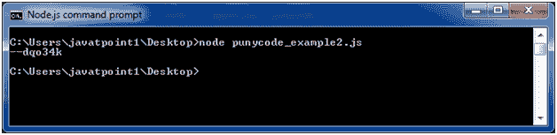
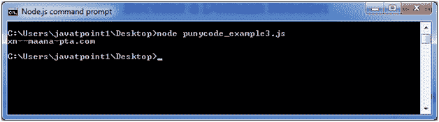
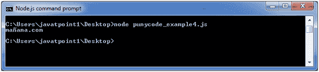

# node . js Punycode NodeJS punycode

> 哎哎哎:# t0]https://www . javatppoint . com/nodejs-punycode

* * *

## 什么是双关语

Punycode 是一种编码语法，用于将 Unicode (UTF-8)字符串转换为基本 ASCII 字符串。由于主机名只理解 ASCII 字符，所以使用 Punycode。它被用作国际化域名(IDN 或 IDNA)。让我们用一个例子来理解它:

假设您在浏览器中搜索**mañana.com**，那么您的浏览器(启用了 IDNA)首先将其转换为 punycode xn-maana-pta.com，因为常规域名中不允许使用字符**-**。旧版本不支持它。

## Node.js 中的 Punycode

Punycode.js 与 Node.js v0.6.2 及更高版本捆绑在一起。如果你想和其他 Node.js 版本一起使用，那么先用 npm 安装 punycode 模块。您必须使用 require ('punycode ')才能访问它。

**语法:**

```
punycode = require('punycode');

```

## punycode.decode(字符串)

它用于将 ASCII 符号的 Punycode 字符串转换为 Unicode 符号的字符串。

文件:punycode_example1.js

```
punycode = require('punycode');
console.log(punycode.decode('maana-pta')); 

```

**输出:**



## punycode . encode(字符串)

它用于将一串 Unicode 符号转换为一串 ASCII 符号。

文件:punycode_example2.js

```
punycode = require('punycode');
console.log(punycode.encode('☃-⌘'));

```

**输出:**



## punycode.toASCII(域)

它用于将代表域名的 Unicode 字符串转换为 Punycode。只转换域名的非 ASCII 部分。

文件:punycode_example3.js

```
punycode = require('punycode');
console.log(punycode.toASCII('mañana.com')); 

```

**输出:**



## punycode . tounicode(域)

它用于将代表域名的 Punycode 字符串转换为 Unicode。只转换域名的双关语部分。

文件:punycode_example4.js

```
punycode = require('punycode');
console.log(punycode.toUnicode('xn--maana-pta.com')); 

```

**输出:**

