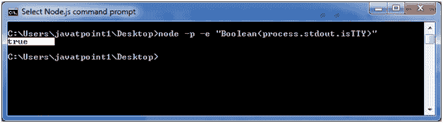
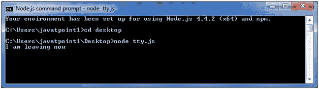

# Node.js TTY(NodeJS TTY)

> 哎哎哎:# t0]https://www . javatppoint . com/nodejs-tty

NodeJS TTY 模块包含 TTY。ReadStream 和 tty。WriteStream 类。大多数情况下，不需要直接使用这个模块。

您必须使用 require ('tty ')才能访问此模块。

**语法:**

```
var tty = require('tty');

```

当 Node.js 发现它正在 TTY 上下文中运行时，那么:

*   process.stdin 将是 tty。ReadStream 实例
*   process.stdout 将是 tty。WriteStream 实例

要检查 Node.js 是否在 TTY 上下文中运行，请使用以下命令:

```
node -p -e "Boolean(process.stdout.isTTY)"

```



## 类:ReadStream

它包含一张网。Socket 子类，表示 tty 的可读部分。在正常情况下。ReadStream 在任何 Node.js 程序中都只有一个名为 process.stdin 的实例(仅当 isatty(0)为真时)。

**rs.isRaw:** 是一个初始化为 false 的布尔值。它指定 tty 的当前“原始”状态。ReadStream 实例。

**rs.setRawMode(模式):**应该是真或假。它用于设置 tty 的属性。读取流作为原始设备或默认设备。isRaw 将被设置为结果模式。

## 类:WriteStream

它包含一张网。Socket 子类，表示 tty 的可写部分。在正常情况下。WriteStream 在任何 Node.js 程序中都只有一个名为 process.stdout 的实例(仅当 isatty(1)为真时)。

**调整大小事件:**当列或行的属性发生变化时，使用该事件。

**语法:**

```
process.stdout.on('resize', () => {
  console.log('screen size has changed!');
  console.log(`${process.stdout.columns}x${process.stdout.rows}`);
});

```

**ws.columns:** 用于给出 TTY 当前拥有的列数。此属性在“调整大小”事件中更新。

**ws.rows:** 用于给出 TTY 当前拥有的行数。此属性在“调整大小”事件中更新。

## TTY 示例

文件:tty.js

```
var tty = require('tty');
process.stdin.setRawMode(true);
process.stdin.resume();
 console.log('I am leaving now');
process.stdin.on('keypress', function(char, key) {
  if (key && key.ctrl && key.name == 'c') {

    process.exit()
  }
});

```

**输出:**

