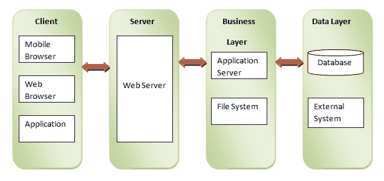
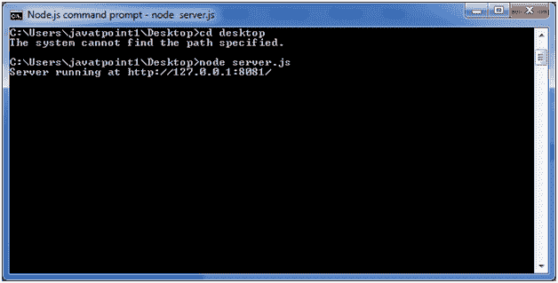
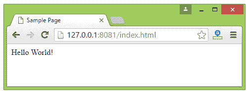

# 网络模块

> 哎哎哎:# t0]https://www . javatppoint . com/nodejs-web 模块

## 什么是网络服务器

网络服务器是一个软件程序，它像网络浏览器一样处理由 HTTP 客户端发送的 HTTP 请求，并响应客户端返回网页。Web 服务器通常用 html 文档以及图像、样式表和脚本来响应。

大多数 web 服务器支持使用脚本语言的服务器端脚本，或者重定向到执行从数据库获取数据、执行复杂逻辑等特定任务的应用服务器。然后通过 Web 服务器将结果发送给 HTTP 客户端。

Apache web 服务器是最常用的 web 服务器之一。这是一个开源项目。

## 网络应用架构

web 应用程序可以分为 4 层:

*   **客户端层:**客户端层包含可以向 web 服务器发出 HTTP 请求的 web 浏览器、移动浏览器或应用程序。
*   **服务器层:**服务器层包含 Web 服务器，可以拦截客户端发出的请求，并将响应传递给客户端。
*   **业务层:**业务层包含应用服务器，web 服务器利用应用服务器进行所需的处理。该层通过数据库或一些外部程序与数据层交互。
*   **数据层:**数据层包含数据库或任何数据源。



## 使用节点创建网络服务器

Node.js 提供了 http 模块，可以用来创建服务器的 HTTP 客户端。创建一个名为 server.js 的 js 文件，包含以下代码:

```
var http = require('http');
var fs = require('fs');
var url = require('url');

// Create a server
http.createServer( function (request, response) {  
   // Parse the request containing file name
   var pathname = url.parse(request.url).pathname;

   // Print the name of the file for which request is made.
   console.log("Request for " + pathname + " received.");

   // Read the requested file content from file system
   fs.readFile(pathname.substr(1), function (err, data) {
      if (err) {
         console.log(err);
         // HTTP Status: 404 : NOT FOUND
         // Content Type: text/plain
         response.writeHead(404, {'Content-Type': 'text/html'});
      }else{	
         //Page found	  
         // HTTP Status: 200 : OK
         // Content Type: text/plain
         response.writeHead(200, {'Content-Type': 'text/html'});	

         // Write the content of the file to response body
         response.write(data.toString());		
      }
      // Send the response body 
      response.end();
   });   
}).listen(8081);
// Console will print the message
console.log('Server running at http://127.0.0.1:8081/');

```

**接下来，在创建 server.js** 的同一目录下创建一个名为 index.html 的 html 文件，该文件包含以下代码

```

Sample Page

Hello World!

```

现在打开 Node.js 命令提示符并运行以下代码:

**节点 server.js**



在任何浏览器中打开 http://127 . 0 . 0 . 1:8081/index . htm，看到下面的结果。

