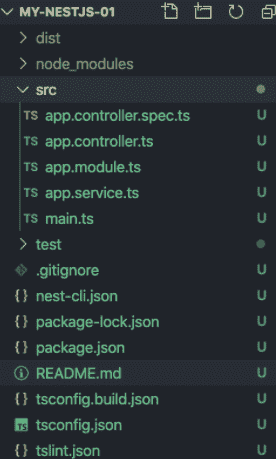
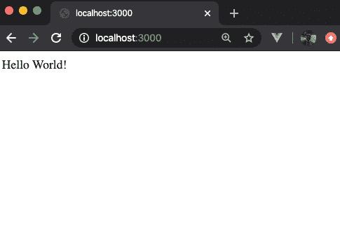

# 雀巢公司

> 哎哎哎:# t0]https://www . javatppoint . com/nesjs


欢迎来到 **NestJS** 教程。本教程只是为了让你获得 NestJS 的绝对知识。您将从初级水平开始学习它，涵盖所有将推动您进入安装的微小阶梯，从零开始创建一个新的应用程序，并学习如何在日常场景中处理和实现。我们开始吧。

## 什么是 NestJS？

NestJS 是在 **Node.js** 的引擎盖下运行的一个相当流行和累积的 JavaScript 框架，用于构建**可扩展、可靠的**和**高效的服务器端**应用。该框架采用 Node.js 环境，完全支持**类型脚本**。也可以在 [Node.js](https://www.javatpoint.com/nodejs-tutorial) 的影响下缩放使用 **Express.js** 。由于 NestJS 是一个完全支持 TypeScript 的框架，它可以让像您这样的开发人员纯粹在 [JavaScript](https://www.javatpoint.com/javascript-tutorial) 中编码，并让您结合**面向对象编程**(OOP)**功能反应编程** (FRP)和纯粹**功能编程** (FP)的概念。

## 在幕后

您可能不知道作为 NestJS 基本构件的某些方面。确切地说，NestJS 在健壮的 **HTTP** 基础设施的掩护下，大量使用了像 Express 这样的服务器端框架。尽管 Express 被认为是默认的，但它也可以选择配置为使用 Fastify。

NestJS 旨在为开发人员提供一定程度的抽象机制，使得不仅像 **Fastify** 或 **Express** 这样内部集成的常见服务器端框架，还可以暴露给开发人员选择的 API。这些隐藏栏为像您这样的开发人员提供了生动地使用第三方模块的自由，并且可以使它们成为 NestJS 平台的基础，而不必操作整个服务器端。

## 装置

在开始使用 NestJS 创建后端应用程序之前，您所需要做的就是确保您已经将 **Nest CLI** 主要安装在您的本地计算机上。如果没有安装，使用**节点包管理器** (NPM)并使用下面给出的命令跟踪该方法。

```js

 $ npm i -g@nestjs/cli

```

但是，您可能需要确保 Node.js 和 NPM 已经预安装在您的本地系统中。如果没有，就按照说明在[https://nodejs.org/](https://nodejs.org/)上安装 Node.js。

一旦 NestJS CLI 安装被标记为完成，就可以使用这些命令了。既然你实际上正在学习它，考虑做一个基于 NestJS 的小项目，这样你就能以实践经验应用这些知识。若要继续创建示例项目，请使用以下命令对其进行初始化。

```js

 $ npm new my-nestjs-01

```

该命令的一次执行，在当前提供的位置创建一个名为 **my-nestjs-01** 的新文件夹，所有默认项目模板由此被下载到该文件夹中。

## 项目结构

为项目创建文件夹后，会创建包含几个核心程序文件的 NestJS 节点模块以及其他样板依赖项。这些核心文件可以从下图中可视化。它由各种重要的源代码组成，将在后面讨论。



在上图中，您可以可视化所有文件和依赖关系，其中一些是核心文件。所示图像中最重要的文件是 **src** 文件夹。这是您可以找到应用程序代码的 TypeScript 文件仓库。在这个项目中，大部分时间你都在播放 src 文件夹。所有这些核心文件将在下面讨论。

**main.ts** :是应用的入口点。它包含一个方法 **NestFactory.create()** ，该方法创建一个 Nest 应用程序的新实例。

**app.modules.ts** :包含应用实现的模块。

**app.controller.ts** :只由一个 NestJS 的路由实现控制器组成。

**app.services.ts** :是常用的服务方法实现。

**app.controller.specs.ts** :测试控制器的文件。

现在，让我们仔细看看包含默认实现方法的 main.ts 文件。

```js

pModule } from './app.module';

async function bootstrap() {
  const app = await NestFactory.create(AppModule);
  await app.listen(3000);
}
bootstrap();

```

在上面的代码中，首先导入 **NestFactory** 方法作为应用程序的入口点。接下来，**应用程序模块**从之前讨论的应用程序中导入。模块文件。其次，引导被标记为**异步**并实现。导入引导函数的主要目的是调用它来执行代码。

其次，当调用**应用模块**方法作为参数传递给根应用模块时，执行开始。这将通过创建新的 NestJS 实例来附加一个模块。下一步是在带有**端口 3000** 的网络服务器上使用事件监听器方法启动服务器。此方法将返回一个承诺，指示服务器已经成功启动，开始等待密钥。

现在，您必须转到根应用程序的实现，该应用程序具有可以在文件 **app.module.ts** 中找到的模块。其中的代码包含以下内容。

```js

import { Module } from '@nestjs/common';
import { AppController } from './app.controller';
import { AppService } from './app.service';

@Module({
  imports: [],
  controllers: [AppController],
  providers: [AppService],
})
export class AppModule {}

```

在上面的代码片段中， **AppModule** 作为方法导入， **@Module** decorator 从 **@nestjs/** 共享公共库导入。@Module 装饰器在传递时由三个属性组成，即导入、控制器和提供者。

在应用程序开发的初始阶段，AppModule 中指定的控制器应该始终是分配给属性的数组的一部分，因为控制器的计数被限制为 **AppController** ，这是根模块。此外，服务应该在 AppModule 中随时可用，因此应该列在分配给提供者属性的数组中。

接下来，您将在 **app.controller.ts** 中查看 AppController 及其实现。代码如下。

```js

import { Controller, Get } from '@nestjs/common';
import { AppService } from './app.service';

@Controller()
export class AppController {
  constructor(private readonly appService: AppService) {}

  @Get()
  getHello(): string {
    return this.appService.getHello();
  }
}

```

上面的代码片段是 NestJS 中一个控制器的简单演示，它只包含一条 **GET** 路线。只需添加@Controller 装饰器，就可以使该类成为控制器。也是从 **@nestjs/** 导入的，这是一个通用的库。

这里的重点是要清楚地理解控制器通常依赖于服务类。在给定的示例中 **AppController** 通过导入添加在顶部的相应语句，使用 Appservice 实现 app.services.ts 文件。

但是，将 AppService 插入 AppController 的过程是基于依赖注入的方法，默认情况下，该方法会添加相同类型的参数。然后通过 **@Get** 装饰器实现 **getHello** 方法，实现一个默认路由来处理 **HTTP GET** 请求。因此，该方法由 AppService 提供动力，通过同时返回来获取数据并执行请求和响应操作。

现在我们进入下一个文件，观察 **app.services.ts 文件**。

```js

import { Injectable } from '@nestjs/common';
@Injectable()
export class AppService {
  getHello(): string {
    return 'Hello World!';
  }
}

```

上面的代码片段是 NestJS 中一个控制器的简单演示，它只包含一个 GET 路由。只需添加 **@Controller** 装饰器，就可以将该类设为控制器。也是从 **@nestjs/** 导入的，这是一个通用的库。

这里的重点是要清楚地理解控制器通常依赖于服务类。在给定的示例中，AppController 通过导入添加在**顶部**的相应语句，使用 Appservice 实现 app.services.ts 文件。

但是将 AppService 插入 AppController 的过程是基于**依赖注入**的方法，默认情况下会添加同类型的参数。然后通过 **@Get** 装饰器实现 **getHello** 方法，实现一个默认路由来处理 **HTTP GET** 请求。因此，该方法由 AppService 提供动力，通过同时返回来获取数据并执行请求和响应操作。

现在我们进入下一个文件，观察 **app.services.ts 文件**。

```js

  $ npm run start

```

NestJS 应用程序应该是这样的。



上图没有显示任何惊喜。输出“**你好世界！**”是从 **getHello** 方法提出的服务中检索的字符串，随后通过与之对应的控制器方法作为 HTTP GET 响应返回。

## 摘要

本教程足以涵盖学习 NestJS 及其实际应用程序的所有方面，从安装到制作一个示例应用程序。在本教程中，您学习了什么是 NestJS 的应用程序，它的使用频率以及实际实现它的常见场景。虽然 NestJS 在 JavaScript 开发人员中不太有用，但是由于它完全支持 TypeScript，许多开发人员利用它的动态代码来解决设计模式问题。随着对 Node.js 依赖性的增加，NestJS 越来越受欢迎，它与 Express 等框架一起使用。为了便于理解，您仅仅通过导入本文中讨论的所有核心文件，就学会了如何使用 NestJS 开发应用程序。也可以使用某些模块来实现应用程序，如添加**课程**、使用**邮递员**对其进行测试以及控制**端点**流程。

* * *