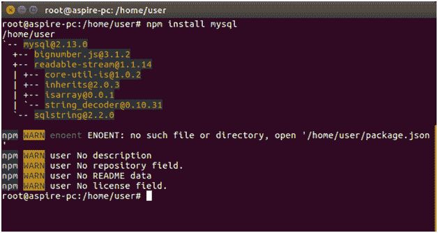
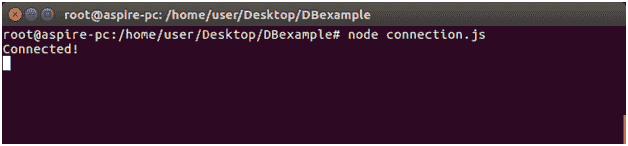

# 节点。用 MySQL 创建连接

> 原文:[https://www.javatpoint.com/nodejs-mysql-create-connection](https://www.javatpoint.com/nodejs-mysql-create-connection)

我们可以在数据库应用程序中使用 Node.js。这里我们使用 MySQL 作为带有 Node.js 的数据库

## 在你的电脑上安装 MySQL。

你可以从这里[https://www.mysql.com/downloads/](https://www.mysql.com/downloads/)下载。

一旦 MySQL 安装并运行，您就可以使用 Node.js 访问它。

## 安装 MySQL 驱动程序

您必须安装 MySQl 驱动程序才能使用 Node.js 访问 MySQL 数据库。从 npm 下载 MySQL 模块。

要下载并安装“mysql”模块，请打开命令终端并执行以下操作:

```

npm install mysql

```



* * *

## 创建连接

创建一个名为“数据库示例”的文件夹。在该文件夹中创建一个名为“connection.js”的 js 文件，其代码如下:

```

var mysql = require('mysql');
var con = mysql.createConnection({
  host: "localhost",
  user: "root",
  password: "12345"
});
con.connect(function(err) {
  if (err) throw err;
  console.log("Connected!");
});

```

现在打开命令终端，使用以下命令:

**节点连接**



现在 Node.js 和 MySQL 连接了。