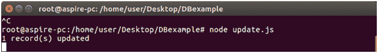
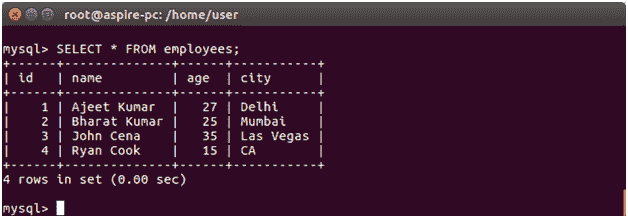
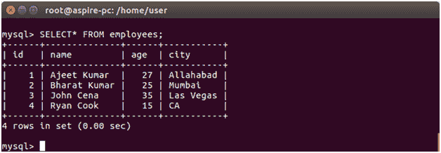

# MySQL 更新记录

> 原文：<https://www.javatpoint.com/nodejs-mysql-update-record>

UPDATE 命令用于更新表中的记录。

**例**

**更新“员工”表中的城市**，其中 id 为 1。

在 DBexample 文件夹中创建一个名为“update”的 js 文件，并将以下数据放入其中:

```

var mysql = require('mysql');
var con = mysql.createConnection({
host: "localhost",
user: "root",
password: "12345",
database: "javatpoint"
});
con.connect(function(err) {
if (err) throw err;
var sql = "UPDATE employees SET city = 'Delhi' WHERE city = 'Allahabad'";
con.query(sql, function (err, result) {
if (err) throw err;
console.log(result.affectedRows + " record(s) updated");
});
});

```

现在打开命令终端并运行以下命令:

```

Node update.js

```

它将把 id 1 的城市改为阿拉哈巴德之前的德里。



您可以在新表中检查更新的记录:



在古老的餐桌城市“阿吉特·库马尔”是阿拉哈巴德。

