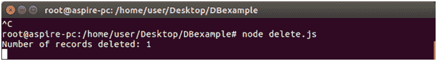
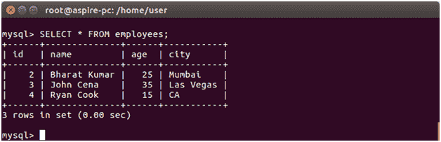

# 删除记录

> 原文：<https://www.javatpoint.com/nodejs-mysql-delete-record>

DELETE FROM 命令用于从表中删除记录。

**例**

在城市为德里的情况下，从员工表中删除员工。

在 DBexample 文件夹中创建一个名为“delete”的 js 文件，并将以下数据放入其中:

```

var mysql = require('mysql');
var con = mysql.createConnection({
host: "localhost",
user: "root",
password: "12345",
database: "javatpoint"
});
con.connect(function(err) {
if (err) throw err;
var sql = "DELETE FROM employees WHERE city = 'Delhi'";
con.query(sql, function (err, result) {
if (err) throw err;
console.log("Number of records deleted: " + result.affectedRows);
});
});

```

现在打开命令终端并运行以下命令:

```

Node delete.js

```



您可以使用 SELECT 语句来验证已删除的记录:

