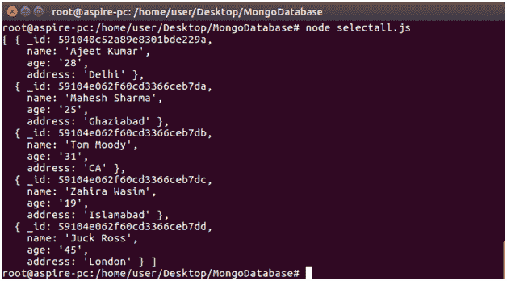

# 选择记录

> 原文:[https://www.javatpoint.com/nodejs-mysql-select-record](https://www.javatpoint.com/nodejs-mysql-select-record)

**例**

**从“员工”表中检索所有数据。**

在 DBexample 文件夹中创建一个名为 select.js 的包含以下数据的 js 文件。

```

var mysql = require('mysql');
var con = mysql.createConnection({
host: "localhost",
user: "root",
password: "12345",
database: "javatpoint"
});
con.connect(function(err) {
if (err) throw err;
con.query("SELECT * FROM employees", function (err, result) {
if (err) throw err;
console.log(result);
});
});

```

现在打开命令终端并运行以下命令:

```

Node select.js

```


您也可以使用以下语句:

```

SELECT * FROM employees;

```

