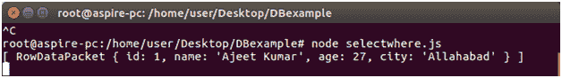
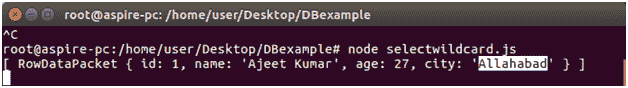

# MySQL 选择唯一记录

> 原文:[https://www . javatpoint . com/nodejs-MySQL-select-unique-record](https://www.javatpoint.com/nodejs-mysql-select-unique-record)

## (WHERE 子句)

从“员工”表中检索唯一数据。

在 DBexample 文件夹中创建一个名为 selectwhere.js 的包含以下数据的 js 文件。

```

var mysql = require('mysql');
var con = mysql.createConnection({
host: "localhost",
user: "root",
password: "12345",
database: "javatpoint"
});
con.connect(function(err) {
if (err) throw err;
con.query("SELECT * FROM employees WHERE id = '1'", function (err, result) {
if (err) throw err;
console.log(result);
});
});

```

现在打开命令终端并运行以下命令:

```

Node selectwhere.js

```



* * *

## 选择通配符

**使用通配符从“员工”表中检索唯一数据。**

在 DBexample 文件夹中创建一个名为 select 通配符. js 的 js 文件，其中包含以下数据。

```

var mysql = require('mysql');
var con = mysql.createConnection({
host: "localhost",
user: "root",
password: "12345",
database: "javatpoint"
});
con.connect(function(err) {
if (err) throw err;
con.query("SELECT * FROM employees WHERE city LIKE 'A%'", function (err, result) {
if (err) throw err;
console.log(result);
});
});

```

现在打开命令终端并运行以下命令:

```

Node selectwildcard.js

```

它将检索城市以 a 开头的记录。

