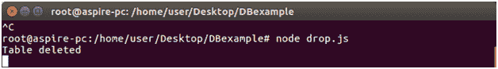
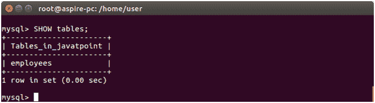

# NodeJS MySQL 删除表

> 哎哎哎:# t0]https://www . javatppoint . com/nodejs-MySQL-drop table

“删除表格”命令用于删除或删除表格。

让我们删除一个名为 employee2 的表。

在 DBexample 文件夹中创建一个名为“delete”的 js 文件，并将以下数据放入其中:

```js

var mysql = require('mysql');
var con = mysql.createConnection({
host: "localhost",
user: "root",
password: "12345",
database: "javatpoint"
});
con.connect(function(err) {
if (err) throw err;
var sql = "DROP TABLE employee2";
con.query(sql, function (err, result) {
if (err) throw err;
console.log("Table deleted");
});
});

```

现在打开命令终端并运行以下命令:

```js

Node drop.js

```



验证数据库中不再有表 employee2。

