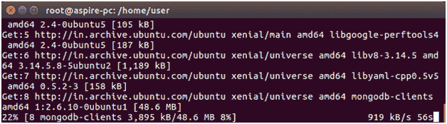
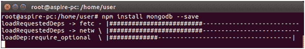

# 用 MongoDB 创建连接

> 原文：<https://www.javatpoint.com/nodejs-mongodb-create-connection>

MongoDB 是一个 NoSQL 数据库。它可以与 Node.js 一起用作数据库来插入和检索数据。

### 下载 MongoDB

打开 Linux 命令终端，执行以下命令:

```js

apt-get install mongodb

```

它会根据你的系统需求下载最新的 MongoDB。



### 安装 MongoDB

下载完成后，使用以下命令安装 MogoDB。

```js

npm install mongodb --save 

```

使用以下命令启动 MongoDb 服务:

```js

service mongodb start

```



现在，为进一步的操作创建了连接。

要在 windows 上下载并安装 MongoDB，请参见以下页面:

[Click here](https://www.javatpoint.com/how-to-install-mongodb-on-windows)