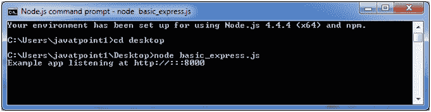
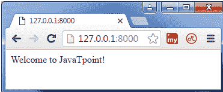

# Express.js 教程

> 原文：<https://www.javatpoint.com/expressjs-tutorial>

Express.js 教程提供了 Express.js 的基本和高级概念。我们的 Express.js 教程是为初学者和专业人士设计的。

Express.js 是 Node.js 的一个 web 框架，本质上是一个快速、健壮、异步的框架。

我们的 Express.js 教程包含了 Express.js 在 windows 和 linux 上的安装、请求对象、响应对象、get 方法、post 方法、cookie 管理、脚手架、文件上传、模板等所有 Express.js 的主题。

## 什么是快递

Express 是 Node.js 的一个快速、自信、基本和适度的网络框架。您可以假设 express 是建立在 Node.js 之上的一个层，它帮助管理服务器和路由。它为开发网络和移动应用程序提供了一套强大的功能。

让我们看看 Express 框架的一些核心特性:

*   它可用于设计单页、多页和混合 web 应用程序。
*   它允许设置中间件来响应 HTTP 请求。
*   它定义了一个路由表，用于根据 HTTP 方法和 URL 执行不同的操作。
*   它允许基于向模板传递参数来动态呈现 HTML 页面。

* * *

## 为什么要用快递

*   超快输入/输出
*   异步和单线程
*   类似 MVC 的结构
*   强大的应用编程接口使路由变得容易

## 快递看起来怎么样

让我们看看一个基本的 Express.js 应用。

**文件:basic_express.js**

```js
var express = require('express');
var app = express();
app.get('/', function (req, res) {
  res.send('Welcome to JavaTpoint!');
});
var server = app.listen(8000, function () {
  var host = server.address().address;
  var port = server.address().port;
  console.log('Example app listening at http://%s:%s', host, port);
});

```



**输出:**



* * *

## Express.js 索引

* * *

**Express.js 教程**

*   [Node.js 教程 50+](nodejs-tutorial)

**Express.js 教程**

*   [Express.js 教程](expressjs-tutorial)
*   [安装 Express.js](install-expressjs)
*   [快递请求](expressjs-request)
*   [Express.js 回应](expressjs-response)
*   [Express.js Get](expressjs-get)
*   [快递 js 邮](expressjs-post)
*   [快递路线](expressjs-routing)
*   [Express.js Cookies](expressjs-cookies)
*   [Express.js 文件上传](expressjs-file-upload)
*   [Express.js 中间件](expressjs-middleware)
*   [快手脚手架](expressjs-scaffolding)
*   [Express.js 模板](expressjs-template)

**面试问题**

*   [Node.js 访谈](node-js-interview-questions)
*   [安古拉杰采访](angularjs-interview-questions)
*   [JavaScript 面试](javascript-interview-questions)
*   [jQuery 面试](jquery-interview-questions)
*   [骨气访谈](backbone-js-interview-questions)
*   [烬 js 采访](ember-js-interview-questions)
*   [Neo4j 访谈](neo4j-interview-questions)

* * *

## 先决条件

在学习 Express.js 之前，必须具备 JavaScript 和 Node.js 的基础知识。

## 观众

我们的 Express.js 教程旨在帮助初学者和专业人士。

## 问题

我们保证您在本教程中不会发现任何问题。但是如果有任何错误，请在联系表格中发布问题。