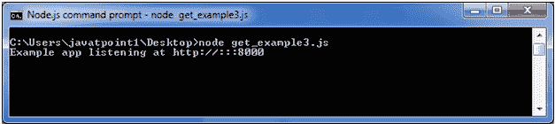

# 获取请求

> 原文：<https://www.javatpoint.com/expressjs-get>

获取和发布都是用于构建 REST 应用编程接口的两个常见的 HTTP 请求。GET 请求用于仅发送有限数量的数据，因为数据被发送到标头中，而 POST 请求用于发送大量数据，因为数据是在正文中发送的。

Express.js 便于您使用 Express 实例处理 GET 和 POST 请求。

* * *

## 获取方法示例 1

**获取 JSON 格式的数据:**

Get 方法便于您只发送有限数量的数据，因为数据是在标头中发送的。它不安全，因为数据在网址栏中可见。

让我们举个例子来演示 GET 方法。

**文件:index.html**

```

First Name: <input type="text" name="first_name">  

Last Name: <input type="text" name="last_name">
<input type="submit" value="Submit">

```

**文件:get_example1.js**

```
var express = require('express');
var app = express();
app.use(express.static('public'));

app.get('/index.html', function (req, res) {
   res.sendFile( __dirname + "/" + "index.html" );
})
app.get('/process_get', function (req, res) {
response = {
       first_name:req.query.first_name,
       last_name:req.query.last_name
   };
   console.log(response);
   res.end(JSON.stringify(response));
})
var server = app.listen(8000, function () {

  var host = server.address().address
  var port = server.address().port
  console.log("Example app listening at http://%s:%s", host, port)

})

```


打开 index.html 页面，填写条目:


现在，您得到了 JSON 格式的数据。

 

## 获取方法示例 2

**获取段落格式的数据**

**文件:index.html**

```

First Name: <input type="text" name="first_name">  

Last Name: <input type="text" name="last_name">

<input type="submit" value="Submit">

```

**文件:get_example2.js**

```
var express = require('express');
var app=express();
app.get('/get_example2', function (req, res) {
res.send('用户名:“+ req.query['first_name']+”last name:“+req . query[' last _ name ']+”');
})
var server = app.listen(8000, function () {
  var host = server.address().address
  var port = server.address().port
  console.log("Example app listening at http://%s:%s", host, port)
})

```


打开 index.html 页面，填写条目:


**输出:**


## 获取方法示例 3

**文件:index.html**

```
<!DOCTYPE html>
<html>
<body>
<form action="http://127.0.0.1:8000/get_example3">  
<table>  
<tr><td>Enter First Name:</td><td><input type="text" name="firstname"/><td></tr>  
<tr><td>Enter Last Name:</td><td><input type="text" name="lastname"/><td></tr>  
<tr><td>Enter Password:</td><td><input type="password" name="password"/></td></tr>  
<tr><td>Sex:</td><td>
<input type="radio" name="sex" value="male"> Male
<input type="radio" name="sex" value="female">Female
</td></tr>  
<tr><td>About You :</td><td>
<textarea rows="5" cols="40" name="aboutyou" placeholder="Write about yourself">
</textarea>
</td></tr>  
<tr><td colspan="2"><input type="submit" value="register"/></td></tr>  
</table>  
</form> 
</body>
</html>

```

**文件:get_example3.js**

```
var express = require('express');
var app=express();

app.get('/get_example3', function (req, res) {
res.send('first name:“+req . query[' first name ']+”
last name:“+req . query[' last name ']+”密码:“+req.query['密码']+”
关于你:'+req.query['关于你']+'');
})

var server = app.listen(8000, function () {
  var host = server.address().address
  var port = server.address().port
  console.log("Example app listening at http://%s:%s", host, port)
})

```

  