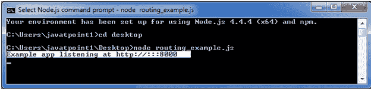
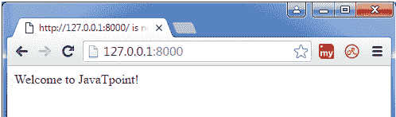
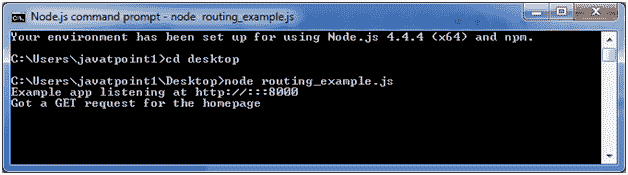
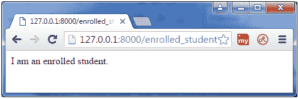
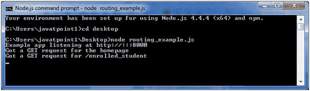
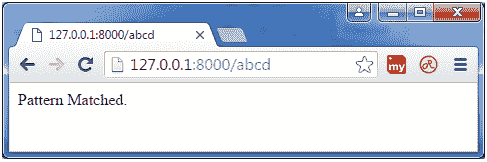
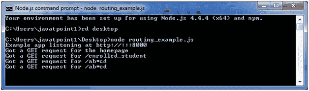

# 快递路线

> 原文:[https://www.javatpoint.com/expressjs-routing](https://www.javatpoint.com/expressjs-routing)

路由是由 route 这个词构成的。它用于确定应用程序的特定行为。它指定应用程序如何响应客户端对特定路由、URI 或路径的请求，以及特定的 HTTP 请求方法(GET、POST 等)。).它可以处理不同类型的 HTTP 请求。

让我们举个例子来看看基本路由。

**文件:routing_example.js**

```
var express = require('express');
var app = express();
app.get('/', function (req, res) {
   console.log("Got a GET request for the homepage");
   res.send('Welcome to JavaTpoint!');
})
app.post('/', function (req, res) {
   console.log("Got a POST request for the homepage");
   res.send('I am Impossible! ');
})
app.delete('/del_student', function (req, res) {
   console.log("Got a DELETE request for /del_student");
   res.send('I am Deleted!');
})
app.get('/enrolled_student', function (req, res) {
   console.log("Got a GET request for /enrolled_student");
   res.send('I am an enrolled student.');
})
// This responds a GET request for abcd, abxcd, ab123cd, and so on
app.get('/ab*cd', function(req, res) {   
   console.log("Got a GET request for /ab*cd");
   res.send('Pattern Matched.');
})
var server = app.listen(8000, function () {
var host = server.address().address
  var port = server.address().port
console.log("Example app listening at http://%s:%s", host, port)
})

```



你看到服务器正在监听。

现在，您可以看到本地主机上的服务器生成的结果 http://127.0.0.1:8000

**输出:**

这是示例应用程序的主页。



**注意:**一次成功响应后会更新命令提示符。



您可以通过更改路线来查看不同的页面。**http://127 . 0 . 0 . 1:8000/已注册 _ 学生**



**更新命令提示:**



这可以读取 abcd、abxcd、ab123cd 等模式。

下一条路线**http://127 . 0 . 0 . 1:8000/ABCD**



**下一条路线 http://127 . 0 . 0 . 1:8000/ab 12345 CD**


**更新命令提示:**

