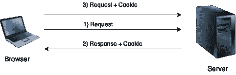
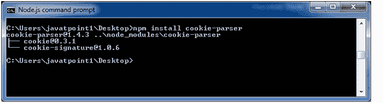
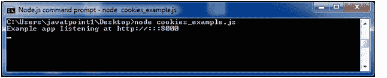
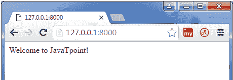
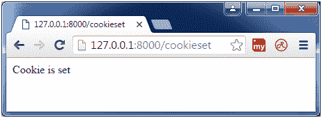
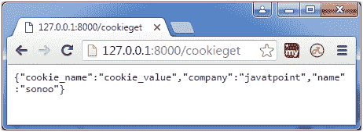

# Express.js Cookies 管理

> 原文:[https://www.javatpoint.com/expressjs-cookies](https://www.javatpoint.com/expressjs-cookies)

* * *

## 饼干是什么

Cookies 是一小段信息，即当用户浏览网站时，从网站发送并存储在用户的网络浏览器中的信息。每次用户加载回该网站时，浏览器都会将存储的数据发送回网站或服务器，以识别用户。



* * *

## 安装 cookie

您必须在 Express.js 中获得 cookie 能力。



* * *

## 将 cookie 解析器导入您的应用程序。

```
var express = require('express');
var cookieParser = require('cookie-parser');
var app = express();
app.use(cookieParser()); 

```

* * *

## 定义路线:

cookie 解析器解析 Cookie 头并用一个由 Cookie 名称键入的对象填充 req.cookies。

让我们在您的 express 应用程序中定义一条新路线，例如设置一个新 cookie:

```
app.get('/cookie',function(req, res){
     res.cookie('cookie_name' , 'cookie_value').send('Cookie is set');
}); 
app.get('/', function(req, res) {
  console.log("Cookies :  ", req.cookies);
});

```

每次浏览器请求该网站时，都会将该 cookie 发送回服务器。

* * *

## Express.js Cookies 示例

**文件:** cookies_example.js

```
var express = require('express');
var cookieParser = require('cookie-parser');
var app = express();
app.use(cookieParser());
app.get('/cookieset',function(req, res){
res.cookie('cookie_name', 'cookie_value');
res.cookie('company', 'javatpoint');
res.cookie('name', 'sonoo');

res.status(200).send('Cookie is set');
});
app.get('/cookieget', function(req, res) {
  res.status(200).send(req.cookies);
});
app.get('/', function (req, res) {
  res.status(200).send('Welcome to JavaTpoint!');
});
var server = app.listen(8000, function () {
  var host = server.address().address;
  var port = server.address().port;
  console.log('Example app listening at http://%s:%s', host, port);
});

```



**输出:**

在浏览器上打开**页面 http://127.0.0.1:8000/** :



**设置饼干:**

现在打开**http://127 . 0 . 0 . 1:8000/cookieset**设置 cookie:



**获取饼干:**

现在打开**http://127 . 0 . 0 . 1:8000/cookieget**获取 cookie:

