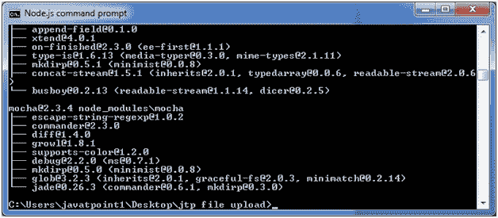

# 文件上传

> 原文:[https://www.javatpoint.com/expressjs-file-upload](https://www.javatpoint.com/expressjs-file-upload)

在 Express.js 中，文件上传稍微有些困难，因为它的异步特性和联网方法。

这可以通过使用中间件来处理多部分/表单数据来实现。有许多中间件可以使用，如 multer、connect、body-parser 等。

让我们举一个例子来演示 Node.js 中的文件上传。

创建包含以下文件的“jtp 文件上传”文件夹:


**上传:**是一个空文件夹，即为存储上传的图像而创建的文件夹。

**包:**是 JSON 文件，有以下数据:

**文件:package.json**

```
{
  "name": "file_upload",
  "version": "0.0.1",
  "dependencies": {
    "express": "4.13.3",
    "multer": "1.1.0"
  },
  "devDependencies": {
    "should": "~7.1.0",
    "mocha": "~2.3.3",
    "supertest": "~1.1.0"
  }
}

```

**文件:index.html**

```

    File upload in Node.js by Javatpoint

      Express.js 文件上传:通过 Javatpoint

       <input type="file" name="myfile">

       <input type="submit" value="Upload Image" name="submit">

```

**文件:server.js**

```

var express	=	require("express");
var multer	=	require('multer');
var app	=	express();
var storage	=	multer.diskStorage({
  destination: function (req, file, callback) {
    callback(null, './uploads');
  },
  filename: function (req, file, callback) {
	callback(null, file.originalname);
  }
});
var upload = multer({ storage : storage}).single('myfile');

app.get('/',function(req,res){
      res.sendFile(__dirname + "/index.html");
});

app.post('/uploadjavatpoint',function(req,res){
	upload(req,res,function(err) {
		if(err) {
			return res.end("Error uploading file.");
		}
		res.end("File is uploaded successfully!");
	});
});

app.listen(2000,function(){
    console.log("Server is running on port 2000");
});

```

要安装 package.json，**执行以下代码**:

```
npm install

```



它将在“jtp 文件上传”文件夹中创建一个新文件夹“node_modules”。


依赖项已安装。现在，运行服务器:

```
node server.js

```


打开本地页面 http://127.0.0.1:2000/上传图片。


选择要上传的图像，然后单击“上传图像”按钮。


在这里，您可以看到文件上传成功。您可以在“上传”文件夹中看到上传的文件。


* * *

### 下载节点. js 快速文件上传示例

[Download this example](js/nodejs/express/downloads/jtp-file-upload.zip)