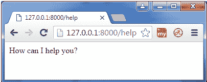

# 中间件

> 原文：<https://www.javatpoint.com/expressjs-middleware>

Express.js 中间件是由 Express.js 路由层在最终请求处理程序之前调用的不同类型的功能。正如所指定的名称，中间件出现在初始请求和最终预期路由之间。在堆栈中，中间件函数总是按照它们被添加的顺序被调用。

中间件通常用于执行任务，如 URL 编码或 JSON 请求的主体解析、基本 cookie 处理的 cookie 解析，甚至动态构建 JavaScript 模块。

* * *

## 什么是中间件功能

中间件功能是在请求-响应周期中访问请求和响应对象(req，res)的功能。

中间件功能可以执行以下任务:

*   它可以执行任何代码。
*   它可以对请求和响应对象进行更改。
*   它可以结束请求-响应周期。
*   它可以调用堆栈中的下一个中间件函数。

## 中间件

以下是 Express.js 应用程序中可能使用的中间件列表:

*   应用层中间件
*   路由器级中间件
*   错误处理中间件
*   内置中间件
*   第三方中间件

让我们举个例子来理解什么是中间件以及它是如何工作的。

让我们以最基本的 Express.js 应用为例:

**文件:simple_express.js**

```
var express = require('express');
var app = express();

app.get('/', function(req, res) {
  res.send('Welcome to JavaTpoint!');
});
app.get('/help', function(req, res) {
  res.send('How can I help You?');
});
var server = app.listen(8000, function () {
  var host = server.address().address
  var port = server.address().port
console.log("Example app listening at http://%s:%s", host, port)
})

```


你看到服务器正在监听。

现在可以在本地主机**上看到服务器生成的结果 http://127.0.0.1:8000**

**输出:**


让我们看看下一页:**http://127 . 0 . 0 . 1:8000/帮助**

**输出:**

 

**注意:**您看到命令提示符没有改变。意思是，虽然在**http://127 . 0 . 0 . 1:8000/帮助页面**中处理了一个 GET 请求，但是它没有显示任何 GET 请求的记录。

## 中间件的使用

如果你想记录每次你收到一个请求，那么你可以使用一个中间件。

**见本例:**

**文件:simple_middleware.js**

```
var express = require('express');
var app = express();
app.use(function(req, res, next) {
  console.log('%s %s', req.method, req.url);
  next();
});
app.get('/', function(req, res, next) {
  res.send('Welcome to JavaTpoint!');
});
app.get('/help', function(req, res, next) {
  res.send('How can I help you?');
});
var server = app.listen(8000, function () {
  var host = server.address().address
  var port = server.address().port
  console.log("Example app listening at http://%s:%s", host, port)
})

```


你看到服务器正在监听。

现在可以在本地主机**上看到服务器生成的结果 http://127.0.0.1:8000**

**输出:**


您可以看到输出是相同的，但是命令提示符显示的是一个 GET 结果。


前往**http://127 . 0 . 0 . 1:8000/帮助**

 

只要重新加载页面，命令提示符就会更新。


**注意:**在上面的例子中，使用了 next()中间件。

**中间件示例说明**

*   在上面的中间件例子中，一个新的函数被用来通过 **app.use()** 调用每个请求。
*   中间件是一个函数，就像路由处理器一样，也以类似的方式被调用。
*   您可以使用相同的应用编程接口在上面或下面添加更多的中间件。