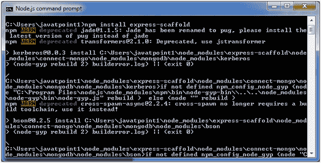
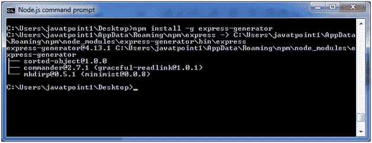
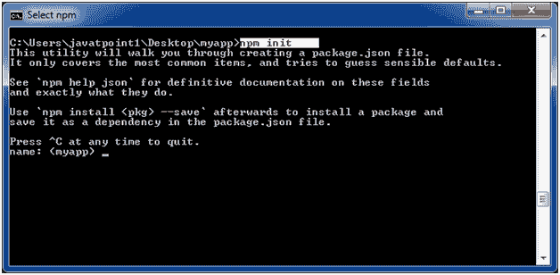
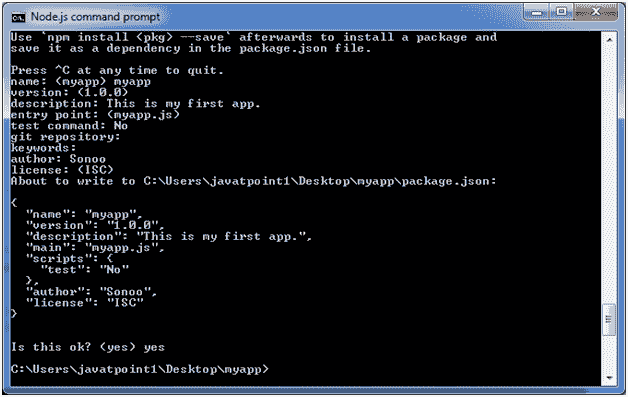
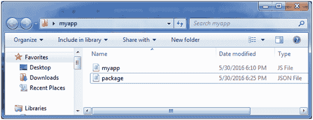
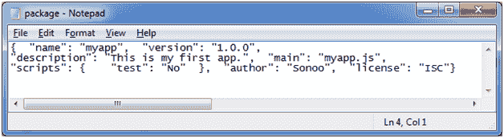

# Express.js 脚手架

> 原文：<https://www.javatpoint.com/expressjs-scaffolding>

* * *

## 什么是脚手架

脚手架是一些 MVC 框架支持的技术。

它主要由以下框架支持:

Ruby on Rails，OutSystems Platform，Express Framework，Play framework，Django，单轨，Brail，Symfony，Laravel，CodeIgniter，Yii，CakePHP，Phalcon PHP，Model-Glue，PRADO，Grails，Catalyst，Seam Framework，Spring Roo，ASP.NET 等。

脚手架便于程序员指定如何使用应用程序数据。具有预定义代码模板的框架使用该规范来生成应用程序可以用于 CRUD 操作(创建、读取、更新和删除数据库条目)的最终代码。

* * *

## Express.js 脚手架

一个 Express.js 支架支持 candy 和更多基于 Node.js 的 web 项目

* * *

## 安装脚手架

执行以下命令安装脚手架。

```
npm install express-scaffold  

```

这将需要几秒钟，屏幕将如下所示:



完成此步骤后，执行以下命令安装 express generator:

```
npm install -g express-generator

```



现在，你可以用 express 搭建一个网络应用。

**举个例子:**

首先创建一个名为 myapp 的目录。在 myapp 目录中创建一个名为 app.js 的文件，包含以下代码:

```
var express = require('express');
var app = express();
app.get('/', function (req, res) {
  res.send('Welcome to JavaTpoint!');
});
app.listen(8000, function () {
  console.log('Example app listening on port 8000!');
});

```

打开 Node.js 命令提示符，转到 myapp 并运行 npm init 命令(在我的例子中，我已经在桌面上创建了 myapp 文件夹)



填写条目并按回车键。



它将在 myapp 文件夹中创建一个 package.json 文件，数据以 json 格式显示。



**输出:**

