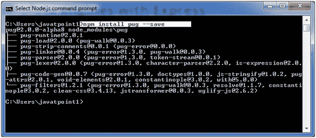

# Express.js 模板引擎

> 原文:[https://www.javatpoint.com/expressjs-template](https://www.javatpoint.com/expressjs-template)

* * *

## 什么是模板引擎

模板引擎便于您在应用程序中使用静态模板文件。在运行时，它用实际值替换模板文件中的变量，并将模板转换成发送给客户端的 HTML 文件。因此，这种方法更适合轻松设计 HTML 页面。

以下是一些使用 Express.js 的流行模板引擎的列表:

*   帕格(原名杰德)
*   髭
*   灰尘
*   ATP 的
*   生态的
*   电休克疗法
*   EJB
*   低增生性急性髓细胞性白血病
*   汉默咖啡
*   把手
*   泥盖木屋
*   爵士乐
*   jqtpl
*   仅仅
*   酒
*   QEJS
*   大喝
*   模板化的
*   太妃糖
*   强调
*   海象
*   胡须

在上述模板引擎中，帕格(原名杰德)和小胡子似乎是最受欢迎的选择。帕格类似于使用空白的哈默尔。根据模板基准，帕格比车把、EJS、下划线慢 2 倍。ECT 似乎是最快的。许多程序员喜欢小胡子模板引擎，主要是因为它是最简单、最通用的模板引擎之一。

* * *

## 使用快速模板引擎

模板引擎使您能够在应用程序中使用静态模板文件。要渲染模板文件，您必须设置以下应用程序设置属性:

*   **视图:**指定模板文件所在的目录。

**例如:**app . set(' view '，')。/view ')。

*   **查看引擎:**指定你使用的模板引擎。例如，要使用帕格模板引擎:app.set(“查看引擎”，“帕格”)。

我们来看一个模板引擎帕格(原名 jade)。

* * *

## 帕格模板引擎

让我们学习如何使用 Express.js 在 Node.js 应用程序中使用 pug 模板引擎。Pug 是 Node.js 的模板引擎。Pug 使用空格和缩进作为语法的一部分。它的语法很容易学。

## 安装帕格

执行以下命令安装 pug 模板引擎:

```
npm install pug --save

```



帕格模板必须写在里面。帕格文件和所有。pug 文件必须放在 Node.js 应用程序的根文件夹中的视图文件夹内。

**注意:**默认情况下，Express.js 搜索根文件夹下的 view 文件夹中的所有视图。还可以使用 express 中的 views 属性设置到另一个文件夹。例如:app . set(' view '，' MyViews ')。

帕格模板引擎以简单的方式接受输入，并以 HTML 格式生成输出。查看它如何呈现 HTML:

**简单输入:**

```
doctype html
html
    head
        title A simple pug example
    body
        h1 This page is produced by pug template engine
        p some paragraph here.. 

```

**帕格模板产生的输出:**

```

    A simple pug example

    该页面由 pug 模板引擎生成
    这里有些段落..

```

Express.js 可以与任何模板引擎一起使用。让我们举一个例子来部署帕格模板如何动态创建 HTML 页面。

**见本例:**

创建一个名为 **index.pug** 文件的文件，并在其中写入以下 pug 模板:

```
doctype html
html
    head
        title A simple pug example
    body
        h1 This page is produced by pug template engine
        p some paragraph here.. 

```

**文件:server.js**

```
var express = require('express');
var app = express();
//set view engine
app.set("view engine","pug")
app.get('/', function (req, res) {
res.render('view.pug', index);
 res.render('index');
});
var server = app.listen(5000, function () {
    console.log('Node server is running..');
});

```