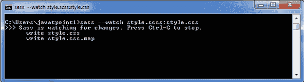
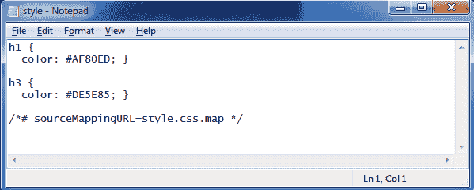
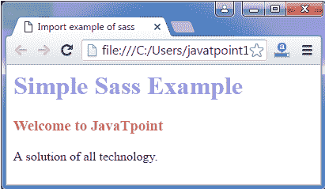

# SASS 示例

> 原文:[https://www.javatpoint.com/sass-example](https://www.javatpoint.com/sass-example)

我们可以简单地创建 SASS 和 SCSS 的例子。为此，请使用以下步骤:

创建一个包含以下代码的 HTML 文件:

**见本例:**

```

    Import example of sass

   简单的萨斯例子
   欢迎来到 JavaTpoint
   所有技术的解决方案。

```

现在创建一个名为“style.scss”的文件。它类似于 CSS 文件。唯一不同的是，它是用”保存的。scss "扩展。将两个文件都放在根文件夹中。

现在，执行以下代码:**sass-watch style . SCS:style . CSS**



它将在根文件夹中自动创建一个名为“style.css”的新 CSS 文件。无论何时更改 SCSS 文件，style.css 文件都会自动更改。

style.css 文件包含以下代码:



现在执行 HTML 文件。它将读取 CSS 文件，输出如下:

**输出:**

