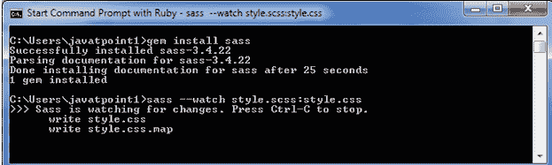
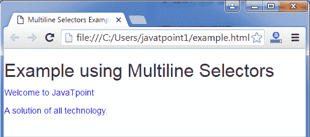

# Sass 语法

> 原文：<https://www.javatpoint.com/sass-syntax>

Sass 支持两种语法:

**SCSS 语法:**SCSS(Sassy CSS)可以指定为 CSS 语法的扩展。这仅仅意味着每个有效的 CSS 也是一个有效的 SCSS。SCSS 使维护大型样式表变得容易。它使用了扩展名”。SCS”。

**缩进语法:**缩进语法是较旧的语法，称为 Sass。为了使用这种语法，你必须简洁地编写 CSS。它使用扩展名。SASS。

* * *

## Sass 缩进语法

SASS 缩进语法或 SASS 是基于 CSS 的 SCSS 语法的替代。它具有以下特点:

*   它使用缩进而不是{和}来分隔块。
*   它使用换行符代替分号(；)来分隔语句。
*   属性声明和选择器必须放在自己的行中，并且{和}中的语句必须放在新行中并缩进。

请参见以下 SCSS 代码:

```

.myclass {
  color= red;
  font-size= 0.2em;
}

```

此语法较旧，因此不建议在新的 Sass 文件中使用。如果您使用此文件，将会出现显示错误。

* * *

## Sass 的句法差异

大多数 CSS 和 SCSS 语法都与 SASS 兼容，但也有一些不同。您可以在以下部分看到不同之处:

**1。属性语法:**

You can declare Sass properties in two ways:*   声明类似 CSS 但不带分号(；).*   声明一个冒号( : )作为每个属性名的前缀。

**例如:**

```

.myclass
  :color blue
  :font-size 0.2em 

```

默认情况下，可以使用两种属性声明方法，即属性名称前没有分号和冒号，但是在使用:property_syntax 选项时，应该只使用一种属性语法来指定。

**2。多行选择器**

在预期的语法中，多行选择器指定只要换行符出现在逗号之后，就可以在换行符上放置一个选择器。

**见本例:**

**HTML 文件:example.html**

```

   Multiline Selectors Example

   使用多行选择器的示例
   欢迎来到 JavaTpoint
   所有技术的解决方案。

```

**SCS 档案:style . SCS**

```

.class1,
.class2{
   color:blue;
} 

```

告诉 SASS 监视文件，并在 SASS 文件更改时更新 CSS。

使用 ruby 打开命令提示符，并运行以下命令:

**sass-watch style . SCS:style . CSS**



它将创建一个 style.css 文件。现在，运行 example.html 文件:

**输出:**



在这个例子中，您可以看到多行选择器的使用。

**@进口指令**

在 SASS 中，@import 指令可以用引号括起来，也可以不用引号。另一方面，在 SCSS，它们必须用引号括起来。

**例如:**在 SCSS，@import 指令可以用作:

```

@import "themes/blackforest";
@import "style.sass";

```

在 Sass 中，它可以写成:

```

@import themes/blackforest
@import fontstyle.sass

```

混合准则

SASS 支持像@mixin 和@include 这样的指令的简写属性。您可以使用=和+字符来代替@mixin 和@include。它需要更少的输入，并使您的代码更简单，更容易阅读。

**例如:**您可以将 mixin 指令编写为:

```

=myclass
  font-size: 12px;
p
  +myclass

```

**同:**

```

@mixin myclass
  font-size: 12px;
p
  @include myclass

```