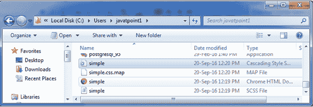
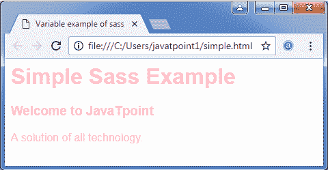

# SASS 变量

> 原文：<https://www.javatpoint.com/sass-variables>

Sass 变量用于存储信息，这些信息可以在需要时在整个样式表中重用。根据您未来的可重用性，您可以存储颜色、字体堆栈或任何 CSS 值。

$符号用于使某物成为变量。请参见语法。

**SCS 语法:**

```sass

$font-stack:    Helvetica, sans-serif;
$primary-color: #333;

body {
  font: 100% $font-stack;
  color: $primary-color;
}

```

**等效 Sass 语法:**

```sass

$font-stack:    Helvetica, sans-serif
$primary-color: #333

body
  font: 100% $font-stack
  color: $primary-color 

```

当它被处理时，它接受我们为$font-stack 和$primary-color 定义的变量，并使用放在 CSS 中的变量值创建一个普通的 CSS。

**加工后的 CSS:**

```sass

body {
  font: 100% Helvetica, sans-serif;
  color: #333;
} 

```

**示例:**

让我们举个例子来看看 Sass 变量的用法。我们有一个名为“simple.html”的 HTML 文件，其代码如下:

**文件:simple.html**

```sass

    Variable example of sass  

   简单的 SASS 例子  
   欢迎来到 JavaTpoint  
   所有技术的解决方案。  

```

创建一个名为“simple.scss”的 SCSS 文件，其代码如下:

**档案:simple . SCS**

```sass

$font-stack:    Helvetica, sans-serif;  
$primary-color: pink;  
body {  
  font: 100% $font-stack;  
  color: $primary-color;  
}

```

将两个文件都放在根文件夹中。

现在，打开命令提示符，运行**观察**命令，告诉 SASS 观察文件，并在 SASS 文件发生变化时更新 CSS。

执行以下代码:**sass-watch simple . SCS:simple . CSS**

它会在同一个目录下自动创建一个名为“simple.css”的普通 CSS 文件。

**例如:**



创建的 CSS 文件“simple.css”包含以下代码:

```sass

body {
  font: 100% Helvetica, sans-serif;
  color: pink; }  

```

现在，执行上面的 html 文件，它将读取 CSS 值。

**输出:**



在上面的例子中，您可以看到 HTML 文件读取 CSS，并相应地以 Helvetica 字体和粉色显示内容。