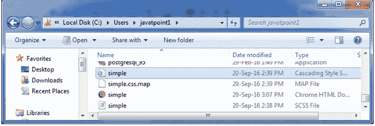
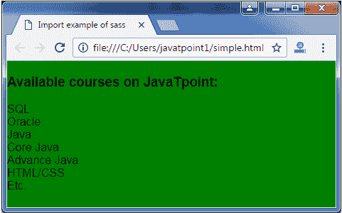

# SASS 导入

> 原文：<https://www.javatpoint.com/sass-import>

CSS 提供了@import 选项，使您能够将 CSS 分割成更小、更易维护的部分。唯一的一个限制是，每次在 CSS 中使用@import 时，它都会创建另一个 HTTP 请求。

Sass 建立在当前 CSS @import 的基础上。它不需要 HTTP 请求。相反，它只是获取您想要导入的文件，并将其与您要导入的文件相结合，这样您就可以将单个 CSS 文件提供给 web 浏览器。

假设我们有两个 Sass 文件，_ reset . SCS 和 base.scss，我们希望将 _ reset . SCS 导入 base.scss。

**见本例:**

```sass
// _reset.scss
html,
body,
ul,
ol {
   margin: 0;
  padding: 0;
}

```

```sass
// base.scss
@import 'reset';
body {
  font: 100% Helvetica, sans-serif;
  background-color: #efefef;
} 

```

导入文件时，不需要包含文件扩展名”。SCS”。它将生成以下 CSS 文件:

**加工后的 CSS:**

```sass
 html, body, ul, ol {
  margin: 0;
  padding: 0;
}
body {
  font: 100% Helvetica, sans-serif;
  background-color: #efefef;
}

```

## 高级安全系统导入示例

让我们举个例子来看看 Sass 导入的用法。我们有一个名为“simple.html”的 HTML 文件，其代码如下:

**文件:simple.html**

```sass

    Import example of sass  

JavaTpoint 上的可用课程:

  *   结构化查询语言
  *   神谕
  *   爪哇

    *   核心 Java

    *   高级 Java

  *   HTML/CSS
  *   等等。

```

创建一个名为“simple.scss”的 SCSS 文件，其代码如下:

**档案:simple . SCS**

```sass
html, body, ul, li {  
  margin: 0;  
  padding: 0;  
}  
body {  
  font: 100% Helvetica, sans-serif;  
  background-color: green;  
}   

```

将两个文件都放在根文件夹中。

现在，打开命令提示符，运行 watch 命令，告诉 SASS**关注**文件，每当 SASS 文件发生变化，就更新 CSS。

执行以下代码:**sass-watch simple . SCS:simple . CSS**

它会在同一个目录下自动创建一个名为“simple.css”的普通 CSS 文件。

**例如:**



创建的 CSS 文件“simple.css”包含以下代码:

```sass
html, body, ul, li {
  margin: 0;
  padding: 0; }

body {
  font: 100% Helvetica, sans-serif;
  background-color: green; } 

```

现在，执行上面的 HTML 文件，它将读取 CSS 值。

**输出:**

