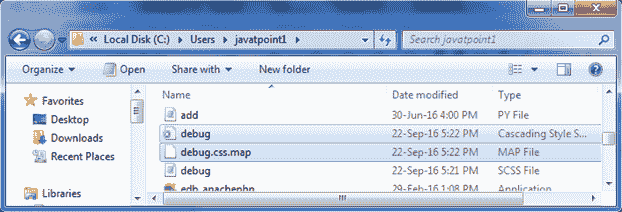
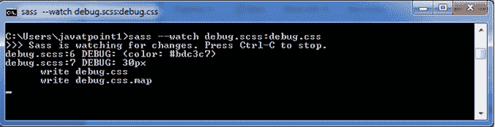

# 调试指令

> 原文:[https://www.javatpoint.com/sass-debug-directive](https://www.javatpoint.com/sass-debug-directive)

Sass @debug 指令用于检测错误，并向标准错误输出流显示 SassScript 表达式值。

* * *

# 调试指令示例

让我们创建一个名为“debug.scss”的 SCSS 文件，包含以下数据。

```
$font-sizes: 10px + 20px;
$style: (
  color: #bdc3c7
);
.container{
  @debug $style;
  @debug $font-sizes;
} 

```

现在，打开命令提示符，运行**观察**命令，告诉 SASS 观察文件，并在 SASS 文件发生变化时更新 CSS。

执行以下代码:**sass-watch debug . SCS:debug . CSS**

它会在同一个目录下自动创建一个名为“debug.css”的普通 CSS 文件。



**输出:**

